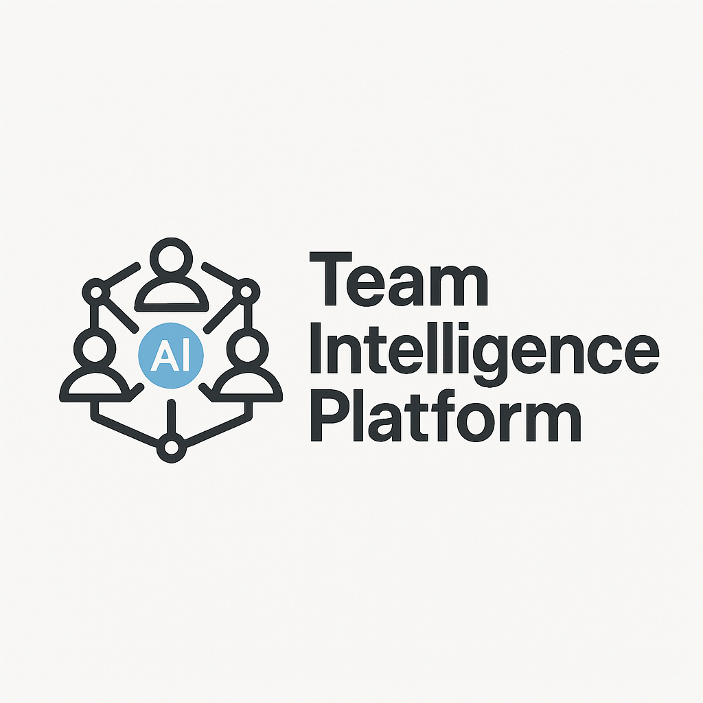

# Team Intelligence Platform (TIP)

<div align="center">



**Transform how teams work with AI: From individual productivity to collective intelligence.**

[](LICENSE)
[](CONTRIBUTING.md)
[](https://github.com/heidemann-consulting/team-intelligence-platform/stargazers)
[](https://github.com/heidemann-consulting/team-intelligence-platform/issues)

</div>

## Table of Contents

- [Team Intelligence Platform (TIP)](#team-intelligence-platform-tip)
  - [Table of Contents](#table-of-contents)
  - [Overview](#overview)
  - [Rituals and Practices](#rituals-and-practices)
  - [Key Concepts](#key-concepts)
    - [AI Co-Management](#ai-co-management)
    - [HORIZON Protocol Process](#horizon-protocol-process)
  - [Documentation](#documentation)
    - [Project Documents](#project-documents)
    - [Prerequisites](#prerequisites)
    - [Setup and Configuration](#setup-and-configuration)
    - [Deployment](#deployment)
    - [Stopping the Application](#stopping-the-application)
    - [Creating a database dump](#creating-a-database-dump)
    - [Restoring a database dump](#restoring-a-database-dump)
    - [Troubleshooting](#troubleshooting)
  - [License](#license)

## Overview

The Team Intelligence Platform (TIP) is an innovative open-source solution designed to transform how product development teams integrate AI into their collaborative workflows. Unlike traditional approaches where AI is used as an individual productivity tool, TIP enables "AI Co-Management" – a paradigm where AI becomes an integrated team member contributing to collective intelligence. The goal is to foster "AI Co-Management," creating a collective intelligence where the team's combined human-AI capability surpasses the sum of its individual parts.

TIP provides:

- A **phased implementation framework** that delivers value at every stage
- **Team-focused AI rituals** that enhance collective performance
- A **fully open-source component stack** for maximum accessibility and customization
- **Knowledge management practices** that preserve and enhance team context
- **Collaboration patterns** optimized for human-AI teamwork

You can find out more about the benefits of the benefits of TIP in the [tip-pitch.md](docs/tip-pitch.md) and the [tip-benefits.md](docs/tip-benefits.md) documents.

## Rituals and Practices

TIP employs several core rituals and practices to achieve this goal:

- **Collective Context Management:** Instead of individuals interacting with AI using only their personal context, TIP focuses on building and maintaining a shared, persistent team knowledge base accessible to both humans and AI. Rituals like *Context Curation* and *Enhanced/Networked Context Management* involve systematically capturing, organizing, and refining this collective knowledge.
- **Explicit AI Roles:** AI is assigned specific roles within team processes (like Documentarian, Analyst, Facilitator, etc.) with defined responsibilities, rather than just being a general assistant.
- **Integration into Core Ceremonies:** AI participation is explicitly structured into routine team activities such as meetings, planning sessions, and retrospectives, with defined touchpoints and expected contributions. Examples include *AI-Assisted Documentation* for meetings, *AI-Enhanced Retrospectives* for deeper learning, and *Context-Aware Planning* using historical data and context.
- **Collaborative Prompt Development:** Teams work together in dedicated workshops to create, test, and refine prompts that effectively encode team processes and knowledge for AI interaction.
- **AI Pair Working:** Patterns are established for individual team members to collaborate directly with AI in real-time on specific, often complex, tasks.
- **AI-Supported Decision Making:** For significant decisions, a structured framework uses AI to help generate options, evaluate them against criteria, identify biases, and document the rationale.
- **Cross-Team Intelligence Sharing:** Mechanisms and rituals are established to facilitate the flow of knowledge, insights, and practices across different team boundaries within an organization.
- **Collective Evaluation and Continuous Learning:** Teams collectively assess the contributions of AI against shared standards and actively work to evolve and improve their human-AI collaboration patterns over time.

## Key Concepts

### AI Co-Management

AI Co-Management represents a fundamental shift in how teams work with AI:

- **From**: Individual team members using AI separately, creating fragmented knowledge and inconsistent practices
- **To**: Teams working with AI collectively, with shared context, explicit roles, and integrated workflows

Six core principles distinguish this approach:

1. **Collective Context over Individual Interaction**
2. **Explicit AI Roles and Responsibilities**
3. **Integration into Core Team Ceremonies**
4. **Transparent Collective Evaluation**
5. **Continuous Learning and Improvement**
6. **Balance of Autonomy and Oversight**

### HORIZON Protocol Process

AI Co-Management is realized via the HORIZON Protocol Process.

You can find the description of the process in these documents:
- [HORIZON Protocol Concept & Design Guidelines](docs/horizonprotocol-conceptanddesignguidelines.md)
- [HORIZON Rituals & Practices Guide](docs/horizonprotocol-rituals-and-practices.md)
- [HORIZON Template Library](docs/horizonprotocol-templates-library.md)
- [HORIZON Workflow Library](docs/horizonprotocol-workflow-library.md)
- [HORIZON Pitch-to-Training Slide-Deck PDF](docs/horizonprotocol-slideset.pdf)
- Templates and workflows for HORIZON Protocol are included in the initially applied [init_db.sql](ulacm_backend/init_db.sql).

Why HORIZON is more than just “an LLM-augmented, data-driven workflow”:

1. **Permanent Strategic Memory** – A shared North-Star charter, value set and decision log are stored once and get re-injected by the LLM whenever they’re relevant, so every action is context-aware.
2. **End-to-end Templates & Workflows** – A library of ready-made Markdown templates (OKRs, Decision Log, Weekly Review, etc.) plus chained micro-workflows forms a closed learning/production loop, not just individual prompts.
3. **Ritual & Role Design** – Fixed daily, weekly and monthly cadences and rotating micro-roles (“Navigator”, “Metrics Steward”) cap human overhead at ≤ 30 minutes per day while keeping everyone engaged.
4. **Built-in Brand & Quality Guardrails** – The LLM enforces tone-of-voice, formatting and decision standards automatically, acting as a “Brand Guardian” that eliminates style drift.
5. **Active Decision Assistance** – Before any proposal is accepted, the model runs alignment checks, pro/contra analyses and value-fit tests, turning it into a real co-manager rather than a passive data interpreter.
6. **“Install Once, Benefit Daily” Flywheel** – Every new template or rule becomes reusable intellectual capital; the more you add, the smarter the system grows without adding extra daily effort.

**Net-net:** HORIZON operates like a lightweight operating system for small teams—combining memory, process, governance and LLM reasoning into one coherent framework—far beyond simply sprinkling AI on top of existing data dashboards.

## Documentation

### Project Documents

- [PRD.md](docs/tip-prd.md) - Product Requirements Document: Basic idea and product requirements of TIP
- [SRS.md](docs/tip-srs.md) - Detailed Software Requirements Specification of TIP
- [TODO.md](TODO.md) - List of open topics
- [CODE_OF_CONDUCT.md](CODE_OF_CONDUCT.md) - Community behavior expectations
- [CONTRIBUTING.md](CONTRIBUTING.md) - Contribution guidelines
- [GOVERNANCE.md](GOVERNANCE.md) - Project governance structure
- [COMMUNITY.md](COMMUNITY.md) - Community participation information
- [CONTRIBUTORS.md](CONTRIBUTORS.md) - List of project contributors

### Prerequisites

* **Docker:** [Install Docker](https://docs.docker.com/get-docker/)
* **Docker Compose:** Usually included with Docker Desktop. If not, [install Docker Compose](https://docs.docker.com/compose/install/).
* **Git:** (Optional, for cloning the repository)
* **Ollama:** An Ollama server instance must be accessible to the backend. You can either:
    * Run Ollama separately on your host machine or network. [Install Ollama](https://ollama.com/).
    * Run Ollama as part of the `docker-compose` setup (recommended for ease of use). Ensure you have pulled the desired models (e.g., `ollama pull llama3`).

### Setup and Configuration

1.  **Clone the Repository (if applicable):**
    ```bash
    git clone https://github.com/Heidemann-Consulting/Team-Intelligence-Platform.git
    cd Team-Intelligence-Platform
    ```

2.  **Create Certificates (these are development certificates, adapt to create official ones):**
    ```bash
    ./generate_certificates.sh
    ```

3.  **Configure Backend Environment Variables:**
    * Navigate to the `ulacm_backend/` directory.
        ```bash
        cd ./ulacm_backend
        ```
    * Copy the example environment file:
        ```bash
        cp .env.example .env
        ```
    * **Edit the `.env` file:**
        * `SESSION_SECRET_KEY`: **CRITICAL!** Generate a strong, unique secret key (at least 32 hexadecimal characters). You can use `openssl rand -hex 32` to generate one.
        * `ADMIN_PASSWORD`: **CRITICAL!** Set a strong password for the administrator login.
        * `POSTGRES_PASSWORD`: **CRITICAL!** Set a strong password for the database user. This password will also be used in the `docker-compose.yml` for the database service.
        * `OLLAMA_API_URL`:
            * If running Ollama via `docker-compose` (recommended), leave the default `http://ollama:11434`.
            * If running Ollama externally (e.g., on the host machine), set it to `http://host.docker.internal:11434` (on Docker Desktop) or the appropriate network IP address and port of your Ollama server.
        * `BACKEND_CORS_ORIGINS`: (Optional) If accessing the API directly from a frontend running outside the default Docker setup (e.g., during local development on `http://localhost:4000`), add the origin(s) here (e.g., `BACKEND_CORS_ORIGINS='["http://localhost:4000"]'`). For standard deployment via compose, this might not be needed if served under the same effective origin or handled by a reverse proxy.
        * Review other variables like `POSTGRES_USER`, `POSTGRES_DB` if you need non-default values (ensure they match `docker-compose.yml`).

4.  **Configure Docker Compose Variables (Optional):**
    * The `docker-compose.yml` file uses environment variables from the host machine (or a `.env` file in the *same directory as `docker-compose.yml`*) to configure ports and database credentials.
    * You can create a `.env` file in the root project directory (where `docker-compose.yml` resides) to override defaults:
        ```env
        # Example .env file in project root
        POSTGRES_USER=ulacm_user
        POSTGRES_PASSWORD=your_strong_db_password_here # Must match backend/.env
        POSTGRES_DB=ulacm_db
        ADMIN_PASSWORD=your_strong_admin_password_here # Must match backend/.env
        SESSION_SECRET_KEY=your_strong_session_key_here # Must match backend/.env
        OLLAMA_API_URL=http://ollama:11434 # If using compose Ollama service

        # Optional Port Overrides
        FRONTEND_PORT=4000
        BACKEND_PORT=8000
        # POSTGRES_HOST_PORT=5432 # Uncomment to expose DB port to host
        OLLAMA_HOST_PORT=11434
        ```
    * **Important:** Ensure `POSTGRES_PASSWORD`, `ADMIN_PASSWORD`, and `SESSION_SECRET_KEY` match between the root `.env` (for compose) and `ulacm_backend/.env` (for the backend app itself). It's often simpler to define them once in the root `.env` and let compose pass them to the backend container via the `environment` section in `docker-compose.yml`. The current `docker-compose.yml` is set up to prefer host environment variables or the root `.env` file.

5.  **Ollama Setup:**
    * **If using the Ollama service in `docker-compose.yml`:** Ensure the `ollama` service is uncommented. After starting compose, you might need to pull models into the container:
        ```bash
        docker exec -it ulacm_ollama ollama pull llama3
        # Pull other models as needed
        ```
    * **If running Ollama externally:** Make sure it's running and accessible from the Docker network (check `OLLAMA_API_URL` setting).

### Deployment

1.  **Build and Start Containers:**
    * Open a terminal in the project's root directory (where `docker-compose.yml` is located).
    * Run the following command:
        ```bash
        docker-compose up --build -d
        ```
        * `--build`: Forces Docker to build the images based on the Dockerfiles (needed on first run or after code changes).
        * `-d`: Runs the containers in detached mode (in the background).

2.  **Database Initialization (First Run):**
    * The backend service should automatically attempt to create database tables on startup if they don't exist (based on the current `init_db` logic in `database.py`). For production, using Alembic migrations initiated manually or via a startup script is recommended.
    * Check the backend logs for any database initialization errors:
        ```bash
        docker logs ulacm_backend
        ```

3.  **Accessing the Application:**
    * **Frontend:** Open your web browser and navigate to `https://localhost:4000` (or the `FRONTEND_PORT` you configured).
    * **Backend API Docs:** `https://localhost:8000/docs` (or the `BACKEND_PORT` you configured).

4.  **Admin Login:**
    * Navigate to the Admin Login page (e.g., via a link on the main login page or directly at `/admin/login`).
    * Use the `ADMIN_PASSWORD` you configured in the environment variables (`.env` file).

5.  **Team Management:**
    * Once logged in as admin, navigate to the Team Management section to create your first team accounts.

### Stopping the Application

```bash
docker-compose down
```

* This command stops and removes the containers defined in `docker-compose.yml`.
* Data stored in named volumes (`postgres_data`, `ollama_data`) will persist unless you explicitly remove the volumes (e.g., `docker-compose down -v`).

### Creating a database dump

The following will save your teams, templates, workflows and documents.

```bash
docker exec -t \
  -e PGPASSWORD="$POSTGRES_PASSWORD" \
  ulacm_db \
  sh -c 'pg_dump --data-only --table=teams --table=content_items --table=content_versions -U "$POSTGRES_USER" -d "$POSTGRES_DB"' | \
  grep -vE "^pg_dump: (warning:|detail:|hint:)" > specific_tables_data.sql 2>/dev/null
```

### Restoring a database dump

The following will restore your database dump to a deployment.

```bash
( \
  echo "SET LOCAL session_replication_role = 'replica';" && \
  echo "TRUNCATE TABLE teams, content_items, content_versions RESTART IDENTITY CASCADE;" && \
  cat specific_tables_data.sql && \
  echo "SET LOCAL session_replication_role = 'origin';" && \
  echo "UPDATE public.content_versions SET content_tsv = to_tsvector('pg_catalog.english', markdown_content);" \
) | docker exec -i \
  -e PGPASSWORD="$POSTGRES_PASSWORD" \
  ulacm_db \
  sh -c 'psql -U "$POSTGRES_USER" -d "$POSTGRES_DB" --quiet --single-transaction --set ON_ERROR_STOP=1'
docker-compose down
docker-compose up -d
```

### Troubleshooting

* **Check Logs**: Use `docker logs <container_name>` (e.g., `docker logs ulacm_backend`, `docker logs ulacm_frontend`, `docker logs ulacm_db`) to view container output and errors.
* **Port Conflicts**: Ensure the host ports specified (`FRONTEND_PORT`, `BACKEND_PORT`, etc.) are not already in use on your machine. Change them in your root `.env` file or directly in `docker-compose.yml` if needed.
* **Database Connection**: Verify `POSTGRES_SERVER` in `ulacm_backend/.env` is set to `db` (the service name in `docker-compose.yml`). Ensure passwords match. Check the database container logs (`docker logs ulacm_db`) for startup issues.
* **Ollama Connection**: Verify `OLLAMA_API_URL` in `ulacm_backend/.env`. If using the compose service, it should be `http://ollama:11434`. Check Ollama container logs (`docker logs ulacm_ollama`) and ensure models are pulled.
* **Permissions**: On Linux, you might encounter permission issues with volume mounts. Ensure the Docker daemon has the necessary permissions.

## License

Copyright 2025 Heidemann Consulting

Licensed under the Apache License, Version 2.0 (the "License");
you may not use this file except in compliance with the License.
You may obtain a copy of the License here: [LICENSE](LICENSE) and at

    http://www.apache.org/licenses/LICENSE-2.0

Unless required by applicable law or agreed to in writing, software
distributed under the License is distributed on an "AS IS" BASIS,
WITHOUT WARRANTIES OR CONDITIONS OF ANY KIND, either express or implied.
See the License for the specific language governing permissions and
limitations under the License.

This project utilizes third-party libraries and components.
For more detailed information on these dependencies and their respective licenses, please refer to the [NOTICE](NOTICE) file.
