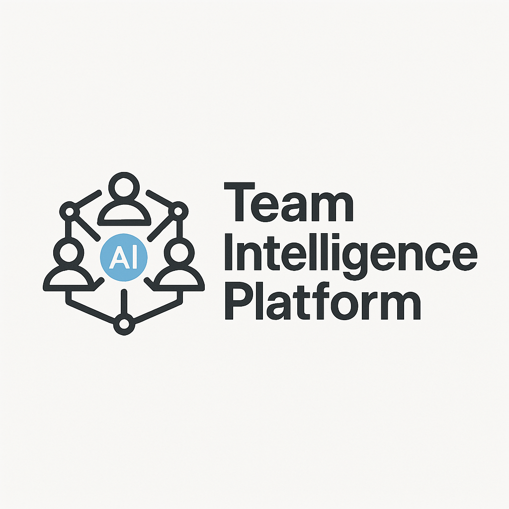

# Team Intelligence Platform (TIP)

<div align="center">



**Transform how teams work with AI: From individual productivity to collective intelligence.**

[](LICENSE)
[](CONTRIBUTING.md)
[](https://github.com/heidemann-consulting/team-intelligence-platform/stargazers)
[](https://github.com/heidemann-consulting/team-intelligence-platform/issues)

</div>

## Table of Contents

- [Overview](#overview)
- [Rituals and Practices](#rituals-and-practices)
- [Stakeholder Pitches](#stakeholder-pitches)
- [Market Analysis and Strategic Context](#market-analysis-and-strategic-context)
- [Key Concepts](#key-concepts)
- [Project Status](#project-status)
- [Documentation](#documentation)
- [Getting Started](#getting-started)
- [Component Architecture](#component-architecture)
- [Contributing](#contributing)
- [Community](#community)
- [Governance](#governance)
- [License](#license)
- [Acknowledgments](#acknowledgments)

## Overview

The Team Intelligence Platform (TIP) is an innovative open-source solution designed to transform how product development teams integrate AI into their collaborative workflows. Unlike traditional approaches where AI is used as an individual productivity tool, TIP enables "AI Co-Management" – a paradigm where AI becomes an integrated team member contributing to collective intelligence. The goal is to foster "AI Co-Management," creating a collective intelligence where the team's combined human-AI capability surpasses the sum of its individual parts.

TIP provides:

- A **phased implementation framework** that delivers value at every stage
- **Team-focused AI rituals** that enhance collective performance
- A **fully open-source component stack** for maximum accessibility and customization
- **Knowledge management practices** that preserve and enhance team context
- **Collaboration patterns** optimized for human-AI teamwork

## Rituals and Practices

TIP employs several core rituals and practices to achieve this goal:

- **Collective Context Management:** Instead of individuals interacting with AI using only their personal context, TIP focuses on building and maintaining a shared, persistent team knowledge base accessible to both humans and AI. Rituals like *Context Curation* and *Enhanced/Networked Context Management* involve systematically capturing, organizing, and refining this collective knowledge.
- **Explicit AI Roles:** AI is assigned specific roles within team processes (like Documentarian, Analyst, Facilitator, etc.) with defined responsibilities, rather than just being a general assistant.
- **Integration into Core Ceremonies:** AI participation is explicitly structured into routine team activities such as meetings, planning sessions, and retrospectives, with defined touchpoints and expected contributions. Examples include *AI-Assisted Documentation* for meetings, *AI-Enhanced Retrospectives* for deeper learning, and *Context-Aware Planning* using historical data and context.
- **Collaborative Prompt Development:** Teams work together in dedicated workshops to create, test, and refine prompts that effectively encode team processes and knowledge for AI interaction.
- **AI Pair Working:** Patterns are established for individual team members to collaborate directly with AI in real-time on specific, often complex, tasks.
- **AI-Supported Decision Making:** For significant decisions, a structured framework uses AI to help generate options, evaluate them against criteria, identify biases, and document the rationale.
- **Cross-Team Intelligence Sharing:** Mechanisms and rituals are established to facilitate the flow of knowledge, insights, and practices across different team boundaries within an organization.
- **Collective Evaluation and Continuous Learning:** Teams collectively assess the contributions of AI against shared standards and actively work to evolve and improve their human-AI collaboration patterns over time.

## Stakeholder Pitches

### For Development Teams

**The Challenge:**  
You're already using AI individually, but the team benefits aren't materializing. Maria creates amazing requirements with AI, Alex generates test cases, and Jamie refines user stories - but this knowledge stays siloed. You're spending more time in meetings trying to align, and context gets lost between sessions.

**The Opportunity:**  
Team Intelligence Platform makes AI a true team member, not just a personal assistant:
- Shared context: Your collective knowledge becomes accessible to AI and everyone on the team
- Collective learning: Your best prompts and workflows become team assets
- Deeper collaboration: Focus on creative problem-solving while AI handles routine coordination
- Persistent memory: Decisions and rationales remain accessible, even as team composition changes

**The Implementation:**  
TIP feels familiar because it integrates with the tools you already use. The open-source foundation means you can extend it to fit your specific needs. Most importantly, it's designed by developers for developers - with the flexibility you need to make it your own.

You'll start seeing benefits from day one, and the system grows smarter as you use it. The best part? You're not just using AI - you're pioneering new ways of working that will define the future of software development.

### For Team Leads and Line Managers

**The Challenge:**  
Your teams face unprecedented pressure to deliver more value faster. You've invested in AI tools, but the results have been mixed at best. Some team members excel with AI, while others struggle. Knowledge gets siloed, and collective performance suffers despite individual gains.

**The Opportunity:**  
Team Intelligence Platform transforms how your teams work with AI. Instead of each person using AI in isolation, TIP enables shared context, collaborative AI interactions, and team-level learning that compounds over time. This means:
- Less time spent in coordination meetings
- Faster onboarding of new team members
- Reduced impact when key personnel leave
- Higher quality decisions through AI-enhanced option analysis

**The Implementation:**  
TIP integrates with your existing Kanban and SAFe workflows, requiring minimal disruption. Our phased approach means you'll see results within weeks, not months. The open-source foundation ensures you're not locked into proprietary systems, and the modular architecture allows customization for your specific domain.

Your role is crucial: by championing AI Co-Management, you position your teams at the forefront of the next productivity revolution.

### For Project Managers

**The Challenge:**  
Your reality: tighter deadlines, complex dependencies, and the constant pressure to deliver. While individuals on your team use AI tools, this hasn't translated into the team-level productivity gains you need. AI is actually creating new challenges - inconsistent outputs, fragmented knowledge, and decision paralysis from too many options.

**The Opportunity:**  
Team Intelligence Platform directly addresses your pain points by making AI a true collaborator in project management:
- Enhanced planning: AI helps identify dependencies and risks based on team-curated context
- Options management: Structure the process of generating and evaluating alternatives
- Institutional memory: Capture decision rationales that inform future planning
- Meeting efficiency: Reduce synchronous coordination time by 35%

**The Implementation:**  
TIP seamlessly integrates with your existing project management tools. The open-source foundation means you can customize workflows to your specific needs. Our implementation plan starts with high-value, low-disruption use cases, delivering immediate ROI while building toward more advanced capabilities.

As a project manager, you'll find TIP doesn't just add another tool to manage - it makes your existing tools and processes more effective.

### For C-Suite Executives

**The Challenge:**  
Despite significant investments in AI licenses and infrastructure, our teams are experiencing a widening performance gap. High-performing teams are achieving breakthrough results with AI, while most teams see only incremental productivity gains. Why? Because we've treated AI as an individual productivity tool, not as a team member.

**The Opportunity:**  
Team Intelligence Platform creates a fundamental competitive advantage by making AI part of our collective intelligence. While competitors focus on individual AI productivity, we're building teams where human and AI cognition combine to deliver superior outcomes. This isn't about cost-cutting—it's about doing things that were previously impossible.

**The Investment and Return:**  
By leveraging open-source components and iterative development, TIP requires minimal capital investment while delivering measurable returns:
- 30-40% reduction in time-to-market
- 25% improvement in product quality metrics
- 35% reduction in coordination overhead
- Significant advantage in talent acquisition and retention

Leading analysts predict that by 2027, enterprises that master team-AI integration will outperform competitors by 40% in innovation metrics. TIP positions us at the forefront of this revolution.

## Market Analysis and Strategic Context

### Current Technology Landscape

The enterprise AI collaboration market is undergoing rapid transformation:

1. **Individual AI tools** dominate the current landscape (ChatGPT Enterprise, Anthropic Claude, etc.)
2. **Knowledge management systems** remain largely separate from AI workflows
3. **Team collaboration platforms** have begun basic AI integration, but primarily for individual tasks
4. **Enterprise LLM platforms** focus on deployment and security, not team workflows

This creates a significant gap in the market for solutions that enable true AI Co-Management.

### Emerging Trends and Strategic Context

TIP is designed as a deliberate catalyst for several emerging transformative trends:

1. **Shift from Individual to Collective Cognition**
   - Current state: AI augments individual capabilities in isolated contexts
   - Direction: AI becomes integral to team-level cognition and decision-making
   - TIP's role: Bridge the gap between individual AI usage and collective intelligence

2. **Transformation of Knowledge Work**
   - Current state: Traditional division between human expertise and machine processing
   - Direction: Hybridized workflows where human-AI boundaries blur
   - TIP's role: Create structured practices for effective human-AI collaboration

3. **Evolution of Organizational Intelligence**
   - Current state: Organization knowledge primarily stored in human teams with high volatility
   - Direction: Persistent organizational intelligence that transcends individual membership
   - TIP's role: Provide mechanisms for capturing, maintaining, and leveraging collective context

4. **Democratization of Advanced AI Capabilities**
   - Current state: Uneven adoption creates widening performance gaps between teams
   - Direction: More equitable access to AI capabilities across organizations
   - TIP's role: Provide accessible tools and practices for teams at various technical levels

### Competitive Positioning

While several proprietary platforms are emerging in this space (e.g., Microsoft Copilot for Teams, Notion AI, etc.), TIP differentiates through:

1. **Open-source foundation:** No vendor lock-in or proprietary limitations
2. **Team-first approach:** Built specifically for collective intelligence, not individual productivity
3. **Integration flexibility:** Adapts to existing enterprise systems rather than replacing them
4. **Workflow orientation:** Focuses on enhancing team processes, not just providing AI features
5. **Knowledge sovereignty:** All context and learning remains within your organization

## Key Concepts

### AI Co-Management

AI Co-Management represents a fundamental shift in how teams work with AI:

- **From**: Individual team members using AI separately, creating fragmented knowledge and inconsistent practices
- **To**: Teams working with AI collectively, with shared context, explicit roles, and integrated workflows

Six core principles distinguish this approach:

1. **Collective Context over Individual Interaction**
2. **Explicit AI Roles and Responsibilities**
3. **Integration into Core Team Ceremonies**
4. **Transparent Collective Evaluation**
5. **Continuous Learning and Improvement**
6. **Balance of Autonomy and Oversight**

### Phased Implementation Approach

TIP is implemented through three progressive phases, each representing a complete and valuable system while building toward increasingly sophisticated collaboration:

#### Phase 1: The Cognitive Foundation
- **Focus**: Knowledge capture and preservation
- **Timeline**: Weeks 1-4
- **Core Rituals**: Context Curation, Prompt Development, AI-Assisted Documentation
- **Key Outcomes**: Improved knowledge preservation, enhanced documentation, team knowledge repository

#### Phase 2: The Collaborative Acceleration
- **Focus**: Enhanced decision-making and planning
- **Timeline**: Weeks 5-12 (after Phase 1)
- **Core Rituals**: Enhanced Context Management, AI-Enhanced Retrospectives, Context-Aware Planning, Basic AI Pair Working
- **Key Outcomes**: Improved estimation accuracy, accelerated delivery cycles, enhanced decision quality

#### Phase 3: The Transformative Intelligence
- **Focus**: Breakthrough team performance
- **Timeline**: Months 7+ (after Phase 2)
- **Core Rituals**: Networked Context, AI-Driven Decisions, Advanced Retrospective System, Cross-Team Intelligence, Advanced AI Pair Working
- **Key Outcomes**: Transformative productivity, breakthrough innovation, strategic advantage

## Project Status

TIP is currently in **Phase 1 Implementation**:

- ✅ Core project documentation complete
- ✅ Phase 1 requirements and specifications defined
- ✅ Phase 1 rituals and practices documented
- 🚧 Phase 1 component deployment scripts (in progress)
- 🚧 Initial knowledge structure templates (in progress)
- 🚧 Base ritual templates (in progress)
- 📅 Phase 2 and 3 implementation will follow successful Phase 1 adoption

## Documentation

TIP documentation is structured by implementation phase to provide clear focus on current priorities while planning for future evolution:

### Project Documentation

- [LICENSE](LICENSE) - Apache 2.0 license
- [CODE_OF_CONDUCT.md](CODE_OF_CONDUCT.md) - Community behavior expectations
- [CONTRIBUTING.md](CONTRIBUTING.md) - Contribution guidelines
- [GOVERNANCE.md](GOVERNANCE.md) - Project governance structure
- [COMMUNITY.md](COMMUNITY.md) - Community participation information
- [CONTRIBUTORS.md](CONTRIBUTORS.md) - List of project contributors

### Phase-Specific Requirements

#### Phase 1: The Cognitive Foundation
- [Product Requirements Document (PRD)](docs/tip-phase1-prd.md) - Business requirements and product definition
- [Software Requirements Specification (SRS)](docs/tip-phase1-srs.md) - Technical specifications
- [Rituals and Practices](docs/tip-phase1-rituals-and-practices.md) - Implementation guide for team rituals

#### Phase 2: The Collaborative Acceleration
- [Product Requirements Document (PRD)](docs/tip-phase2-prd.md) - Future requirements (planning)
- [Software Requirements Specification (SRS)](docs/tip-phase2-srs.md) - Future specifications (planning)
- [Rituals and Practices](docs/tip-phase2-rituals-and-practices.md) - Future implementation guide (planning)

#### Phase 3: The Transformative Intelligence
- [Product Requirements Document (PRD)](docs/tip-phase3-prd.md) - Future requirements (planning)
- [Software Requirements Specification (SRS)](docs/tip-phase3-srs-part1.md) - Future specifications (planning)
- [Rituals and Practices](docs/tip-phase3-rituals-and-practices.md) - Future implementation guide (planning)

### Implementation Guides

- [Installation Guide](docs/tip-phase1-srs.md#7-installation-and-setup) - Setup instructions for all components
- [Knowledge Structure Guide](docs/tip-phase1-srs.md#61-knowledge-structure) - Obsidian vault organization
- [Integration Guide](docs/tip-phase1-srs.md#55-integration-layer) - Connecting components
- [Troubleshooting Guide](docs/tip-phase1-srs.md#115-troubleshooting-guide) - Common issues and solutions

## Getting Started

### Prerequisites

- Git
- Docker and Docker Compose
- Obsidian (local knowledge management)
- 8GB+ RAM for local LLM deployment

### Quick Start

1. **Clone the repository**

```bash
git clone https://github.com/heidemann-consulting/team-intelligence-platform.git
cd team-intelligence-platform
```

2. **Run the installation script**

```bash
# Make the script executable
chmod +x scripts/install.sh

# Run the installation script
./scripts/install.sh
```

3. **Configure Obsidian**

- Open Obsidian
- Create a new vault pointing to `knowledge-base/`
- Install recommended community plugins

4. **Access the components**

- Ollama: Command line interface
- Open-webui: http://localhost:3000
- LangFlow: http://localhost:7860
- HedgeDoc: http://localhost:3001
- OpenProject: http://localhost:8080

5. **Follow the First-Time Setup Guide**

See the [First Time Setup Guide](docs/tip-phase1-srs.md#8-first-time-setup-guide) for detailed instructions on:
- Configuring your team's knowledge repository
- Setting up your first team ritual
- Creating your initial prompt library
- Integrating with your existing workflow

### Docker Deployment

For team environments, you can deploy all components using Docker Compose:

```bash
# Start all components
docker-compose up -d

# View component status
docker-compose ps

# Stop all components
docker-compose down
```

For detailed deployment options, see the [Installation Guide](docs/installation/README.md).

## Component Architecture

TIP leverages a modular, component-based architecture built entirely on open-source tools:

### Core Components

- **LLM Runtime & Interface**
  - [Ollama](https://ollama.ai/): Local LLM deployment supporting multiple open models
  - [Open-webui](https://github.com/open-webui/open-webui): User interface for Ollama with chat and history management

- **Knowledge Management**
  - [Obsidian](https://obsidian.md/): Markdown-based knowledge repository with graph visualization
  - [Git/GitHub](https://github.com/): Version control and collaboration for knowledge assets

- **Workflow Automation**
  - [LangFlow](https://github.com/logspace-ai/langflow): Visual workflow builder for creating AI processes
  - Custom Scripts: Automation for routine integration tasks

- **Collaboration Tools**
  - [HedgeDoc](https://hedgedoc.org/): Collaborative markdown editing for team documents
  - GitHub Issues: Tracking improvements and actions

- **Project Management**
  - [OpenProject](https://www.openproject.org/): Agile project management with JIRA compatibility
  - Integration Scripts: Connecting task management to other systems

### Architecture Diagram

```
+----------------------------------------+
|           TEAM INTERFACES              |
|                                        |
| Open-webui | Obsidian | HedgeDoc | OP  |
+----------------------------------------+
                    |
+----------------------------------------+
|         INTEGRATION LAYER              |
|                                        |
| Phase 1: Manual | Phase 2: Scripts     |
| Phase 3: Custom Middleware             |
+----------------------------------------+
            |           |           |
 +-----------------+ +----------------+ +----------------+
 | KNOWLEDGE REPO  | | AI INTERACTION | | PROJECT MGMT   |
 |                 | |                | |                |
 | Obsidian        | | Ollama         | | OpenProject    |
 | Git Version Ctrl| | LangFlow       | | GitHub Issues  |
 | Templates       | | Open-webui     | | HedgeDoc       |
 +-----------------+ +----------------+ +----------------+
            |                |                |
 +--------------------------------------------------+
 |              DEPLOYMENT OPTIONS                  |
 | Local | Docker | Kubernetes | Cloud Terraform    |
 +--------------------------------------------------+
```

For more details on the component architecture, see the SRS documents in the docs folder, starting with the [Phase 1 Software Requirements Specification (SRS)](docs/tip-phase1-srs.md).

## Contributing

We welcome contributions from individuals and organizations of all kinds! The TIP project is designed to grow through community involvement, with multiple ways to contribute:

### Ways to Contribute

- **Code Contributions**: Features, bug fixes, performance improvements
- **Documentation**: Guides, tutorials, examples, clarifications
- **Ritual Templates**: Team ritual implementation templates and guides
- **Knowledge Architecture**: Structure templates for effective knowledge organization
- **LangFlow Workflows**: Ready-to-use workflows for team rituals
- **Integration Scripts**: Connecting components for smoother operation
- **Case Studies**: Sharing your implementation experience
- **Community Support**: Answering questions, mentoring new contributors

### Contribution Process

1. Read the [CONTRIBUTING.md](CONTRIBUTING.md) guide
2. Check the [Phase 1 SRS](docs/tip-phase1-srs.md) for current technical requirements
3. Fork the repository and create a feature branch
4. Make your changes following the contribution guidelines
5. Submit a pull request

### Good First Issues

New contributors can look for issues tagged with `good-first-issue` to find beginner-friendly tasks to work on.

For more details, see [CONTRIBUTING.md](CONTRIBUTING.md).

## Community

The TIP community is open to everyone interested in transforming how teams work with AI. Here's how to get involved:

### Communication Channels

- **GitHub Discussions**: For general questions, ideas, and conversations
- **GitHub Issues**: For bug reports and feature requests
- **GitHub Wiki**: For evolving documentation and knowledge sharing

### Getting Help

If you need assistance:
1. Check the [Troubleshooting Guide](docs/troubleshooting/README.md)
2. Search existing [GitHub Issues](https://github.com/heidemann-consulting/team-intelligence-platform/issues) and [Discussions](https://github.com/heidemann-consulting/team-intelligence-platform/discussions)
3. Create a new Discussion post with your question if it hasn't been addressed

### Community Guidelines

All community interactions are governed by our [Code of Conduct](CODE_OF_CONDUCT.md). Please review it before participating.

For more details on our community structure and participation, see [COMMUNITY.md](COMMUNITY.md).

## Governance

TIP operates under a multi-tiered, meritocratic governance model:

- **Initial Stewardship**: Heidemann Consulting serves as the initial project steward
- **Technical Steering Committee (TSC)**: Strategic oversight and major decisions
- **Maintainers**: Technical leadership for specific components
- **Contributors**: Anyone making contributions to the project

Decision-making processes, roles and responsibilities, and governance evolution are detailed in [GOVERNANCE.md](GOVERNANCE.md).

## License

This project is licensed under the Apache License, Version 2.0 - see the [LICENSE](LICENSE) file for details.

## Acknowledgments

The Team Intelligence Platform was initially developed by Heidemann Consulting as an open contribution to advance the state of team-AI collaboration. We gratefully acknowledge:

- The open source community whose tools make this project possible
- Early adopters and testers who provide valuable feedback
- All contributors who help improve and expand the platform

---

<div align="center">

**Team Intelligence Platform: Transform how teams work with AI**

[GitHub](https://github.com/heidemann-consulting/team-intelligence-platform) | 
[Website]((https://github.com/heidemann-consulting/team-intelligence-platform) | 
[Documentation](README.md)

</div>
