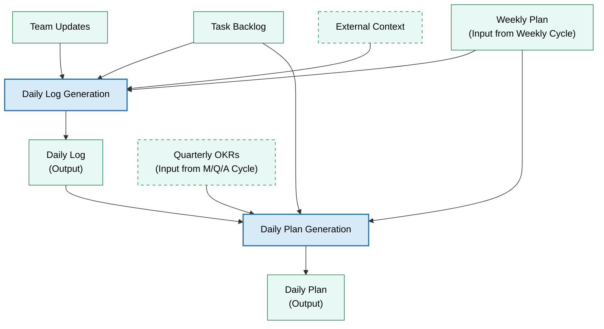
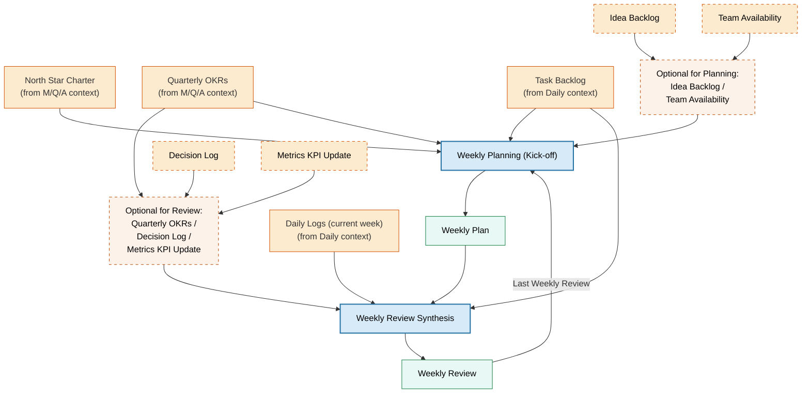
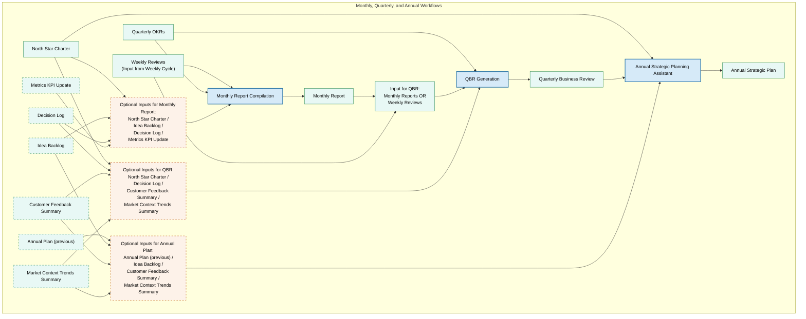
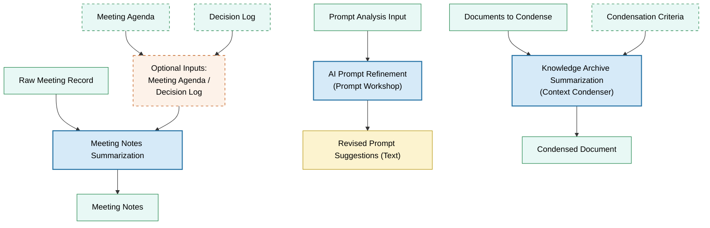

# HORIZON Pitch-to-Training Deck

**Version:** 1.0
**Date:** May 18, 2025
**Author:** Heidemann Consulting
**License:** Apache 2.0

- [HORIZON Pitch-to-Training Deck](#horizon-pitch-to-training-deck)
  - [Slide 1: The Modern Team Challenge](#slide-1-the-modern-team-challenge)
  - [Slide 2: Enter AI Co-Management](#slide-2-enter-ai-co-management)
  - [Slide 3: Introducing the **HORIZON Protocol**](#slide-3-introducing-the-horizon-protocol)
  - [Slide 4: Key Benefits at a Glance](#slide-4-key-benefits-at-a-glance)
  - [Slide 5: High ROI – Only 30 Minutes a Day](#slide-5-high-roi--only-30-minutes-a-day)
  - [Slide 6: How HORIZON Works – Overview](#slide-6-how-horizon-works--overview)
  - [Slide 7: The Knowledge Base – Team Memory](#slide-7-the-knowledge-base--team-memory)
  - [Slide 8: Intelligent Workflows – Your Auto-Pilot](#slide-8-intelligent-workflows--your-auto-pilot)
  - [Slide 9: Team Roles – Everyone Plays a Part](#slide-9-team-roles--everyone-plays-a-part)
  - [Slide 10: Daily \& Weekly Rituals – Rhythm of Execution](#slide-10-daily--weekly-rituals--rhythm-of-execution)
  - [Slide 11: Monthly, Quarterly, Annual – Adapting \& Aligning](#slide-11-monthly-quarterly-annual--adapting--aligning)
  - [Slide 12: Getting Started – Setting Up HORIZON](#slide-12-getting-started--setting-up-horizon)
  - [Slide 13: Best Practices for Smooth Sailing](#slide-13-best-practices-for-smooth-sailing)
  - [Slide 14: FAQ – Making HORIZON Yours](#slide-14-faq--making-horizon-yours)
  - [Slide 15: Achieve More – Your Team at its Best](#slide-15-achieve-more--your-team-at-its-best)
  - [Overview of the HORIZON Protocol - Daily](#overview-of-the-horizon-protocol---daily)
  - [Overview of the HORIZON Protocol - Weekly](#overview-of-the-horizon-protocol---weekly)
  - [Overview of the HORIZON Protocol - Monthly, Quarterly, Annual](#overview-of-the-horizon-protocol---monthly-quarterly-annual)
  - [Overview of the HORIZON Protocol - Supplemental](#overview-of-the-horizon-protocol---supplemental)
  - [Overview of the HORIZON Protocol - Complete](#overview-of-the-horizon-protocol---complete)

## Slide 1: The Modern Team Challenge

* Teams today juggle **information overload**: project plans, meeting notes, tasks scattered across apps.
* Critical knowledge gets **lost in inboxes or people’s heads**, leading to repeated mistakes and onboarding woes.
* Members spend hours on **status reports, emails, and coordination** instead of creative or strategic work.
* Small teams feel these pains acutely – with limited time, **priorities slip and decisions delay** when the process is chaotic.
  *Image Prompt:* Ultra High Resolution photo of a small office team looking frustrated at a cluttered whiteboard and multiple screens, papers everywhere, symbolizing information overload award-winning, epic composition, ultra detailed. A diverse team of five professionals in business attire, their faces etched with stress as they huddle around a chaotic whiteboard covered in overlapping diagrams, scribbled equations, and red-inked revisions. Multiple 27-inch monitors glow with endless spreadsheets and error messages, their blue light casting cold reflections on the team's weary expressions. Papers litter the wooden conference table, scattered with coffee cups, crumpled reports, and sticky notes in varying stages of illegibility. The office environment features glass walls revealing a dimly lit corridor beyond, while a clock on the wall reads 3:47 AM. Harsh fluorescent lighting hums overhead, casting stark shadows that amplify the tension in the room. Nikon D850 camera with 16-35mm wide-angle lens at f/8 aperture, ISO 100, 1/125s shutter speed capturing every detail of the disarray. The mood is oppressive and tense, with the artful composition emphasizing the overwhelming scale of the information chaos through dynamic angles and contrasting light sources.

## Slide 2: Enter AI Co-Management

* Imagine having a **24/7 intelligent assistant** on the team – not just a tool, but a team member handling routine drudgery.
* This AI tracks your team’s memory: it **remembers decisions, tasks, and insights** so you don’t have to.
* It helps plan each day, **summarize meetings, draft documents**, and even flags if you’re off-course.
* AI co-management frees humans to do what they do best: innovate, connect, and make judgment calls.
  *Image Prompt:* Ultra High Resolution Photo of a diverse team of professionals seated around a sleek, modern conference table in a sunlit, high-tech meeting room filled with glass walls showcasing a city skyline and digital displays, the central figure of a glowing holographic AI assistant hovering above the table with intricate light patterns and data streams, the team members in tailored business attire engaged in collaborative discussion with animated expressions, the room featuring minimalist furniture, ambient LED lighting casting soft shadows, the hologram's ethereal blue and white light reflecting on polished surfaces, the atmosphere charged with innovation and teamwork, award-winning, epic composition, ultra detailed

## Slide 3: Introducing the **HORIZON Protocol**

* **HORIZON** is a next-generation workflow that fuses AI into your daily operations seamlessly.
* Designed for teams of 1–9, it’s **lightweight but powerful** – no heavy software or complex setup.
* Runs on a local LLM AI model (via Ollama), meaning **fast, private, and always available** – your data stays secure in-house.
* It’s a structured process: using **templates, automated workflows, and regular rituals** to keep everything on track with minimal effort.
  *Image Prompt:* Ultra High Resolution photo of a sunrise over an abstract horizon line made of digital data streams and binary code, award-winning, epic composition, ultra detailed. A 20-year-old female tech visionary in a sleek white lab coat stands at the edge of a futuristic cityscape, her silhouette backlit by golden hour rays piercing through fractal-shaped clouds. The horizon merges into a cascading waterfall of glowing binary code (0s and 1s) that morphs into neural network patterns, while data streams ripple across the sky like liquid light. The scene captures the moment when the sun's rays touch the binary horizon, creating prismatic reflections on the glassy surface of a nearby AI collaboration hub. The atmosphere blends warm amber tones with cool digital blues, highlighting the synergy between nature and technology. Nikon D850 camera, 24-70mm f/2.8 lens, ISO 100, 1/200s shutter speed, f/16 depth of field, vibrant color style with hyper-realistic textures. The mood is hopeful innovation, with dynamic light beams intersecting the binary horizon and subtle shadows from the tech infrastructure. The composition features a modern professional aesthetic with sleek architectural elements and glowing data pathways. epic composition, ultra detailed

## Slide 4: Key Benefits at a Glance

* **Strategic Memory:** Never lose important knowledge – team vision, notes, and decisions are captured and reused effortlessly.
* **Augmented Capacity:** The AI acts as a multiplier, **handling tasks** (summaries, first drafts, analyses) that would normally consume human hours.
* **Workflow Automation:** Routine processes (daily planning, weekly reporting, etc.) are partly or fully automated – **“build once, benefit daily.”**
* **Content Consistency:** Templates ensure every output (emails, plans, docs) follows your **brand voice and standards**, no more ad-hoc formatting.
* **Decision Support:** The AI cross-references your goals and data to provide **well-informed options and insights** for faster, better decisions.
  *Image Prompt:* Ultra High Resolution photo of a futuristic modern office workspace featuring a striking collage-style arrangement of five towering glass-and-steel pillars, award-winning, epic composition, ultra detailed. The scene showcases a 20-year-old female tech entrepreneur in a sleek black blazer standing amidst the pillars, each radiating symbolic icons: a glowing neural network brain representing memory, a supersonic rocket with fiery exhaust denoting performance, a complex gear system symbolizing workflow, a floating digital document with dynamic text streams for content, and a luminous compass needle pointing towards a holographic dashboard for decision-making. The modern office environment includes floor-to-ceiling glass walls revealing a city skyline at golden hour, polished concrete floors with minimalist furniture, and ambient LED lighting casting soft shadows. The composition balances geometric precision with organic flow, highlighting the interplay of light on the pillars' reflective surfaces. Shot with a Nikon D850 camera using a 16-35mm wide-angle lens at f/8.0, ISO 100, 1/500s shutter speed, capturing the vibrant yet professional mood through sharp details and warm golden-hour hues. The artistic influence of photographer Steve McCurry's vivid storytelling combined with the architectural precision of I. M. Pei's modernist designs.

## Slide 5: High ROI – Only 30 Minutes a Day

* **Minimal time, Maximum output:** Each team member spends ≤30 min/day interacting with HORIZON, but saves much more time in return.
* Example: A daily AI-generated summary + plan (10 min review) can replace an hour of unguided morning email catch-up and coordination.
* By week’s end, the team has comprehensive reports and plans with only ~3 hours total invested – **instead of 8–10 hours if done manually**.
* This reclaimed time can go into creative work, strategic thinking, or just ending the day on time. It’s like adding a super-efficient team member who works for “free.”
* **Outcome:** Less burnout, more focus on high-value tasks, and a feeling that the week is under control, not controlling you.
  *Image Prompt:* Ultra High Resolution photo of a sleek modern office desk with a minimalist design, featuring a retro-style analog clock displaying 0:30 on a polished walnut surface, next to a neatly stacked pile of white paper reports with faint ink markings, implying productivity and efficiency, team members in casual business attire lounging in the background near a floor-to-ceiling glass wall showcasing a city skyline at golden hour, soft natural light filtering through sheer curtains casting gentle shadows across the desk's metallic pen holder and glass water goblet, Nikon D850 camera with 35mm f/1.4 lens, ISO 100, 1/200s shutter speed, f/8 aperture for sharp focus, natural color style with warm tonal balance, capturing the serene confidence of a well-organized workspace, award-winning, epic composition, ultra detailed

## Slide 6: How HORIZON Works – Overview

* **Knowledge Base:** Central documents (vision, goals, backlog, etc.) store your team’s knowledge in TIP. This is the AI’s brain – it draws context from here.
* **Templates:** Pre-defined Markdown templates ensure every document (daily log, plan, review, etc.) has a consistent, easy-to-read format.
* **AI Workflows:** Automated processes use the local LLM to combine info and generate outputs (e.g., daily plan) following these templates.
* **Human-in-the-Loop:** Team members trigger workflows and lightly edit/approve outputs. AI does the heavy lifting, humans give the final OK.
* **Continuous Loop:** Each day’s docs feed into weekly summaries, which feed into monthly reports... creating an ongoing loop of learning and context.
  *Image Prompt:* Ultra High Resolution Infographic of a dynamic knowledge transformation cycle, award-winning, epic composition, ultra detailed. A sleek, modern digital workspace features a circular flowchart with four key stages: Knowledge Base (stacked data servers and digital archives), AI Workflow (neural network nodes and algorithmic processes), Output Document (editable text panels and visual reports), and Feedback Loop (interactive dashboards and analytics). Team members in business attire collaborate with glowing AI icons (circuit board avatars and holographic assistants) at each interaction point. Vibrant neon-blue data streams connect the stages, while floating 3D graphs, code snippets, and AI-generated visuals populate the background. The scene blends futuristic tech elements with clean corporate design, featuring minimalist typography, glowing touchscreens, and transparent data panels. Bright, clinical lighting highlights the seamless integration of human expertise and artificial intelligence, with a sleek vector art style and bold geometric shapes. The mood is professional yet innovative, emphasizing synergy between human teams and AI systems through precise technical illustrations and fluid motion lines.

## Slide 7: The Knowledge Base – Team Memory

* **North Star Charter:** Captures mission, vision, values, strategy pillars – the guiding light for all AI outputs to align with.
* **Quarterly OKRs:** Your goals and targets – the AI references these to prioritize tasks and measure progress.
* **Task Backlog:** A dynamic list of tasks/user stories – updated by the team, consumed by the AI for planning.
* **Logs & Records:** Daily Logs, Decision Log, Meeting Notes – a running history that the AI mines for context (so nothing is forgotten).
* **Single Source of Truth:** All in TIP, version-controlled. When someone updates a doc, the AI instantly has the latest info next run.
* *Result:* The team no longer has to remember “what was decided last month?” or “where’s the design doc?” – HORIZON surfaces it when needed.
  *Image Prompt:* Ultra High Resolution photo of organized binders and files on a sleek modern office shelf labeled Mission, Goals, Tasks, Decisions in an office, award-winning, epic composition, ultra detailed. A meticulously arranged collection of leather-bound folders and crisp manila files with gold-embossed labels resting on a minimalist brushed stainless-steel shelf against a wall of floor-to-ceiling glass windows revealing a city skyline. The 20-year-old female office manager in a tailored navy blazer stands beside the shelf, her reflection visible in the glass, while a glowing digital brain overlay hovers above the files with pulsating neon-blue neural pathways and floating data clusters representing AI memory. The scene features soft natural daylight filtering through the windows casting subtle shadows across the polished wooden floor, with a sleek ergonomic desk and vintage rotary phone completing the professional workspace. Nikon D850 camera, 50mm f/1.8 lens, ISO 100 1/200s shutter speed f/8 aperture, natural color style with vibrant digital highlights, photographed by a modern tech photography influencer, professional yet futuristic mood, intricate textures of leather folders and metallic shelf surfaces, ethereal glow of the digital brain with light refractions in the glass, dynamic interplay between traditional office elements and cutting-edge AI visualization, epic composition with the shelf as central focal point, ultra detailed

## Slide 8: Intelligent Workflows – Your Auto-Pilot

* **Daily Log Workflow:** Every morning, AI compiles yesterday’s achievements and today’s context into a brief summary – no more starting the day blind.
* **Daily Plan Workflow:** AI suggests the day’s top priorities and schedule based on backlog and goals – you confirm or tweak and go execute.
* **Weekly Review Workflow:** On Friday, AI produces a recap of wins, challenges, and metrics – the team reviews lessons and heads into Monday prepared.
* **Monthly/Quarterly Reports:** AI aggregates weeks of data into strategic insights – great for management updates or planning next steps.
* **Ad-hoc workflows:** Need meeting minutes written up? A decision analyzed? The AI can do that too with appropriate templates.
* *Think of these as automated “plays” – you call the play, the AI runs it, you get the result with minimal effort.*
  *Image Prompt:* Ultra High Resolution Photo of a meticulously detailed modern computer screen displaying an intricate flowchart pipeline diagram, award-winning, epic composition, ultra detailed. A sleek 15-inch OLED laptop screen reflects soft ambient lighting, showcasing a digital workflow diagram with interconnected boxes labeled "Daily Plan," "Weekly Review," "Automated Tasks," "Data Sync," and "Report Generation" in clean sans-serif typography. The diagram features smooth gradient transitions between nodes, with glowing blue arrows indicating data flow. A realistic human hand approaches the mouse, index finger poised just above the "Run" button labeled in bold white text on a dark interface panel. The hand exhibits lifelike skin texture, subtle knuckle shadows, and a minimalist silver ring. The background reveals a clutter-free modern workspace with a glass desk, ergonomic keyboard, and a faint reflection of a neon "AI" logo on the screen. Nikon D850 camera with 50mm f/1.4 lens, ISO 100, 1/250s shutter speed, f/8 aperture for sharp focus on the screen and hand. Natural daylight streaming through a nearby window casts soft shadows on the desk. The mood radiates professional efficiency, with hyper-realistic textures of the screen's glossy surface, the hand's skin pores, and the keyboard's backlighting. The composition emphasizes the symbiotic relationship between human interaction and automated systems, with the "Run" button glowing faintly as if activating the workflow.

## Slide 9: Team Roles – Everyone Plays a Part

* **Navigator (rotating):** The day’s driver of HORIZON – kicks off workflows, feeds AI any needed info, and checks outputs. This role rotates so everyone gains skill and no one is overburdened.
* **Contributors:** All team members contribute updates – e.g., each person gives a quick status for the Daily Log or provides feedback on AI drafts. HORIZON is collaborative.
* **Metrics Steward (rotating):** Ensures key numbers (sales figures, user metrics) are up-to-date for the AI to include in reports. A small weekly duty, rotated among team analysts or leads.
* **Editor-in-Chief (rotating):** Final set of eyes for weekly/monthly outputs – polishes wording, ensures tone and quality, and helps maintain template consistency by feeding improvements back.
* *By dividing and rotating these roles, the load is light and knowledge of the system spreads across the team (no single point of failure). Plus, it’s kind of fun to take turns “driving” the AI!*
  *Image Prompt:* Ultra High Resolution photo of a team of male and female engineers in a collaborative meeting, award-winning, epic composition, ultra detailed. A group of 6 individuals from varied cultural backgrounds gathered around a sleek modern conference table, each wearing a name tag featuring distinct symbolic icons: a polished navigator compass, a detailed contributor gear, a dynamic metrics graph, and an elegant editor pen. The subjects radiate genuine warmth with confident smiles and engaged body language, hands resting on the table as they lean forward in conversation. The high-tech meeting room features floor-to-ceiling windows letting in soft natural light that highlights the intricate details of their professional attire and the reflective surface of the table. A large digital whiteboard in the background displays evolving project concepts, while laptops and notepads add layers of authenticity. Nikon D850 camera with 50mm f/1.4 lens, ISO 100, 1/200s shutter speed, f/2.8 aperture, natural color style reminiscent of Steve McCurry's vibrant human-centric photography. The scene exudes a professional yet approachable mood, with subtle shadows under the table and soft glows from ambient lighting creating depth. The icons on the name tags are rendered in metallic finishes with subtle engravings, while the participants' expressions capture genuine camaraderie and intellectual synergy. epic composition, ultra detailed.

## Slide 10: Daily & Weekly Rituals – Rhythm of Execution

* **Morning Stand-up (daily, ~10 min):** Team shares what’s done & what’s next. The Navigator then has AI generate Daily Log + Plan – everyone leaves with a clear game plan by 9:30 AM.
* **Throughout the Day:** Team members update the Task Backlog as they progress. If something big happens (decision, blocker), just jot it down – it’ll flow into tomorrow’s log or weekly review.
* **Weekly Kick-off (Monday, ~20 min):** Review the AI-drafted Weekly Plan outlining goals/tasks for the week. Align on who’s doing what. This sets focus and helps resist random mid-week detours.
* **Weekly Review (Friday, ~15 min):** Quick retrospective using AI’s summary. Celebrate wins, note challenges. Team discusses any adjustments for next week while it’s fresh. Then, unplug for the weekend knowing nothing is lost.
* **Consistency is key:** These checkpoints become a heartbeat that keeps the team synchronized. The AI ensures documentation is ready at each beat, the team ensures the insights are acted on.
  *Image Prompt:* Ultra High Resolution Photo of a meticulously organized office wall calendar featuring a grid of Daily and Weekly recurring meetings marked with handwritten notes, checkmarks, and colored sticky notes, with a team of five professionals in business attire gathered for a Monday morning stand-up meeting around a sleek conference table, a large monitor displaying a detailed project plan with Gantt charts and task timelines, the scene bathed in natural daylight filtering through floor-to-ceiling windows casting soft shadows across modern office furniture, the calendar's textured paper surface and the team's focused expressions captured in razor-sharp detail, the composition emphasizing the synergy between physical planning tools and digital project management, award-winning, epic composition, ultra detailed

## Slide 11: Monthly, Quarterly, Annual – Adapting & Aligning

* **Monthly Review (end of month):** The AI provides a higher-level report: how are we tracking toward quarterly goals? Any trend emerging? A short team huddle can solidify any course corrections or resource shifts for the new month.
* **Quarterly Business Review:** At quarter’s end, a more comprehensive look. The AI-generated QBR doc surfaces overall performance, objective outcomes, and lessons. The team (and perhaps stakeholders) meet to strategize for the next quarter. This often feeds into updating the North Star Charter or setting the next OKRs – aligning strategy to reality.
* **Annual Planning:** Using QBRs and stored knowledge, the AI helps draft an annual strategic plan. In an annual retreat, leadership refines vision, sets big yearly objectives, and allocates budgets. HORIZON ensures all the rich context of the year is at their fingertips during this big-picture thinking.
* **Continuous Alignment:** These longer-term rituals prevent strategic drift. Because the AI keeps history, each review builds on real data and documented decisions. The team is always moving forward with context, not starting from scratch each quarter or year.
  *Image Prompt:* Ultra High Resolution ultrarealistic image of a high-end corporate conference room featuring a sleek black glass wall-mounted display showcasing dynamic data charts and an animated yearly timeline in vibrant blue and silver hues. A team of five executives in tailored charcoal-gray suits stand around a polished mahogany conference table, their sharp creases and professional postures emphasizing the quarterly review meeting's gravity. The room's floor-to-ceiling windows frame a city skyline bathed in golden-hour sunlight, casting soft shadows across modern ergonomic chairs and a whiteboard filled with strategic notes. A large digital clock above the table displays 10:17 AM, while a projector in the ceiling casts a faint glow on the back wall. The scene captures intense yet composed body language - one executive points at the timeline, another reviews a tablet, and three others lean forward with focused expressions. Nikon D850 camera with 24-70mm f/2.8 lens, ISO 100, 1/250s shutter speed, f/8 aperture, natural color grading with enhanced contrast. Award-winning, epic composition, ultra detailed.

## Slide 12: Getting Started – Setting Up HORIZON

* **Import Templates:** Load the provided HORIZON templates into your TIP workspace. These cover all document types you’ll need.
* **Create Core Docs:** Draft your North Star Charter (mission, values, strategy) and list current quarter OKRs, backlog tasks, etc. Don’t worry about perfection – even a rough draft gives the AI something to work with.
* **Configure Workflows:** In TIP’s workflow manager, set up the HORIZON processes (Daily Log, Plan, Weekly, etc.) per instructions. It’s mostly selecting which docs go in and which come out, using the templates.
* **Assign Roles & Schedule:** Decide who will be Navigator on Day 1, who keeps an eye on metrics, etc. Put the daily stand-up and weekly meetings on everyone’s calendar with clear times.
* **Trial Run:** Do a “practice day”. For example, run the Daily Log workflow using yesterday’s info to see the output, and adjust any prompt if needed (maybe you want a different tone – tweak the template). This dry run helps the team trust the system when it goes live.
* **Onboard the Team:** Walk everyone through the process (could even use these slides!). Address concerns and emphasize that it’s okay to make adjustments – HORIZON will adapt with you.
  *Image Prompt:* Ultra High Resolution Photo of a diverse team of five professionals gathered around a sleek, minimalist glass-top conference table in a sunlit, high-tech modern workspace. The scene captures a moment of collaborative excitement as one team member, a young woman in a tailored navy blazer, leans forward with an eager expression, her finger pointed toward a glowing 32-inch dual-monitor setup displaying a dynamic software interface filled with clean code and interactive design elements. The other team members—three men and one woman—surround the table, their faces lit with focused energy as they review laptops open to project management dashboards, gesture toward digital schematics, and type rapidly on mechanical keyboards. The workspace features floor-to-ceiling windows revealing a city skyline, a floating LED ceiling grid casting cool white light, and modular acoustic panels in muted gray tones. The table is cluttered with wireless mice, espresso cups, and a single potted succulent. The atmosphere radiates innovation and camaraderie, with subtle reflections of the team members' faces shimmering on the glass surface. Award-winning, epic composition, ultra detailed.

## Slide 13: Best Practices for Smooth Sailing

* **Keep Info Updated:** Treat the knowledge base as living documents. A quick update today saves the AI (and everyone) from bad info tomorrow. If you close a task or decide something, log it.
* **Review AI Outputs, then Trust Them:** Always give outputs a quick sanity check, but over time you’ll find they’re mostly on point. Rely on them to avoid rework – edit a bit rather than writing from scratch.
* **Be Specific with AI Instructions:** If you need something nuanced, don’t hesitate to tweak a prompt or add a one-liner note for the AI (e.g., “Client X is very important, highlight their project in the report”). The local LLM is good, but clarity helps it shine.
* **Timebox and Iterate:** Set a limit (say 5 min) for editing an AI-generated doc. If it’s not perfect by then, save it and move on – you can refine in the next cycle. It’s better to have a “good enough” version now than a perfect version too late.
* **Continuously Improve:** Make the Prompt Workshop a regular habit (bi-weekly or monthly). Little tweaks to templates or workflows (like adding an example, or a new rule) can gradually boost quality and team satisfaction. It’s like sharpening the axe.
* **Stay Open to Feedback:** Encourage team members to speak up if something feels off – maybe a workflow is too frequent or a template section isn’t useful. HORIZON is flexible; you can turn knobs to suit your unique team culture.
  *Image Prompt:* Ultra High Resolution photo of a modern workspace featuring a sleek, minimalist office with floor-to-ceiling glass walls bathed in bright natural light from large windows. A vibrant "Do's and Don'ts" poster in bold typography dominates one wall with colorful icons illustrating professional etiquette, while three diverse team members in business attire stand around a glass conference table. Two individuals review a digital tablet with focused expressions as a third gives an enthusiastic thumbs-up, their hands overlapping in a gesture of collaboration. The scene captures polished wooden flooring, ergonomic chairs, and a whiteboard filled with sticky notes, with a coffee machine and potted plants adding subtle warmth. The atmosphere radiates professionalism and camaraderie, with sharp details on the team members' attire, the glossy surface of the table, and the crisp clarity of the poster's graphics. Award-winning, epic composition, ultra detailed.

## Slide 14: FAQ – Making HORIZON Yours

* **“What if the AI says something wrong?”** – Built-in human oversight means you’ll catch it. Fix the output and refine the prompt if needed. Over time, these cases dwindle. The system learns from corrections.
* **“Can we modify the templates?”** – Absolutely! They’re a starting point. Add your company’s sections (e.g., a safety tip of the day), or change wording to fit your lingo. Just keep the structure clear for the AI.
* **“Do we have to use every part of HORIZON?”** – Not at all. Start with the pieces that solve your biggest pain. Maybe that’s just daily planning and weekly recaps. You can always add the rest later once you’re comfortable.
* **“Is our data safe?”** – Yes, everything runs locally in your environment. The AI isn’t calling external APIs. Plus, TIP’s versioning means you have an audit trail of changes.
* **“What if we already use Tool X?”** – HORIZON can complement existing tools. For instance, if you use JIRA for tasks, you might still use HORIZON for higher-level planning and let the AI read summaries from JIRA exports. It’s flexible – integrate where it makes sense, but many teams find they rely less on other tools as HORIZON covers their needs in one place.
* In short: **make it work for you.** HORIZON is a framework, not a rigid mandate. Experiment and tailor it to amplify your team’s strengths and workflows.
  *Image Prompt:* Ultra High Resolution ultrarealistic image of two colleagues in a modern corporate meeting room, a 35-year-old male in a tailored navy suit with furrowed brow and furrowed eyebrows expressing deep contemplation as he leans forward with one hand resting on the conference table, while a 30-year-old female in a crisp white blouse and charcoal pants gestures animatedly with a marker in her hand, her face lit with a warm, confident smile as she points toward a large whiteboard covered in handwritten question marks, lightbulb icons, and flowchart diagrams, the scene bathed in soft natural daylight streaming through floor-to-ceiling windows revealing subtle dust particles in the air, sleek black leather chairs arranged around a polished mahogany table, a laptop open to a presentation slide with graphs and charts, the whiteboard's fluorescent lights casting faint reflections on the polished floor, 85mm lens with f/2.8 aperture for shallow depth of field, ISO 100, 1/250s shutter speed, award-winning, epic composition, ultra detailed

## Slide 15: Achieve More – Your Team at its Best

* With HORIZON Protocol, your small team can **punch above its weight** – working smarter, not harder.
* No more scrambling for status updates or forgetting important follow-ups: the AI co-manager has it covered.
* Expect to see **clearer communication, faster decisions, and a calmer, more controlled workflow** day-to-day.
* The ultimate goal: **free your humans to be human** – creative, strategic, empathetic – while the AI takes care of the grind and the memory.
* As you adopt HORIZON, you’re not just implementing a tool, you’re embracing a culture of continuous improvement and collaboration with AI.
* **Welcome to the future of teamwork** – where your team’s potential extends far beyond the horizon.
  *Image Prompt:* Ultra High Resolution photorealistic image of a team of five professionals in tailored business attire, their faces lit with confident smiles and triumphant expressions, standing together in a modern office space positioned in front of a towering floor-to-ceiling window that frames a breathtaking sunrise cityscape, where the golden hues of dawn illuminate the skyline with vibrant colors, subtle technological elements such as sleek tablets hovering in mid-air and translucent holographic displays casting soft blue light around the group, the atmosphere radiates success, optimism, and a promising future, with the warm sunrise symbolizing new beginnings, shot with a Nikon D850 camera using a 24-70mm f/2.8 lens at 1/200s shutter speed, ISO 100, and f/8 aperture, capturing the scene in natural yet vibrant colors, emulating the dynamic compositions and emotional storytelling of photographer Steve McCurry, award-winning, epic composition, ultra detailed

## Overview of the HORIZON Protocol - Daily

Here is a Mermaid.js diagram showing the daily process, its documents and workflows and relations:

## Overview of the HORIZON Protocol - Weekly

Here is a Mermaid.js diagram showing the weekly process, its documents and workflows and relations:

## Overview of the HORIZON Protocol - Monthly, Quarterly, Annual

Here is a Mermaid.js diagram showing the monthly, quartly and annual processes, their documents and workflows and relations:

## Overview of the HORIZON Protocol - Supplemental

Here is a Mermaid.js diagram showing the supplemental processes, their documents and workflows and relations:

## Overview of the HORIZON Protocol - Complete

Here is a Mermaid.js diagram showing the whole process, its documents and workflows and relations:

```mermaid
graph TD
    %% Define styles
    classDef workflow fill:#D6EAF8,stroke:#2874A6,stroke-width:2px,color:#000;
    classDef document fill:#E8F8F5,stroke:#1E8449,stroke-width:1px,color:#000;
    classDef optionalDocument fill:#E8F8F5,stroke:#1E8449,stroke-width:1px,stroke-dasharray: 5 5,color:#000;
    classDef bundle fill:#FDF2E9,stroke:#BA4A00,stroke-width:1px,color:#000;
    classDef optionalBundle fill:#FDF2E9,stroke:#BA4A00,stroke-width:1px,stroke-dasharray: 5 5,color:#000;
    classDef textOutput fill:#FCF3CF,stroke:#B7950B,stroke-width:1px,color:#000;

    %% Document Definitions (to be reused across subgraphs)
    Doc_TeamUpdates["Team Updates"]:::document
    Doc_TaskBacklog["Task Backlog"]:::document
    Doc_ExternalContext["External Context"]:::optionalDocument
    Doc_DailyLog["Daily Log"]:::document
    Doc_DailyPlan["Daily Plan"]:::document
    Doc_WeeklyPlan["Weekly Plan"]:::document
    Doc_QOKRs["Quarterly OKRs"]:::document
    Doc_NorthStarCharter["North Star Charter"]:::document
    Doc_WeeklyReview["Weekly Review"]:::document
    Doc_IdeaBacklog["Idea Backlog"]:::optionalDocument
    Doc_TeamAvailability["Team Availability"]:::optionalDocument
    Doc_DecisionLog["Decision Log"]:::optionalDocument
    Doc_MetricsKPIUpdate["Metrics KPI Update"]:::optionalDocument
    Doc_MonthlyReport["Monthly Report"]:::document
    Doc_CustFeedSum["Customer Feedback Summary"]:::optionalDocument
    Doc_MarketContext["Market Context Trends Summary"]:::optionalDocument
    Doc_AnnualPlanPrev["Annual Plan (previous)"]:::optionalDocument
    Doc_QBR["Quarterly Business Review"]:::document
    Doc_AnnualStrategicPlan["Annual Strategic Plan"]:::document
    Doc_RawMeetingRecord["Raw Meeting Record"]:::document
    Doc_MeetingAgenda["Meeting Agenda"]:::optionalDocument
    Doc_MeetingNotes["Meeting Notes"]:::document
    Doc_PromptAnalysisInput["Prompt Analysis Input"]:::document
    Output_RevisedPromptSuggestions["Revised Prompt Suggestions (Text)"]:::textOutput
    Doc_DocsToCondense["Documents to Condense"]:::document
    Doc_CondensationCriteria["Condensation Criteria"]:::optionalDocument
    Doc_CondensedDocument["Condensed Document"]:::document
    Doc_MonthlyOrWeeklyReports_For_QBR["Input: Monthly Reports OR<br/>Weekly Reviews (for QBR)"]:::document

    subgraph Daily
        direction LR
        W_DLG["Daily Log Generation"]:::workflow
        W_DPG["Daily Plan Generation"]:::workflow

        Doc_TeamUpdates --> W_DLG
        Doc_TaskBacklog --> W_DLG
        Doc_WeeklyPlan --> W_DLG
        Doc_ExternalContext --> W_DLG
        W_DLG --> Doc_DailyLog

        Doc_DailyLog --> W_DPG
        Doc_TaskBacklog --> W_DPG
        Doc_WeeklyPlan --> W_DPG
        Doc_QOKRs --> W_DPG
        W_DPG --> Doc_DailyPlan
    end

    subgraph Weekly
        direction LR
        W_WP["Weekly Planning (Kick-off)"]:::workflow
        W_WRS["Weekly Review Synthesis"]:::workflow

        Bundle_WeeklyPlanning_Opt_Inputs["Optional Inputs:<br/>Idea Backlog /<br/>Team Availability"]:::optionalBundle
        Doc_IdeaBacklog --> Bundle_WeeklyPlanning_Opt_Inputs
        Doc_TeamAvailability --> Bundle_WeeklyPlanning_Opt_Inputs

        Bundle_WeeklyReview_Opt_Inputs["Optional Inputs:<br/>Quarterly OKRs /<br/>Decision Log /<br/>Metrics KPI Update"]:::optionalBundle
        Doc_QOKRs --> Bundle_WeeklyReview_Opt_Inputs
        Doc_DecisionLog --> Bundle_WeeklyReview_Opt_Inputs
        Doc_MetricsKPIUpdate --> Bundle_WeeklyReview_Opt_Inputs

        Doc_NorthStarCharter --> W_WP
        Doc_QOKRs --> W_WP
        Doc_WeeklyReview --> W_WP
        Doc_TaskBacklog --> W_WP
        Bundle_WeeklyPlanning_Opt_Inputs --> W_WP
        W_WP --> Doc_WeeklyPlan

        Doc_WeeklyPlan --> W_WRS
        Doc_DailyLog --> W_WRS
        Doc_TaskBacklog --> W_WRS
        Bundle_WeeklyReview_Opt_Inputs --> W_WRS
        W_WRS --> Doc_WeeklyReview
    end

    subgraph "Monthly/Quarterly/Annual"
        direction LR
        W_MRC["Monthly Report Compilation"]:::workflow
        W_QBRG["QBR Generation"]:::workflow
        W_ASP["Annual Strategic Planning Assistant"]:::workflow

        Bundle_MonthlyReport_Opt_Inputs["Optional Inputs:<br/>North Star Charter /<br/>Idea Backlog /<br/>Decision Log /<br/>Metrics KPI Update"]:::optionalBundle
        Doc_NorthStarCharter --> Bundle_MonthlyReport_Opt_Inputs
        Doc_IdeaBacklog --> Bundle_MonthlyReport_Opt_Inputs
        Doc_DecisionLog --> Bundle_MonthlyReport_Opt_Inputs
        Doc_MetricsKPIUpdate --> Bundle_MonthlyReport_Opt_Inputs

        Bundle_QBR_Opt_Inputs["Optional Inputs:<br/>North Star Charter /<br/>Decision Log /<br/>Customer Feedback Summary /<br/>Market Context Trends Summary"]:::optionalBundle
        Doc_NorthStarCharter --> Bundle_QBR_Opt_Inputs
        Doc_DecisionLog --> Bundle_QBR_Opt_Inputs
        Doc_CustFeedSum --> Bundle_QBR_Opt_Inputs
        Doc_MarketContext --> Bundle_QBR_Opt_Inputs

        Bundle_AnnualPlan_Opt_Inputs["Optional Inputs:<br/>Annual Plan (previous) /<br/>Idea Backlog /<br/>Customer Feedback Summary /<br/>Market Context Trends Summary"]:::optionalBundle
        Doc_AnnualPlanPrev --> Bundle_AnnualPlan_Opt_Inputs
        Doc_IdeaBacklog --> Bundle_AnnualPlan_Opt_Inputs
        Doc_CustFeedSum --> Bundle_AnnualPlan_Opt_Inputs
        Doc_MarketContext --> Bundle_AnnualPlan_Opt_Inputs

        Doc_WeeklyReview --> W_MRC
        Doc_QOKRs --> W_MRC
        Bundle_MonthlyReport_Opt_Inputs --> W_MRC
        W_MRC --> Doc_MonthlyReport

        Doc_QOKRs --> W_QBRG
        Doc_MonthlyOrWeeklyReports_For_QBR --> W_QBRG
        Bundle_QBR_Opt_Inputs --> W_QBRG
        W_QBRG --> Doc_QBR
        Doc_MonthlyReport --> Doc_MonthlyOrWeeklyReports_For_QBR
        Doc_WeeklyReview --> Doc_MonthlyOrWeeklyReports_For_QBR


        Doc_NorthStarCharter --> W_ASP
        Doc_QBR --> W_ASP
        Bundle_AnnualPlan_Opt_Inputs --> W_ASP
        W_ASP --> Doc_AnnualStrategicPlan
    end

    subgraph Supplemental
        direction LR
        W_MNS["Meeting Notes Summarization"]:::workflow
        W_APR["AI Prompt Refinement"]:::workflow
        W_KAS["Knowledge Archive Summarization"]:::workflow

        Bundle_MeetingNotes_Opt_Inputs["Optional Inputs:<br/>Meeting Agenda /<br/>Decision Log"]:::optionalBundle
        Doc_MeetingAgenda --> Bundle_MeetingNotes_Opt_Inputs
        Doc_DecisionLog --> Bundle_MeetingNotes_Opt_Inputs

        Doc_RawMeetingRecord --> W_MNS
        Bundle_MeetingNotes_Opt_Inputs --> W_MNS
        W_MNS --> Doc_MeetingNotes

        Doc_PromptAnalysisInput --> W_APR
        W_APR --> Output_RevisedPromptSuggestions

        Doc_DocsToCondense --> W_KAS
        Doc_CondensationCriteria --> W_KAS
        W_KAS --> Doc_CondensedDocument
    end
```

