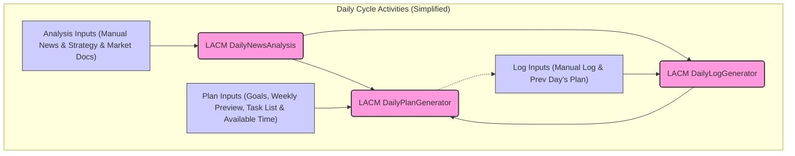
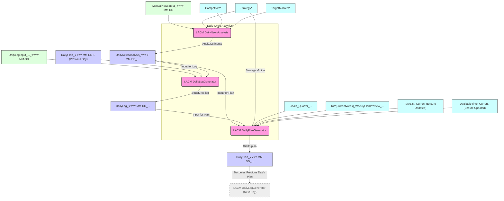
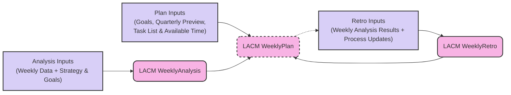
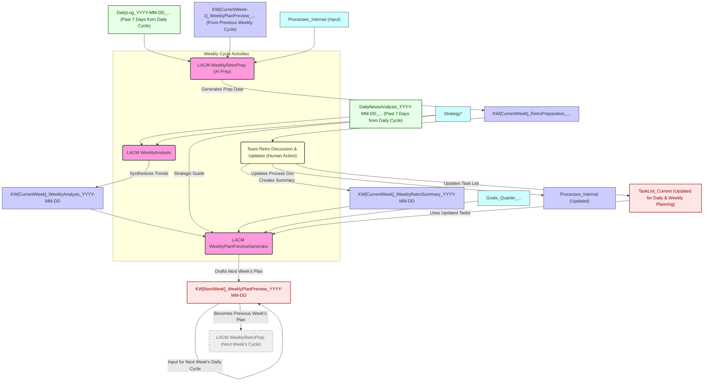
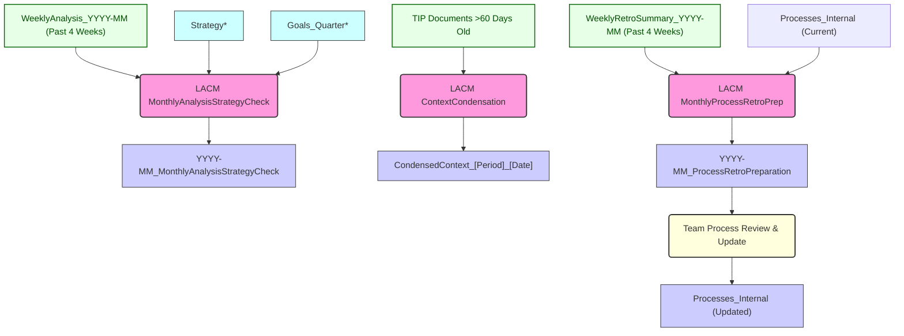
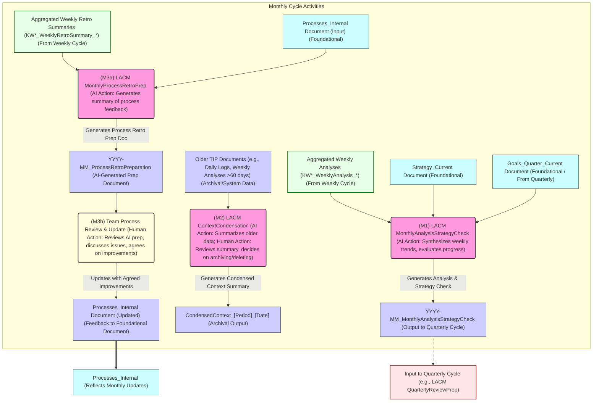
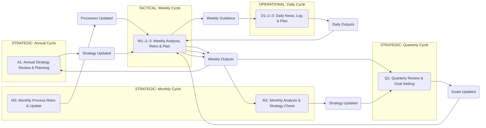
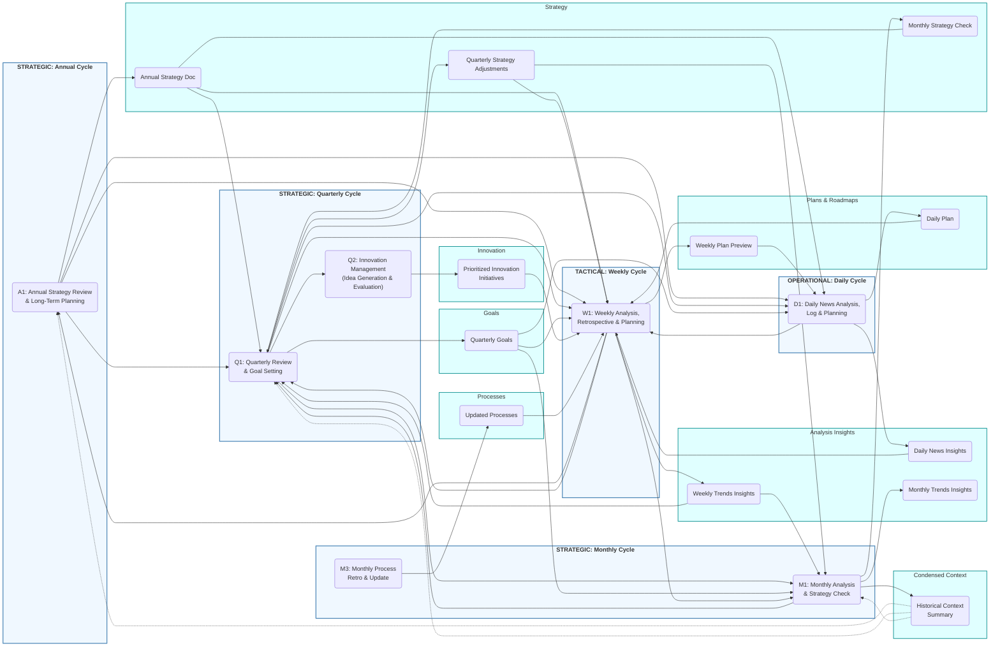

```mermaid
graph TD;
    %% === Foundational/External Document Nodes ===
    FD_Strategy["<b>Strategy Current Document</b><br>(Updated Annually/Quarterly)"];
    FD_Goals["<b>Quarterly Goals Document (OKRs)</b><br>(Updated Quarterly)"];
    FD_Processes["<b>Internal Processes Document</b><br>(Updated Monthly/Weekly)"];
    FD_CompetitorsTM["Competitors & Target Markets Data<br>(External/Foundational)"];
    FD_OtherInputs["Manual Inputs (News, Daily Logs)<br>Available Time, Initial Task List<br>Older Docs, Customer Feedback, etc.<br>(External/Operational)"];

    %% === Inter-Cycle Data Flow Nodes ===
    node_DailyOutputsToWeekly["Output: Aggregated Daily Data<br>(News Analysis, Logs)"];
    node_WeeklyGuidanceToDaily["Feedback/Input: Weekly Guidance<br>(Updated Task List, Weekly Plan Preview)"];
    node_WeeklyOutputsToMQY["Output: Aggregated Weekly Data<br>(Analyses, Retro Summaries)"];

    %% === DAILY CYCLE =======================================================
    subgraph DailyCycle["OPERATIONAL: Daily Cycle"]
        direction LR;
        R_D_NewsAnalysis["(D1) Daily News Analysis"];
        R_D_LogGenerator["(D2) Daily Log Generator"];
        R_D_PlanGenerator["(D3) Daily Plan Generator"];
    end

    %% Inputs to Daily Cycle Rituals
    FD_Strategy-.->R_D_NewsAnalysis;
    FD_Strategy-.->R_D_PlanGenerator;
    FD_CompetitorsTM-->R_D_NewsAnalysis;
    FD_OtherInputs-->|Manual News|R_D_NewsAnalysis;
    FD_OtherInputs-->|Manual Daily Logs|R_D_LogGenerator;
    FD_OtherInputs-->|Available Time, Initial Tasks|R_D_PlanGenerator;
    FD_Goals-.->R_D_PlanGenerator;
    node_WeeklyGuidanceToDaily-->|Feeds Daily Planning|R_D_PlanGenerator;

    %% Outputs from Daily Cycle Rituals
    R_D_NewsAnalysis-->|Daily News Output|node_DailyOutputsToWeekly;
    R_D_LogGenerator-->|Daily Log Output|node_DailyOutputsToWeekly;

    %% === WEEKLY CYCLE ======================================================
    subgraph WeeklyCycle["TACTICAL: Weekly Cycle"]
        direction LR;
        R_W_Analysis["(W1) Weekly Analysis"];
        R_W_Retro["(W2) Weekly Retro & Updates<br>(Incl. Task List & Process Update)"];
        R_W_PlanPreview["(W3) Weekly Plan Preview"];
    end

    %% Connection from Daily to Weekly
    node_DailyOutputsToWeekly===>R_W_Analysis;
    node_DailyOutputsToWeekly===>R_W_Retro;

    %% Other Inputs to Weekly Cycle Rituals
    FD_Strategy-.->R_W_Analysis;
    FD_Strategy-.->R_W_PlanPreview;
    FD_Processes-.->R_W_Retro;
    FD_Goals-.->R_W_PlanPreview;

    %% Outputs from Weekly Cycle Rituals
    R_W_Retro-->|Updated Task List|node_WeeklyGuidanceToDaily;
    R_W_PlanPreview-->|Weekly Plan Preview Doc|node_WeeklyGuidanceToDaily;
    R_W_Analysis-->|Weekly Analysis Output|node_WeeklyOutputsToMQY;
    R_W_Retro-->|Weekly Retro Summary & Process Ideas|node_WeeklyOutputsToMQY;
    R_W_Retro-.->|Updates Processes Directly|FD_Processes;

    %% === MONTHLY / QUARTERLY / YEARLY CYCLE ===============================
    subgraph MQYCycle["STRATEGIC: Monthly / Quarterly / Yearly Cycles"]
        direction TB;
        R_M_AnalysisStrategy["(M1) Monthly Analysis & Strategy Check"];
        R_M_ContextCondense["(M2) Monthly Context Condensation"];
        R_M_ProcessRetro["(M3) Monthly Process Retro & Update"];
        R_Q_ReviewGoals["(Q1) Quarterly Review & Goal Setting (OKRs)"];
        R_Q_Innovation["(Q2) Quarterly Innovation Management"];
        R_A_StrategyPlanning["(A1) Annual Strategy Review & Planning"];
    end

    %% Connection from Weekly to M/Q/Y
    node_WeeklyOutputsToMQY===>R_M_AnalysisStrategy;
    node_WeeklyOutputsToMQY===>R_M_ProcessRetro;
    node_WeeklyOutputsToMQY===>R_Q_ReviewGoals;

    %% Other Inputs to M/Q/Y Cycle Rituals
    FD_Strategy-->R_M_AnalysisStrategy;
    FD_Strategy-->R_Q_ReviewGoals;
    FD_Strategy-->R_Q_Innovation;
    FD_Strategy-->R_A_StrategyPlanning;
    FD_Goals-->R_M_AnalysisStrategy;
    FD_Goals-->R_Q_ReviewGoals;
    FD_Processes-->R_M_ProcessRetro;
    FD_OtherInputs-->|Older Docs for Condensation|R_M_ContextCondense;
    FD_OtherInputs-->|Feedback/Ideas for Innovation|R_Q_Innovation;
    FD_CompetitorsTM-->R_Q_Innovation;

    %% Strategic Feedback Loops updating Foundational Docs
    R_A_StrategyPlanning-->|"Updates Strategy (Annual Feedback Loop)"|FD_Strategy;
    R_Q_ReviewGoals-->|"Sets/Updates Goals (Quarterly Feedback Loop)"|FD_Goals;
    R_M_ProcessRetro-->|"Refines Processes (Monthly Feedback Loop)"|FD_Processes;

    %% === Styling ===
    classDef cycleBlock fill:#f0f8ff,stroke:#4682b4,stroke-width:2px,color:#333,font-weight:bold;
    class DailyCycle,WeeklyCycle,MQYCycle cycleBlock;
    classDef foundationalDoc fill:#fffacd,stroke:#b8860b,stroke-width:2px,color:#333,font-weight:bold;
    class FD_Strategy,FD_Goals,FD_Processes foundationalDoc;
    classDef externalDoc fill:#faf0e6,stroke:#8fbc8f,stroke-width:1.5px,color:#333;
    class FD_CompetitorsTM,FD_OtherInputs externalDoc;
    classDef interCycleDoc fill:#e0ffff,stroke:#008b8b,stroke-width:1.5px,color:#333;
    class node_DailyOutputsToWeekly,node_WeeklyGuidanceToDaily,node_WeeklyOutputsToMQY interCycleDoc;
    classDef ritualInBlock fill:#ffffff,stroke:#b0c4de,stroke-width:1px,color:#333;
    class R_D_NewsAnalysis,R_D_LogGenerator,R_D_PlanGenerator ritualInBlock;
    class R_W_Analysis,R_W_Retro,R_W_PlanPreview ritualInBlock;
    class R_M_AnalysisStrategy,R_M_ContextCondense,R_M_ProcessRetro,R_Q_ReviewGoals,R_Q_Innovation,R_A_StrategyPlanning ritualInBlock;
```

**Slide 1: Title Slide**

* **Title:** Stop Drowning in Data, Start Collaborating with AI: Introducing Lean AI Co-Management (LACM) with TIP
* **Content:**
    * Unlock the practical power of AI in your daily work.
    * Turn information chaos into structured knowledge.
    * Make AI your efficient, reliable co-manager using the Team Intelligence Platform (TIP).
* **Slide 1 Prompt:** Stylized image of a person calmly organizing flowing streams of data with a subtle, helpful AI assistant glow nearby, modern minimalist style, consistent color palette.

---

**Slide 2: The Modern Work Challenge**

* **Title:** 🌪️ Information Overload & Untapped AI Potential
* **Content:**
    * Struggling to keep up with news, emails, reports?
    * Is valuable knowledge lost in chat logs and scattered notes?
    * Using AI tools ad-hoc, but lacking a systematic approach?
    * Wish AI could *proactively* help manage your workflow?
* **Slide 2 Prompt:** Abstract image of a person looking stressed, surrounded by overwhelming, chaotic piles of documents and glowing screens, feeling of information overload, consistent color palette.

---

**Slide 3: Introducing LACM with TIP**

* **Title:** What is Lean AI Co-Management (LACM) in TIP?
* **Content:**
    * LACM is a **Process Framework** implemented using the **Team Intelligence Platform (TIP)** software.
    * It integrates AI (running locally in TIP for privacy) into your daily routines.
    * Builds a **structured, version-controlled knowledge base** within TIP (using simple Markdown files).
    * Focuses on **rapid value**, efficiency, and user control.
    * Think of it as giving your team an AI-powered Chief of Staff within TIP.
* **Slide 3 Prompt:** Minimalist abstract concept art: interconnected nodes representing a human figure, a subtle AI symbol (🤖), and a central stylized knowledge vault (like a glowing book 📚), clean lines showing interaction, consistent color palette.

---

**Slide 4: Core Principles of LACM in TIP**

* **Title:** How LACM in TIP Works: The Foundations
* **Content:**
    * **Collective Context:** AI works from your shared knowledge base in TIP (your notes!).
    * **Explicit AI Roles:** AI performs defined tasks (Analyze, Summarize, Plan Draft) via TIP Workflows.
    * **Integrated Routines:** AI steps are built into daily/weekly cycles within TIP.
    * **Human Evaluation:** YOU review and approve AI outputs in TIP – you're in control.
    * **Continuous Learning:** The system and your use of it improve over time.
    * **Markdown Standard:** Simple text files (`.md`) are the backbone of TIP documents.
* **Slide 4 Prompt:** Abstract image of clean, interconnected gears (⚙️) smoothly meshing together, representing human collaboration with AI and knowledge systems, simple, modern style, consistent color palette.

---

**Slide 5: The LACM Process in TIP: Daily Cycle ☀️**

* **Title:** Your Day, Supercharged: The Daily Cycle in TIP
* **Content:**
    * **AI News Analysis:** Start your day with relevant news, analyzed for *your* context. (AI Role: Analyst 🧐)
    * **AI Context Capture:** Quickly log yesterday's progress & issues; AI structures it. (AI Role: Documenter 📝)
    * **AI Daily Planning:** Get a draft plan for today, aligned with weekly goals & capacity. (AI Role: Planning Assistant 📅)
    * **You:** Review, refine, approve AI outputs within the TIP interface.
    * **Result:** Focused execution, captured knowledge, less morning scramble. (Benefit: ⏱️ Focus)
* **Slide 5 Prompt:** Stylized graphic: a simple daily cycle or clock face with integrated icons representing analysis (magnifying glass 🔍), documentation (stylized note 🗒️), and planning (checklist ✅), flowing smoothly, consistent color palette.

---

**Slide 6: The LACM Process in TIP: Weekly Cycle 🗓️**

* **Title:** Zooming Out: The Weekly Cycle in TIP
* **Content:**
    * **AI Weekly Analysis:** AI summarizes the week's external trends. (AI Role: Synthesizer 🧩)
    * **Team Retro (AI Assist):** AI analyzes daily logs for patterns to inform your weekly review (What went well? What needs improvement?).
    * **AI Weekly Planning:** Get a draft focus plan for *next* week, based on goals & learnings.
    * **You:** Reflect, discuss, improve processes, set weekly priorities.
    * **Result:** Continuous improvement, tactical adjustments, clear weekly focus. (Benefit: 🌱 Clarity)
* **Slide 6 Prompt:** Abstract visualization: a spiral path made of small daily cycle symbols leading upwards towards a larger icon representing review and learning (like an eye 👁️ or a simple graph 📈), consistent color palette.

---

**Slide 7: The LACM Process in TIP: Monthly & Beyond 🔭**

* **Title:** Strategic Alignment: Monthly & Longer Cycles in TIP
* **Content:**
    * **Monthly:** AI summarizes weekly trends, checks alignment with strategy & goals. Helps manage knowledge base size. (AI Roles: Strategy Analyst 📊, Archivar 🗄️)
    * **Quarterly:** Deep dive review, goal setting (OKRs). AI analyzes performance and drafts next quarter's goals. Innovation management.
    * **Annually:** Foundational strategy review and update.
    * **You:** Make key strategic decisions informed by AI analysis within TIP.
    * **Result:** Strategy stays relevant, long-term goals are tracked, knowledge base remains efficient. (Benefit: 🎯 Efficiency)
* **Slide 7 Prompt:** Stylized image: looking through binoculars or telescope towards a distant, clear goal (mountain peak 🏔️ or star ⭐), with a pathway made of smaller weekly cycle symbols leading towards it, consistent color palette.

---

**Slide 8: Why Use LACM with TIP? The Benefits 🏆**

* **Title:** Tangible Benefits, Starting Now
* **Content:**
    * ⏱️ **Save Time:** Automate analysis, summarization, reporting, and planning drafts.
    * 🧠 **Preserve Knowledge:** Stop losing insights; build a searchable, permanent brain in TIP.
    * 📈 **Improve Decisions:** Act on AI-surfaced trends, risks, and opportunities daily & weekly.
    * 🎯 **Increase Focus:** Start each day/week with clear, aligned priorities.
    * ⚙️ **Boost Efficiency:** Streamline workflows and improve processes based on data.
    * 🔒 **Data Privacy:** Uses local AI by default within TIP – your data stays with you.
    * 💰 **Affordable & Lean:** Leverages open-source tools, minimal overhead.
* **Slide 8 Prompt:** Clean graphic displaying simple, positive icons: a clock with speed lines, a glowing brain or book, an upward trending graph arrow, a shield symbol, minimalist style, consistent color palette.

---

**Slide 9: Realizing the Full Potential ✨**

* **Title:** From Assistant to True Co-Manager: The LACM Potential with TIP
* **Content:**
    * Imagine an AI in TIP that deeply understands your context, history, and goals.
    * Proactively surfaces connections and insights you might miss.
    * Helps anticipate challenges and opportunities sooner.
    * Turns your accumulated knowledge in TIP into a strategic advantage.
    * Frees you up for higher-level thinking and action.
    * **This isn't sci-fi – it's the result of consistent LACM practice in TIP.**
* **Slide 9 Prompt:** Futuristic but clean image: a person seamlessly collaborating with an integrated, abstract AI light form, viewing a clear, glowing holographic network of interconnected knowledge, consistent color palette.

---

**Slide 10: What "Done Right" Means ✔️**

* **Title:** Unlocking Potential: How to Do LACM in TIP Right
* **Content:**
    * **Consistency:** Run the cycles regularly – especially daily & weekly. Habit is power.
    * **Honest Input & Review:** Provide good input, *critically* review AI output. Garbage In, Garbage Out applies! You are the quality control.
    * **Curate Your Knowledge:** Actively build and link your Markdown notes in TIP. The richer the context, the better the AI performs.
    * **Embrace Iteration:** Don't expect perfection on day one. Refine documents, processes, (and TIP Workflow prompts via Admin) as you go. Continuous learning is key.
    * **Commit Changes:** Use TIP's "Save" functionality – this creates new versions of your documents and builds the history.
* **Slide 10 Prompt:** Metaphorical image: a person carefully tending a well-organized, thriving digital garden (🌳) representing knowledge, tools like a watering can (consistency💧) and magnifying glass (review 🔎) nearby, clean, positive style, consistent color palette.

---

**Slide 11: Your Return on Investment ⚖️**

* **Title:** Why Invest ~30 Mins a Day in LACM with TIP? The ROI.
* **Content:**
    * **Time Saved > Time Spent:** Automating routine tasks frees up hours per week.
    * **Cost of Lost Knowledge Avoided:** What's the value of *not* forgetting key decisions or insights?
    * **Value of Better Decisions:** Faster identification of trends/risks leads to better outcomes.
    * **Reduced Friction & Stress:** Less searching, more finding. Less reacting, more proactive planning.
    * **Future-Proofing:** Builds skills & systems for effective AI collaboration.
    * **LACM with TIP isn't just another tool – it's a system for thinking and operating more effectively with AI as your partner.**
* **Slide 11 Prompt:** Simple graphic: a balance scale with minimal effort symbol on one side clearly outweighed by multiple positive outcome symbols (upward arrows 📈, growing plant 🌱) on the other side, consistent color palette.

---

**Slide 12: Call to Action 🚀**

* **Title:** Ready to Make AI Your Co-Manager with TIP?
* **Content:**
    * Start today by setting up your initial documents in TIP (see next slide!).
    * Commit to the daily and weekly cycles.
    * Experience the power of structured AI collaboration.
    * **Take control of your information, empower your decisions.**
    * **Let's begin your LACM journey in TIP!**
* **Slide 12 Prompt:** Inviting image: an open doorway (🚪) revealing a pathway leading towards a bright, organized, efficient future landscape, welcoming perspective, consistent color palette.

---

**Slide 13: Initial Setup: Your Foundation in TIP 🏗️**

* **Title:** Setting Up For Success: Initial Documents in TIP
* **Content:**
    * Before starting, create these foundational documents in TIP using the available Admin-created Templates:
        * `Strategy_Current` (using `LACM Strategy` Template)
        * `Competitors_Current` (using `LACM Competitors` Template)
        * `TargetMarkets_Current` (using `LACM TargetMarkets` Template)
        * `Goals_Q[CurrentQuarter]_[CurrentYear]` (using `LACM QuarterlyGoals` Template)
        * `KW[CurrentWeek]_WeeklyPlanPreview_InitialSetup` (using `LACM WeeklyPlanPreview_Initial` Template)
        * `TaskList_Current` (using `LACM TaskList` Template)
        * `AvailableTime_Current` (using `LACM AvailableTime` Template)
        * `Processes_Internal` (using `LACM Processes` Template)
    * These documents provide the essential context for your team and TIP's AI Workflows.
* **Slide 13 Prompt:** Image of a checklist (📋) with document icons (📄), symbolizing the initial setup phase, clean and organized, consistent color palette.

---

**Slide 14: Daily Ritual ☀️: News & Environment Analysis**

* **Title:** Daily Pulse: AI-Assisted News & Environment Analysis
* **Content:**
    * 👤 **Your Action:** Manually research and log news/updates into `ManualNewsInput_YYYY-MM-DD` (using `LACM ManualNewsInput` Template).
    * ⚙️ **TIP Workflow:** Run `LACM DailyNewsAnalysis`.
        * **Input Docs:** Your `ManualNewsInput_YYYY-MM-DD`, `Strategy_Current`, `Competitors_Current`, `TargetMarkets_Current`.
        * 🤖 **AI Action:** Analyzes inputs against your strategic context.
    * 📄 **Output Doc:** `DailyNewsAnalysis_YYYY-MM-DD_...` (AI-generated, reviewed by you).
    * 🌟 **Value:** Early awareness of opportunities/threats; external context for daily decisions. (Benefit: 💡 Decisions)
* **Slide 14 Prompt:** Icon of a magnifying glass (🔍) over a news feed (📰), with an AI gleam, symbolizing focused analysis, consistent color palette.

---

**Slide 15: Daily Ritual ☀️: Review & Context Capture**

* **Title:** Daily Download: AI-Assisted Review & Context Capture
* **Content:**
    * 👤 **Your Action:** Team reflects and logs progress/issues into `DailyLogInput_..._YYYY-MM-DD` (using `LACM DailyLogInput` Template).
    * ⚙️ **TIP Workflow:** Run `LACM DailyLogGenerator`.
        * **Input Docs:** Your `DailyLogInput_..._YYYY-MM-DD`, previous day's `DailyPlan_YYYY-MM-DD-1`, today's `DailyNewsAnalysis_YYYY-MM-DD_...`.
        * 🤖 **AI Action:** Structures inputs into a draft daily log.
    * 📄 **Output Doc:** `DailyLog_YYYY-MM-DD_...` (AI-drafted, reviewed and saved by you).
    * 🌟 **Value:** Captures vital operational context, records progress/issues, documents learnings. (Benefit: 🧠 Knowledge)
* **Slide 15 Prompt:** Stylized icon of a notebook or journal (📓) with an AI symbol, representing structured logging, consistent color palette.

---

**Slide 16: Daily Ritual ☀️: Daily Planning**

* **Title:** Daily Roadmap: AI-Powered Daily Planning
* **Content:**
    * 👤 **Your Action:** Ensure `AvailableTime_Current` (from `LACM AvailableTime` Template) & `TaskList_Current` (from `LACM TaskList` Template) are updated.
    * ⚙️ **TIP Workflow:** Run `LACM DailyPlanGenerator`.
        * **Input Docs:** Daily context (today's `DailyLog_...` & `DailyNewsAnalysis_...`), strategic guides (`Strategy_Current`, `Goals_Quarter_...`, `KW[CurrentWeek]_WeeklyPlanPreview_...`), resource docs (`TaskList_Current`, `AvailableTime_Current`).
        * 🤖 **AI Action:** Analyzes inputs, prioritizes tasks, and drafts a daily plan.
    * 📄 **Output Doc:** `DailyPlan_YYYY-MM-DD_...` (AI-drafted, reviewed and saved by you).
    * 🌟 **Value:** Clear, prioritized, achievable plan for the day, aligned with larger goals. (Benefit: 🎯 Focus)
* **Slide 16 Prompt:** A simple checklist or planner icon (🗓️) with an AI spark (✨), indicating intelligent task prioritization, consistent color palette.

---

**Slide 17: Daily Practice ✍️: Continuous Documentation**

* **Title:** Living Knowledge: Continuous Documentation in TIP
* **Content:**
    * 👤 **Your Action (Manual):** Capture notes, decisions, outcomes in new/existing TIP Documents (e.g., `MeetingSummary_...` using `LACM MeetingSummary` Template, `DecisionLog_...` using `LACM DecisionLog` Template). Use consistent naming.
    * 👤 **Your Action (AI Assist Ad-hoc):** For specific tasks (drafting, brainstorming, analysis), prepare a `PairInput_[TaskDescription]_[Date]` document (user-created, can use `A blank Template` or structure as needed).
    * ⚙️ **TIP Workflow:** Select a general-purpose workflow (e.g., `LACM DraftSection`, `LACM BrainstormIdeas`, `LACM AnalyzeTextSegment`).
        * 🤖 **AI Action:** Processes your `PairInput_...` document.
    * 📄 **Output Doc:** Various updated/new TIP Documents, including AI-assisted drafts (e.g., `DraftOutput_...`) reviewed and integrated by you.
    * 🌟 **Value:** Builds "Collective Context," makes info searchable/reusable, preserves knowledge. (Benefit: 📚 Knowledge Base)
* **Slide 17 Prompt:** Abstract image of interconnected notes (🔗) and documents forming a growing knowledge network, with an AI node assisting, consistent color palette.

---

**Slide 18: Weekly Ritual 🗓️: Analysis Summary & Trend ID**

* **Title:** Weekly Lens: AI-Synthesized Analysis & Trends
* **Content:**
    * ⚙️ **TIP Workflow:** Run `LACM WeeklyAnalysis`.
        * **Input Docs:** `DailyNewsAnalysis_YYYY-MM-DD_...` (from past 7 days), `Strategy_Current` (from `LACM Strategy` Template).
        * 🤖 **AI Action:** Processes daily analyses and strategy, identifies trends.
    * 📄 **Output Doc:** `KW[CurrentWeek]_WeeklyAnalysis_YYYY-MM-DD` (AI-generated, reviewed and saved by you).
    * 🌟 **Value:** Higher-level view of the external environment, informs weekly planning. (Benefit: 📈 Insights)
* **Slide 18 Prompt:** A graph showing upward trends (📊) with a magnifying glass (🔍) and AI symbol, indicating trend identification, consistent color palette.

---

**Slide 19: Weekly Ritual 🗓️: Review & Retrospective**

* **Title:** Weekly Learnings: AI-Prepped Team Retrospective
* **Content:**
    * ⚙️ **TIP Workflow (Prep):** Run `LACM WeeklyRetroPrep`.
        * **Input Docs (AI Prep):** `DailyLog_YYYY-MM-DD_...` (past 7 days), `KW[CurrentWeek-1]_WeeklyPlanPreview_...`, optional: `Processes_Internal` (from `LACM Processes` Template).
        * 🤖 **AI Action:** Generates `KW[CurrentWeek]_RetroPreparation_...` with data points.
    * 👤 **Your Action (Team):** Review AI prep, conduct retro discussion. Create/Update:
        * `KW[CurrentWeek]_WeeklyRetroSummary_YYYY-MM-DD` (using `LACM WeeklyRetroSummary` Template)
        * `Processes_Internal` (using `LACM Processes` Template)
        * `TaskList_Current` (using `LACM TaskList` Template)
    * 🌟 **Value:** Drives continuous improvement, addresses recurring issues. (Benefit: 🌱 Growth)
* **Slide 19 Prompt:** Simple graphic of a team (👥) collaborating around a whiteboard with AI insights highlighted (💡), consistent color palette.

---

**Slide 20: Weekly Ritual 🗓️: Weekly Planning (Preview)**

* **Title:** Next Week Now: AI-Drafted Weekly Plan Preview
* **Content:**
    * ⚙️ **TIP Workflow:** Run `LACM WeeklyPlanPreviewGenerator`.
        * **Input Docs:** Current week's `KW[CurrentWeek]_WeeklyAnalysis_...` & `KW[CurrentWeek]_WeeklyRetroSummary_...` (human-created from `LACM WeeklyRetroSummary` Template), `Strategy_Current` (from `LACM Strategy` Template), `Goals_Quarter_...` (from `LACM QuarterlyGoals` Template), `TaskList_Current` (from `LACM TaskList` Template).
        * 🤖 **AI Action:** Analyzes inputs, proposes objectives for next week.
    * 📄 **Output Doc:** `KW[NextWeek]_WeeklyPlanPreview_YYYY-MM-DD` (AI-drafted, reviewed and saved by you).
    * 🌟 **Value:** Sets clear priorities for the upcoming week. (Benefit: 🧭 Direction)
* **Slide 20 Prompt:** A calendar icon for the next week (📅) with key objectives highlighted by an AI symbol (✨), consistent color palette.

---

**Slide 21: Monthly Ritual 🌑: Analysis & Strategy Check**

* **Title:** Monthly Compass: AI-Assisted Strategy Alignment
* **Content:**
    * ⚙️ **TIP Workflow:** Run `LACM MonthlyAnalysisStrategyCheck`.
        * **Input Docs:** `KW*_WeeklyAnalysis_*` (for the month), `Strategy_Current` (from `LACM Strategy` Template), `Goals_Quarter_Current` (from `LACM QuarterlyGoals` Template).
        * 🤖 **AI Action:** Synthesizes weekly trends, evaluates progress against strategy/goals.
    * 📄 **Output Doc:** `YYYY-MM_MonthlyAnalysisStrategyCheck` (AI-generated, reviewed and saved by you).
    * 🌟 **Value:** Consolidated strategic view, data-informed reviews. (Benefit: 🧭 Strategic Clarity)
* **Slide 21 Prompt:** A compass (🧭) with an AI integration, pointing towards strategic goals, consistent color palette.

---

**Slide 22: Monthly Ritual 🌳: Context Size Management**

* **Title:** Knowledge Pruning: AI-Aided Context Condensation
* **Content:**
    * ⚙️ **TIP Workflow:** Run `LACM ContextCondensation`.
        * **Input Docs:** Older TIP documents (e.g., daily logs, weekly analyses >60 days old).
        * 🤖 **AI Action:** Generates a summary of older data.
    * 👤 **Your Action (Crucial):** Carefully review AI summary; manually decide on archiving/deleting originals in TIP.
    * 📄 **Output Doc:** `CondensedContext_[Period]_[Date]` (AI-generated, reviewed and saved by you).
    * 🌟 **Value:** Keeps knowledge base lean and relevant for AI; requires significant human judgment. (Benefit: 🧹 Efficiency)
* **Slide 22 Prompt:** Bonsai tree (🌳) being carefully pruned by a human hand (✋) with subtle AI assistance, symbolizing knowledge curation, consistent color palette.

---

**Slide 23: Monthly Ritual 🛠️: Process Retrospective & Update**

* **Title:** Monthly Tune-Up: AI-Prepped Process Review
* **Content:**
    * ⚙️ **TIP Workflow (Prep):** Run `LACM MonthlyProcessRetroPrep`.
        * **Input Docs (AI Prep):** `KW*_WeeklyRetroSummary_*` (for the month, created using `LACM WeeklyRetroSummary` Template), `Processes_Internal` (from `LACM Processes` Template).
        * 🤖 **AI Action:** Generates `YYYY-MM_ProcessRetroPreparation` summarizing process feedback.
    * 👤 **Your Action (Team):** Review AI prep, discuss process issues. Update `Processes_Internal` (using `LACM Processes` Template) with agreed improvements and save.
    * 🌟 **Value:** Systematic improvement of core operational workflows. (Benefit: ⚙️ Optimization)
* **Slide 23 Prompt:** Interlocking gears (⚙️) with one gear being adjusted/optimized with AI assistance (✨), consistent color palette.

---

**Slide 24: Quarterly Ritual 🎯: Review & Goal Setting**

* **Title:** Quarterly Checkpoint: AI-Powered Review & Goal Setting
* **Content:**
    * ⚙️ **TIP Workflow (Prep):** Run `LACM QuarterlyReviewPrep`.
        * **Input Docs (AI Prep):** `YYYY-MM_MonthlyAnalysisStrategyCheck` (for the quarter), expiring `Goals_Quarter_Current` (from `LACM QuarterlyGoals` Template), `Strategy_Current` (from `LACM Strategy` Template), optional: `PrioritizedInnovationInitiatives_Current` (from `LACM PrioritizedInnovationInitiatives` Template), other user-created performance summaries.
        * 🤖 **AI Action:** Generates `Q[CurrentQuarter]_[Year]_ReviewPreparation_DraftOKRs_Q[NextQuarter]`.
    * 👤 **Your Action (Team):** Use AI prep for strategic discussion. Create/Update: New `Goals_Quarter_Q[NextQuarter]_[Year]` (using `LACM QuarterlyGoals` Template), potentially updated `Strategy_Current` (using `LACM Strategy` Template).
    * 🌟 **Value:** Data-driven quarterly planning, strategic alignment, clear 90-day direction. (Benefit: 🗺️ Roadmap)
* **Slide 24 Prompt:** A calendar showing a quarter (📅), with a large checkmark (✔️) and an AI symbol (✨), indicating review and planning, consistent color palette.

---

**Slide 25: Quarterly Ritual💡: Innovation Management**

* **Title:** Sparking Innovation: AI-Assisted Idea Generation & Evaluation
* **Content:**
    * ⚙️ **TIP Workflow (Idea Gen):** Run `LACM InnovationIdeaGeneration`.
        * **Input Docs (AI Idea Gen):** Recent analysis docs, `Competitors_Current` (from `LACM Competitors` Template), `CustomerFeedback_Log` (from `LACM CustomerFeedback` Template), `IdeaBacklog` (from `LACM IdeaBacklog` Template), `Strategy_Current` (from `LACM Strategy` Template).
        * 🤖 **AI Action:** Generates `NewIdeas_Q[CurrentQuarter]_YYYY-MM-DD`.
    * 👤 **Your Action (Team):** Review AI ideas, add human ideas to `IdeaBacklog` (using `LACM IdeaBacklog` Template). Manually evaluate and update `PrioritizedInnovationInitiatives_Current` (using `LACM PrioritizedInnovationInitiatives` Template).
    * 📄 **Output Docs (AI + Human Updated):** `NewIdeas_...`, updated `IdeaBacklog`, updated `PrioritizedInnovationInitiatives_Current`.
    * 🌟 **Value:** Structured approach to fostering, capturing, evaluating, and prioritizing new ideas. (Benefit: ✨ Innovation)
* **Slide 25 Prompt:** A lightbulb icon (💡) with AI sparks (✨), connected to a funnel (🔽) representing idea evaluation and prioritization, consistent color palette.

---

**Slide 26: Annual Ritual 🌍: Strategy Review & Long-Term Planning**

* **Title:** Yearly Horizon: AI-Supported Annual Strategy & Planning
* **Content:**
    * ⚙️ **TIP Workflow (Prep):** Run `LACM AnnualStrategyAnalysisPrep`.
        * **Input Docs (AI Prep):** All `Q*_ReviewPreparation_*` files for the year, user-created annual financial/market summaries, expiring `Strategy_Current` (from `LACM Strategy` Template).
        * 🤖 **AI Action:** Generates `[Year]_AnnualStrategyAnalysisInput`.
    * 👤 **Your Action (Team):** Use AI analysis for deep strategic discussions. Create/Update: Significantly updated `Strategy_NextYear` (becomes current, using `LACM Strategy` Template), optionally `YYYY_AnnualReport_Strategy` (user-created, can use `A blank Template` or specific report template if available).
    * 🌟 **Value:** Ensures long-term strategic relevance and sets overarching direction for the upcoming year. (Benefit: 🚀 Vision)
* **Slide 26 Prompt:** A telescope (🔭) looking towards a distant horizon, with an AI interface integrated, symbolizing long-term vision, consistent color palette.

---

**Slide 27: Summary: The LACM Achievement with TIP 🤝**

* **Title:** Your Achievement: AI as a True Team Collaborator in TIP
* **Content:**
    * **Systematic AI Integration:** AI is now part of your daily, weekly, monthly, quarterly and annual routines within TIP.
    * **Structured Knowledge Base:** You've built a version-controlled, searchable "team brain" in TIP.
    * **Enhanced Decision-Making:** Proactive insights from AI-analyzed news and internal data across all timeframes.
    * **Improved Efficiency:** Streamlined planning, documentation, and review cycles from daily to strategic levels.
    * **Continuous Learning Loop:** Rituals ensure your processes, knowledge, and strategy continuously improve.
    * **Data-Driven Operations:** From daily tasks to long-term vision, decisions are better informed.
    * **You're not just using AI; you're co-managing your work *with* AI, leveraging the Team Intelligence Platform.**
* **Slide 27 Prompt:** A handshake between a human hand (🤝) and an abstract AI hand, symbolizing successful collaboration and partnership, with a background of organized data and upward-trending graphs encompassing short to long-term perspectives, consistent color palette.

---------------------------------------
Simplified Daily Cycle as a Mermaid JS diagram:
---------------------------------------

---------------------------------------
Detailed Daily Cycle as a Mermaid JS diagram:
---------------------------------------

---------------------------------------
Simplified Weekly Cycle as a Mermaid JS diagram:
---------------------------------------

---------------------------------------
Detailed Weekly Cycle as a Mermaid JS diagram:
---------------------------------------

---------------------------------------
Simplified Monthly Cycle as a Mermaid JS diagram:
---------------------------------------

---------------------------------------
Detailed Monthly Cycle as a Mermaid JS diagram:
---------------------------------------

---------------------------------------
Simplified Cycle Interactions as a Mermaid JS diagram:
---------------------------------------

---------------------------------------
Detailed Cycle Interactions as a Mermaid JS diagram:
---------------------------------------

---------------------------------------
Complete Cycle as a Mermaid JS diagram:
---------------------------------------

