# Team Intelligence Platform & Lean-Loop: Transforming Collaboration

---

## Slide 1: Welcome to a New Way of Working

**Team Intelligence Platform & Lean-Loop**
*Amplifying your team's capabilities, not replacing them*

**Bullets:**
* Imagine combining your team's expertise with an AI thinking partner
* Structured collaboration that grows smarter over time
* A practical workflow that respects your time (just 25-30 minutes/day)

**Image Prompt:**
*Warm, inclusive image of diverse team members around a table with glowing connections between them and a subtle AI element in the center. Use warm colors, natural lighting, and show genuine collaboration rather than technology dominating the scene. The mood should be positive and empowering.*

---

## Slide 2: The Challenge We All Face

**Information Overload & Decision Fatigue**

**Bullets:**
* The average team loses 4-6 hours weekly hunting for information
* Context switching costs us 23 minutes of focus per interruption
* Valuable insights buried in chat histories, never to be found again
* Decisions made without full context lead to rework and frustration

**Image Prompt:**
*Split screen showing: Left side - person overwhelmed by floating documents, messages, and notifications in chaotic arrangement. Right side - same person with organized, flowing information and a calm expression. Use contrasting colors to emphasize the difference between chaos and order.*

---

## Slide 3: What Lean-Loop Actually Does For You

**From Information Chaos to Decision Clarity**

**Bullets:**
* Captures daily progress in a structured, searchable format
* Suggests next actions based on your team's priorities and capacity
* Preserves context without drowning in details (compression, not deletion)
* Surfaces patterns and insights that humans might miss

**Image Prompt:**
*Three connected circular panels showing transformation: 1) Scattered puzzle pieces, 2) Pieces being gathered and organized by hands, 3) Complete picture emerging with clear path forward. Use blues and greens with subtle gold highlights for "aha" moments.*

---

## Slide 4: The Human-AI Partnership

**Your Team + AI = Better Together**

**Bullets:**
* You provide the expertise, experience, and judgment
* The AI provides memory, patterns, and alternative perspectives
* Together: faster decisions with fuller context
* No technical expertise required - just follow the process


**Image Prompt:**
*Two hands - one human, one stylized as AI/digital - meeting in the middle in a collaborative handshake or high-five gesture. The background should show subtle team elements like a workspace with notes and plans. The mood should be partnership rather than technology takeover.*

---

## Slide 5: How Lean-Loop Works Every Day

**The Daily Rhythm (Just 25-30 Minutes Total)**

**Bullets:**
* **5 min:** Coordinator fills the Prompt Packet with today's goals and questions
* **10-15 min:** Team members add comments and vote on AI-generated draft
* **5 min:** Review refined output and add key points to Daily Digest
* **10 min:** Apply insights to your actual work


**Image Prompt:**
*A flowing timeline showing a workday with the Lean-Loop process integrated naturally. Show real people at different stages (filling prompt packet, reviewing, discussing results) with subtle clock elements showing how little time each step takes. Use a bright, productive color palette with warm highlights.*

---

## Slide 6: The Secret Sauce - Core Documents

**Five Simple Documents Power Everything**

**Bullets:**
* **North-Star Charter:** Your team's mission and measurable goals
* **Working Backlog:** What needs to be done in the next 12 weeks
* **Prompt Packet:** Today's focus, questions, and constraints
* **Daily Digest:** Rolling 14-day history of key decisions and insights
* **Decision Log:** The "why" behind important choices

**Image Prompt:**
*Five connected document icons arranged in a star pattern around a central team element. Each document should have a unique color and small visual that represents its purpose (compass for North-Star, checklist for Backlog, etc.). The style should be clean, professional but approachable.*

---

## Slide 7: What a Prompt Packet Actually Looks Like

**Example: Marketing Campaign Planning**

```markdown
# Prompt Packet 2025-05-14

## Goal of the Day
Finalize messaging strategy for Q3 product launch

## New Facts / Resources
- Focus group feedback shows users value "simplicity" and "time-saving" above all
- Competitor X launched similar feature yesterday with technical focus
- Budget approved: $15,000 for digital campaign

## Questions Requiring Reasoning
1. How should we position our product against Competitor X's new feature?
2. Which messaging themes best align with our North-Star goals?
3. What's the most efficient allocation of our $15K budget?

## Desired Output Format
Messaging strategy outline with recommended budget allocation
```

**Image Prompt:**
*A clean, modern document interface showing the example Prompt Packet with subtle annotations pointing out key elements. The document should appear on a device screen with a small group of people collaboratively working on it. Use a professional design style with readable text elements.*

---

## Slide 8: The AI's Response - What You Get Back

**Example: AI-Generated Draft**

```markdown
# LLM Draft 2025-05-14

## Draft - Messaging Strategy

### Positioning vs Competitor X
Position our product as the "human-centered solution" contrasting with Competitor X's technical approach. Emphasize how we solve real user problems rather than showcasing technology.

### Recommended Messaging Themes
1. **Time Reclaimed** - Quantify time savings (matches North-Star KPI #2)
2. **Effortless Simplicity** - Focus on reduced learning curve (addresses focus group feedback)
3. **Work-Life Harmony** - Emotional benefit of time saved (supports North-Star goal of user satisfaction)

### Budget Allocation
- Digital Ads: $8,000 (search + social targeting existing users)
- Content Creation: $5,000 (case studies showing time savings)
- A/B Testing: $2,000 (optimize conversion on key messages)

## Risks
- Simplicity message may undersell technical capabilities
- Budget insufficient for broad awareness - requires targeting
- (LOW-CONF) Time-saving claims need validation with wider user base

## Clarifying Questions
- Do we have specific time-saving metrics from user testing?
- Are there channel preferences from previous campaign data?

## 👍 Points
- Builds on validated user feedback (simplicity, time-saving)
- Direct response to competitive situation
- Aligns with North-Star KPIs

## 👎 Points
- May need more technical differentiation
- Content budget might be insufficient for quality case studies

## Next-Best-Steps
1. Run A/B test on "Time Reclaimed" vs "Effortless Simplicity" taglines (highest ROI)
2. Schedule technical comparison video shoot (addresses competitive weakness)
3. Brief design team on campaign identity (critical path for content creation)
```

**Image Prompt:**
*A clean document showing the AI response with subtle highlighting on key sections. Add small reaction elements (thumbs up/down icons) near team feedback sections. The document should appear professional with good formatting and structure, possibly on a screen or tablet with a hand pointing to an insight.*

---

## Slide 9: The Weekly Rhythm

**30 Minutes That Save Hours**

**Bullets:**
* **Monday Kickoff (15 min):** Review metrics, adjust backlog priorities
* **Friday Retrospective (15 min):** Identify patterns, vote on process improvements
* **Continuous Improvement:** Each week builds on lessons from the last


**Image Prompt:**
*A circular weekly calendar with Monday and Friday highlighted, showing teams collaborating on those days with small AI helper elements. The Tuesday-Thursday section should show the daily loop in miniature. Use bright, energetic colors for Monday/Friday and cooler tones for the middle of the week. Include small clock elements showing the brief time commitment.*

---

## Slide 10: Monthly & Quarterly Cadences

**Building Long-Term Intelligence**

**Bullets:**
* **Monthly (30 min):** Compress older context, update metrics dashboard
* **Quarterly (60 min):** Align backlog with strategic goals, adjust North-Star if needed
* **Result:** Growing team intelligence without growing documentation burden


**Image Prompt:**
*A mountain range with each peak representing a different time horizon (daily, weekly, monthly, quarterly) with a path connecting them all. The quarterly peak should be highest with the best view. Teams of people should be shown at different points along the path, with subtle data visualizations hovering near the monthly and quarterly peaks. Use cool blues for daily activities transitioning to warmer colors for strategic horizons.*

---

## Slide 11: Real-World Application: Product Development

**Example: Accelerating Time-to-Market**

**Bullets:**
* **Challenge:** Coordinating design, engineering, and marketing for feature launch
* **Lean-Loop Impact:**
  * Shared context across functions (reducing meetings by ~30%)
  * Daily priority adjustments based on blockers (faster issue resolution)
  * Preserved decision rationale (no more "why did we decide that?")
* **Result:** 2-week reduction in delivery timeline for new features

**Image Prompt:**
*Split screen showing before/after timeline of product development. Left side shows longer timeline with disconnected teams and communication gaps. Right side shows compressed timeline with Lean-Loop connecting previously siloed teams. Use product development imagery (wireframes, code, marketing materials) flowing smoothly between teams in the "after" image. Professional and positive tone.*

---

## Slide 12: Real-World Application: Research & Analysis

**Example: Making Sense of Complex Data**

**Bullets:**
* **Challenge:** Extracting actionable insights from market research
* **Lean-Loop Impact:**
  * Multiple analysis perspectives generated each day
  * Team focus on verification rather than initial analysis
  * Connection of new data to historical context
* **Result:** ~40% more insights identified vs. traditional methods

**Image Prompt:**
*Data visualization transforming into clear insights through the Lean-Loop process. Show raw data elements on left side, flowing through a simplified process flow, and emerging as clear, actionable insight cards on the right. Include a small team element reviewing and selecting the best insights. Use blues and purples for data, transitioning to greens for insights.*

---

## Slide 13: Real-World Application: Team Onboarding

**Example: Bringing New Team Members Up to Speed**

**Bullets:**
* **Challenge:** New hires taking 3+ months to reach full productivity
* **Lean-Loop Impact:**
  * Compressed context from past decisions
  * Explicit reasoning behind current priorities
  * Accelerated exposure to team thinking patterns
* **Result:** ~40% faster time-to-productivity for new team members

**Image Prompt:**
*Show a new team member's journey from day one to full integration. Visual should include timeline elements showing traditional onboarding vs. Lean-Loop accelerated onboarding. Include elements of knowledge transfer through the Daily Digest and access to condensed historical context. Use welcoming, inclusive imagery with progression from uncertainty to confidence.*

---

## Slide 14: Implementation Steps

**Getting Started Today**

**Bullets:**
1. **Day 1:** Import templates & workflows into TIP (15 min)
2. **Day 1:** Create North-Star Charter & Working Backlog (60 min)
3. **Day 2:** Run your first daily cycle with the team (30 min)
4. **Week 1:** Daily practice + Friday mini-retro (adjust as needed)
5. **Week 2:** Begin measuring effectiveness metrics
6. **Month 1:** First context compression & metric review

**Image Prompt:**
*A step-by-step path or staircase showing the implementation journey with small milestone markers. Include small clock elements showing time investment at each stage. Show increasing team engagement and results as the path progresses. Use bright, action-oriented colors and include both people and document elements to represent the combination of process and tools.*

---

## Slide 15: Investment vs. Return

**What You Put In, What You Get Out**

| Role | Time Investment | Primary Responsibility | Value Created |
|------|----------------|------------------------|---------------|
| Coordinator | 5-10 min/day | Prompt Packets, Daily Digest | Clarity on priorities, preserved context |
| Contributors | 3-15 min/day | Comments, corrections, votes | Better decisions, reduced meeting time |
| Editor-in-Chief | 20 min/week | Memory trimming, metrics tracking | Long-term alignment, continuous improvement |

**Image Prompt:**
*A balanced scale visualization showing time investment on one side and value created on the other, with the value side clearly heavier. Include small role icons for each team position and tiny clock elements to represent the time commitments. Design should be clean, professional, and data-focused while remaining visually appealing.*

---

## Slide 16: Best Practices for Success

**Maximizing Your Team Intelligence**

**Bullets:**
* **Be specific with questions** - "How might we increase conversion by 15%?" beats "How do we improve conversion?"
* **Flag uncertainty** - Create a team culture where "I don't know" is valued
* **Vote fast, often** - Quick 👍/👎 reactions are better than perfect comments
* **Focus on patterns** - Look for recurring insights in the Weekly Retro
* **Keep artefacts lean** - Rigorous compression keeps context manageable

**Image Prompt:**
*Five illustrated best practice cards arranged in a visually appealing layout. Each card should have a small icon representing the practice (question mark, thumbs up/down, pattern, etc.) with brief text. The overall image should feel like practical toolkit or guide with a professional but friendly design.*

---

## Slide 17: Results You Can Expect

**Realistic Outcomes Based on Implementation**

**Bullets:**
* **Month 1:** ~15% reduction in meeting time, improved decision documentation
* **Month 3:** ~25% faster onboarding for new team members, more consistent decision quality
* **Month 6:** Organizational memory becomes a competitive advantage, ~30% reduction in rework
* **Year 1:** Data-driven process improvements, measurable alignment with strategic goals

**Image Prompt:**
*A growth chart showing the accumulation of benefits over time with key milestone markers. The visualization should include both quantitative elements (like percentage improvements) and qualitative elements (like team satisfaction). Use a professional design with an upward trajectory that's realistic rather than hockey-stick growth.*

---

## Slide 18: Ready to Transform Your Team?

**Next Steps**

**Bullets:**
* Choose your pilot team (3-7 people works best)
* Assign initial roles (Coordinator, Contributors, Editor-in-Chief)
* Schedule 60-minute kickoff to create North-Star Charter
* Begin tomorrow with your first Prompt Packet

**Call to Action:**
*"Let's create a team that gets smarter every day"*

**Image Prompt:**
*Team members standing at the beginning of a path that leads to a brighter, more organized workspace. The path should have small milestone markers corresponding to the implementation steps. Include visual elements representing the Team Intelligence Platform and Lean-Loop process as helpful guides along the way. The mood should be optimistic, empowering, and forward-looking.*

---

## Appendix: Sample Templates & Workflows

*Include screenshots or examples of all core templates from the Lean-Loop Templates Library*

---

## Appendix: Detailed Daily Loop

```mermaid
graph TD
    A[Coordinator<br>Prepares Prompt Packet] -->|5 min| B[TIP System<br>Runs Generate_LLM_Draft]
    B -->|AI processing| C[Team Review<br>Provides 👍/👎 feedback]
    C -->|10-15 min async| D[TIP System<br>Runs Incorporate_Comments]
    D -->|AI processing| E[Refined Output<br>Ready for use]
    D --> F[TIP System<br>Runs Digest_Compressor]
    F -->|AI processing| G[Daily Digest<br>Updated with key points]
    E -->|Team action| H[Work gets done!]

    style A fill:#D5E8D4,stroke:#333
    style B fill:#DAE8FC,stroke:#333
    style C fill:#D5E8D4,stroke:#333
    style D fill:#DAE8FC,stroke:#333
    style E fill:#FFE6CC,stroke:#333
    style F fill:#DAE8FC,stroke:#333
    style G fill:#FFE6CC,stroke:#333
    style H fill:#FFD966,stroke:#333
```



---

## Appendix: Detailed Weekly Loop


