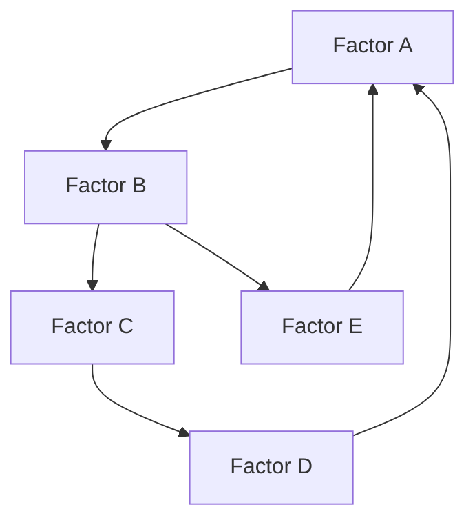

### 6.3 Ritual Templates

Phase 3 includes sophisticated templates for each core ritual:

#### 6.3.1 Networked Context Management Templates

**Continuous Context Evolution Template**
```markdown
---
ritual: networked-context-monitoring
date: {{date:YYYY-MM-DD}}
monitoring_period: {{date:YYYY-MM-DD}} to {{date:YYYY-MM-DD}}
teams_involved: [team1, team2, team3]
status: auto-generated
federation_level: organization
visibility: organization-internal
---

# Networked Context Monitoring Report - {{date:YYYY-MM-DD}}

## Overview
This report provides an automated analysis of cross-team context evolution, identifying significant changes, emerging patterns, and recommended actions.

## Key Context Changes

### High Priority Changes
[Automatically populated with significant context changes across teams that require immediate attention]

| Team | Element | Change Type | Importance | Relevance | Teams Affected |
|------|---------|------------|------------|-----------|----------------|
| [team] | [element link] | [creation/update/relationship] | [high/medium/low] | [relevance score] | [affected teams] |

### New Strategic Context
[Automatically populated with new context elements that have strategic importance]

| Team | Element | Strategic Alignment | Related Capabilities | Recommended Actions |
|------|---------|---------------------|----------------------|---------------------|
| [team] | [element link] | [strategic goals] | [capabilities] | [actions] |

### Changing Domain Knowledge
[Automatically populated with significant changes to domain knowledge]

| Team | Element | Change Type | Impact Assessment | Teams to Notify |
|------|---------|------------|-------------------|-----------------|
| [team] | [element link] | [creation/update/relationship] | [impact details] | [teams] |

## Cross-Team Relationship Analysis

### New Relationships
[Automatically populated with new cross-team relationships]

| Source Team | Source Element | Target Team | Target Element | Relationship Type | Significance |
|-------------|----------------|-------------|----------------|-------------------|-------------|
| [team1] | [element1 link] | [team2] | [element2 link] | [relationship type] | [significance] |

### Changed Relationships
[Automatically populated with modified cross-team relationships]

| Source Team | Source Element | Target Team | Target Element | Change Type | Impact Assessment |
|-------------|----------------|-------------|----------------|-------------|-------------------|
| [team1] | [element1 link] | [team2] | [element2 link] | [change description] | [impact] |

### Potentially Conflicting Information
[Automatically populated with relationship conflicts or contradictions]

| Team 1 | Element 1 | Team 2 | Element 2 | Conflict Description | Resolution Status |
|--------|-----------|--------|-----------|---------------------|-------------------|
| [team1] | [element1 link] | [team2] | [element2 link] | [conflict details] | [status] |

## Context Health Analysis

### Overall Network Health
- **Relationship Density**: [score] - [interpretation]
- **Information Consistency**: [score] - [interpretation]
- **Currency**: [score] - [interpretation]
- **Coverage**: [score] - [interpretation]
- **Cross-Team Accessibility**: [score] - [interpretation]

### Team-Specific Health Metrics

| Team | Relationship Density | Consistency | Currency | Coverage | Cross-Team Access |
|------|----------------------|-------------|----------|----------|-------------------|
| [team1] | [score] | [score] | [score] | [score] | [score] |
| [team2] | [score] | [score] | [score] | [score] | [score] |
| [team3] | [score] | [score] | [score] | [score] | [score] |

### Knowledge Gaps Identified
[Automatically populated with identified gaps in networked knowledge]

| Knowledge Area | Gap Description | Affected Teams | Priority | Suggested Owners |
|---------------|-----------------|----------------|----------|------------------|
| [area] | [description] | [teams] | [priority] | [suggested owners] |

## Automated Recommendations

### Immediate Actions
1. [High-priority action recommendation with rationale]
2. [High-priority action recommendation with rationale]
3. [High-priority action recommendation with rationale]

### Strategic Knowledge Development
1. [Strategic knowledge recommendation with alignment rationale]
2. [Strategic knowledge recommendation with alignment rationale]
3. [Strategic knowledge recommendation with alignment rationale]

### Cross-Team Collaboration Opportunities
1. [Collaboration opportunity with expected benefits]
2. [Collaboration opportunity with expected benefits]
3. [Collaboration opportunity with expected benefits]

## AI Analysis Notes
[Context patterns, trends, and insights automatically generated by AI]

---

*This report was automatically generated by the Networked Context Management System. Items requiring attention have been flagged for review during the Weekly Team Curation and Monthly Cross-Team Alignment sessions.*
```

**Weekly Team Curation Template**
```markdown
---
ritual: weekly-context-curation
date: {{date:YYYY-MM-DD}}
team: [team-name]
facilitator: [facilitator-name]
participants: [list-participants]
duration_minutes: 30
status: draft
federation_level: team
related_monitoring: [link-to-monitoring-report]
---

# Weekly Context Curation - {{date:YYYY-MM-DD}}

## Participants
- [List of team members present]

## Automated Monitoring Review
![[networked-context-monitoring-report-{{date:YYYY-MM-DD}}]]

### Key Items Requiring Attention
[Copy of high-priority items from monitoring report that need team discussion]

## Context Health Assessment

### Team-Specific Health Metrics
- **Total Knowledge Items**: [number]
- **New Items This Week**: [number]
- **Relationship Density**: [number] connections per item
- **Overall Health Score**: [percentage]
- **Cross-Team Connections**: [number]
- **Incoming References**: [number]
- **Outgoing References**: [number]

### Health Analysis
#### Strengths
- [Area of strong knowledge representation]
- [Area with good relationship mapping]
- [Well-utilized knowledge area]

#### Improvement Opportunities
- [Area with knowledge gaps]
- [Area with weak relationships]
- [Underutilized knowledge]

## Cross-Team Context Review

### Incoming Context Changes
[Changes from other teams that affect our context]

| Source Team | Element | Change Type | Impact Assessment | Response Needed |
|-------------|---------|-------------|-------------------|-----------------|
| [team] | [element link] | [change type] | [impact] | [yes/no] |

### Outgoing Context Changes
[Our changes that affect other teams]

| Target Team | Our Element | Change Type | Notification Status | Feedback Received |
|-------------|-------------|-------------|---------------------|-------------------|
| [team] | [element link] | [change type] | [notified/pending] | [feedback] |

### Relationship Management
[Cross-team relationships that need review or update]

| Related Team | Element | Relationship Type | Issue | Action Needed |
|--------------|---------|-------------------|-------|---------------|
| [team] | [element link] | [relationship type] | [issue] | [action] |

## Prioritized Actions

1. **[High Priority Area]**
   - [ ] [Specific action item] (@owner) (due: [date])
   - [ ] [Specific action item] (@owner) (due: [date])

2. **[Medium Priority Area]**
   - [ ] [Specific action item] (@owner) (due: [date])
   - [ ] [Specific action item] (@owner) (due: [date])

3. **[Standard Maintenance]**
   - [ ] [Specific action item] (@owner) (due: [date])
   - [ ] [Specific action item] (@owner) (due: [date])

## Cross-Team Communication Needed
- [ ] [Specific communication] to [team] regarding [topic] (@owner)
- [ ] [Specific communication] to [team] regarding [topic] (@owner)

## Next Week Focus
- Primary focus areas: [list]
- Special attention items: [list]
- Preparation needed: [list]

## Notes
[Any additional discussion points or observations]
```

**Monthly Cross-Team Alignment Template**
```markdown
---
ritual: monthly-cross-team-alignment
date: {{date:YYYY-MM-DD}}
teams_involved: [list-teams]
facilitator: [facilitator-name]
participants: [list-participants]
duration_minutes: 60
status: draft
federation_level: cross-team
---

# Monthly Cross-Team Alignment - {{date:YYYY-MM-DD}}

## Participants
[List of participants from each team with roles]

## Strategic Context Review
[Brief review of relevant organizational strategic objectives]

## Knowledge Federation Health

### Cross-Team Federation Metrics
- **Total Federated Elements**: [number]
- **Cross-Team Relationships**: [number]
- **Federation Density**: [score] - [interpretation]
- **Consistency Score**: [score] - [interpretation]
- **Accessibility Score**: [score] - [interpretation]
- **Utilization Score**: [score] - [interpretation]

### Team-Specific Federation Metrics

| Team | Shared Elements | Consumed Elements | Relationship Ratio | Federation Health |
|------|-----------------|-------------------|-------------------|-------------------|
| [team1] | [number] | [number] | [ratio] | [score] |
| [team2] | [number] | [number] | [ratio] | [score] |
| [team3] | [number] | [number] | [ratio] | [score] |

## Boundary Areas Analysis

### Domain Boundary: [Boundary Area 1]
[Analysis of knowledge area that spans multiple teams]

#### Current State
- **Ownership**: [Primary team] with [Secondary teams]
- **Elements**: [number] knowledge elements
- **Relationship Density**: [score]
- **Consistency Issues**: [number] identified
- **Recent Changes**: [summary of changes]

#### Discussion Points
- [Key point requiring alignment]
- [Key point requiring alignment]
- [Key point requiring alignment]

#### Alignment Decisions
- **Ownership**: [decision on primary/shared ownership]
- **Element Structure**: [decision on structure]
- **Update Protocol**: [decision on how changes will be handled]
- **Actions**:
  - [ ] [Specific action item] (@owner) (due: [date])
  - [ ] [Specific action item] (@owner) (due: [date])

### Technical Boundary: [Boundary Area 2]
[Analysis of technical knowledge that spans multiple teams]

[Same structure as above]

### Process Boundary: [Boundary Area 3]
[Analysis of process knowledge that spans multiple teams]

[Same structure as above]

## Strategic Knowledge Planning

### Upcoming Organizational Initiatives
[Discussion of upcoming initiatives requiring knowledge coordination]

| Initiative | Knowledge Areas | Teams Involved | Knowledge Gaps | Preparation Needed |
|------------|-----------------|----------------|---------------|-------------------|
| [initiative] | [areas] | [teams] | [gaps] | [preparation] |

### Knowledge Development Priorities
[Strategic priorities for cross-team knowledge development]

1. **[Priority Area 1]**
   - Rationale: [strategic reasoning]
   - Teams involved: [list of teams]
   - Current state: [brief assessment]
   - Target state: [description of desired state]
   - Actions:
     - [ ] [Specific action item] (@owner) (due: [date])
     - [ ] [Specific action item] (@owner) (due: [date])

2. **[Priority Area 2]**
   [Same structure as above]

3. **[Priority Area 3]**
   [Same structure as above]

## Action Summary

### Immediate Actions (Next 2 Weeks)
- [ ] [Action item] (@owner) (due: [date])
- [ ] [Action item] (@owner) (due: [date])
- [ ] [Action item] (@owner) (due: [date])

### Medium-Term Actions (Next Month)
- [ ] [Action item] (@owner) (due: [date])
- [ ] [Action item] (@owner) (due: [date])
- [ ] [Action item] (@owner) (due: [date])

### Long-Term Actions (Next Quarter)
- [ ] [Action item] (@owner) (due: [date])
- [ ] [Action item] (@owner) (due: [date])
- [ ] [Action item] (@owner) (due: [date])

## Next Alignment Session
- Date: [next session date]
- Focus areas: [list]
- Preparation required: [list]

## Notes
[Any additional discussion points or observations]
```

#### 6.3.2 AI-Driven Decision Framework Templates

**Decision Initialization Template**
```markdown
---
ritual: decision-initialization
decision_id: [YYYY-MM-DD]-[short-title]
date: {{date:YYYY-MM-DD}}
decision_owner: [owner-name]
stakeholders: [list-stakeholders]
teams_involved: [list-teams]
importance: [critical/high/medium/low]
status: initialization
visibility: [team/department/organization]
---

# Decision Initialization: [Decision Title]

## Decision Overview
[2-3 sentence summary of the decision to be made]

## Decision Context
[Detailed explanation of why this decision is needed, including background and current situation]

## Strategic Alignment
[How this decision relates to organizational/team objectives]

| Strategic Objective | Relationship | Importance |
|---------------------|--------------|------------|
| [objective 1] | [how decision relates] | [high/medium/low] |
| [objective 2] | [how decision relates] | [high/medium/low] |

## Scope and Boundaries
[Clear definition of what is and isn't included in this decision]

### In Scope
- [Scope item 1]
- [Scope item 2]
- [Scope item 3]

### Out of Scope
- [Out of scope item 1]
- [Out of scope item 2]
- [Out of scope item 3]

## Decision Criteria
[Explicit criteria that will be used to evaluate options]

### Primary Criteria (Must Have)
- [Criterion 1] - [explanation and measurement approach]
- [Criterion 2] - [explanation and measurement approach]
- [Criterion 3] - [explanation and measurement approach]

### Secondary Criteria (Should Have)
- [Criterion 4] - [explanation and measurement approach]
- [Criterion 5] - [explanation and measurement approach]
- [Criterion 6] - [explanation and measurement approach]

### Bonus Criteria (Nice to Have)
- [Criterion 7] - [explanation and measurement approach]
- [Criterion 8] - [explanation and measurement approach]

## Stakeholder Perspective Mapping
[Identification of key stakeholders and their perspectives]

| Stakeholder | Role/Team | Key Concerns | Decision Influence |
|-------------|-----------|--------------|-------------------|
| [stakeholder 1] | [role/team] | [primary concerns] | [high/medium/low] |
| [stakeholder 2] | [role/team] | [primary concerns] | [high/medium/low] |
| [stakeholder 3] | [role/team] | [primary concerns] | [high/medium/low] |

## Constraints
[Immovable limitations that must be respected]

- **Time Constraints**: [description]
- **Resource Constraints**: [description]
- **Technical Constraints**: [description]
- **Policy Constraints**: [description]
- **Other Constraints**: [description]

## Related Knowledge
[Key knowledge elements that inform this decision]

- [Link to related knowledge item 1] - [relevance]
- [Link to related knowledge item 2] - [relevance]
- [Link to related knowledge item 3] - [relevance]

## Related Decisions
[Previous or parallel decisions that relate to this one]

- [Link to related decision 1] - [relationship]
- [Link to related decision 2] - [relationship]
- [Link to related decision 3] - [relationship]

## Decision Timeline
- **Options Development Due**: [date]
- **Analysis Completion Due**: [date]
- **Decision Target Date**: [date]
- **Implementation Deadline**: [date]

## Decision Process
1. **Option Development**: [approach and participants]
2. **Analysis Method**: [approach and techniques]
3. **Evaluation Process**: [how options will be compared]
4. **Decision Making**: [how final decision will be made]
5. **Communication Plan**: [how decision will be communicated]

## Initial Options Identified
[Early options already known, to be expanded in option development]

1. **[Option 1 Title]**
   - Brief description: [description]
   - Key considerations: [considerations]

2. **[Option 2 Title]**
   - Brief description: [description]
   - Key considerations: [considerations]

## AI Analysis Note
[Initial AI analysis of the decision context, highlighting key considerations or potential blind spots]

## Next Steps
- [ ] Distribute decision initialization to stakeholders (@[owner]) (due: [date])
- [ ] Schedule option development session (@[owner]) (due: [date])
- [ ] Gather additional context needed (@[owner]) (due: [date])
- [ ] [Other next steps as appropriate]
```

**Option Development Template**
```markdown
---
ritual: option-development
decision_id: [YYYY-MM-DD]-[short-title]
date: {{date:YYYY-MM-DD}}
facilitator: [facilitator-name]
participants: [list-participants]
status: option-development
related_initialization: [link-to-initialization]
---

# Option Development: [Decision Title]

## Participants
[List of participants in the option development session]

## Decision Context Review
[Brief review of the decision context from initialization]

## Option Generation

### [Option 1 Title]
- **Description**: [Comprehensive description of the option]
- **Key Components**:
  - [Component 1]
  - [Component 2]
  - [Component 3]
- **Implementation Approach**:
  - [Implementation details]
- **Resource Requirements**:
  - [Resource needs]
- **Timeline**:
  - [Implementation timeline]
- **Assumptions**:
  - [Key assumptions]
- **Origin**: [Human-generated / AI-suggested / Hybrid]

### [Option 2 Title]
[Same structure as Option 1]

### [Option 3 Title]
[Same structure as Option 1]

### [Option 4 Title]
[Same structure as Option 1]

## Option Refinement

### Initial Filtering
[If applicable, reasoning for any options that were eliminated immediately]

### Option Combinations
[If applicable, how elements of different options were combined]

### Option Improvements
[Specific refinements made to original options]

## Preliminary Assessment

### Criterion-Based Quick Assessment
[Initial assessment of options against key criteria]

| Criterion | Option 1 | Option 2 | Option 3 | Option 4 |
|-----------|----------|----------|----------|----------|
| [Criterion 1] | [rating] | [rating] | [rating] | [rating] |
| [Criterion 2] | [rating] | [rating] | [rating] | [rating] |
| [Criterion 3] | [rating] | [rating] | [rating] | [rating] |

### Key Differentiators
[What primarily distinguishes these options from each other]

### Risk Comparison
[High-level comparison of risks between options]

## Additional Analysis Needed
[Specific analysis needed to fully evaluate these options]

- [Analysis 1] - [description and approach]
- [Analysis 2] - [description and approach]
- [Analysis 3] - [description and approach]

## AI Contribution Analysis
[Assessment of how AI contributed to option development]

- **Options Generated**: [number] options entirely AI-generated
- **Options Enhanced**: [number] options significantly enhanced by AI
- **Novel Elements**: [description of particularly novel contributions]
- **Patterns Applied**: [relevant patterns applied from past decisions]

## Next Steps
- [ ] Conduct detailed analysis of Option 1 (@[owner]) (due: [date])
- [ ] Conduct detailed analysis of Option 2 (@[owner]) (due: [date])
- [ ] Gather additional data for Option 3 (@[owner]) (due: [date])
- [ ] Schedule structured evaluation session (@[owner]) (due: [date])
```

**Structured Evaluation Template**
```markdown
---
ritual: structured-evaluation
decision_id: [YYYY-MM-DD]-[short-title]
date: {{date:YYYY-MM-DD}}
facilitator: [facilitator-name]
participants: [list-participants]
status: evaluation
related_initialization: [link-to-initialization]
related_options: [link-to-options]
---

# Structured Evaluation: [Decision Title]

## Participants
[List of participants in the evaluation session]

## Decision Context and Options Review
[Brief reminder of decision context and options being evaluated]

## Multi-Criteria Analysis

### Criteria Weighting
[Final criteria and weights used for evaluation]

| Criterion | Weight | Rationale |
|-----------|--------|-----------|
| [Criterion 1] | [weight] | [rationale for weight] |
| [Criterion 2] | [weight] | [rationale for weight] |
| [Criterion 3] | [weight] | [rationale for weight] |
| [Criterion 4] | [weight] | [rationale for weight] |

### Option Scoring

#### [Option 1 Title]
| Criterion | Score (1-5) | Weighted Score | Justification |
|-----------|-------------|----------------|---------------|
| [Criterion 1] | [score] | [weighted score] | [justification] |
| [Criterion 2] | [score] | [weighted score] | [justification] |
| [Criterion 3] | [score] | [weighted score] | [justification] |
| [Criterion 4] | [score] | [weighted score] | [justification] |
| **TOTAL** | | [total weighted score] | |

**Strengths**:
- [Key strength 1]
- [Key strength 2]
- [Key strength 3]

**Weaknesses**:
- [Key weakness 1]
- [Key weakness 2]
- [Key weakness 3]

#### [Option 2 Title]
[Same structure as Option 1]

#### [Option 3 Title]
[Same structure as Option 1]

### Sensitivity Analysis
[Analysis of how results change if weights or scores are adjusted]

| Scenario | Change Applied | Impact on Ranking | Significance |
|----------|----------------|-------------------|-------------|
| [Scenario 1] | [change] | [impact] | [significance] |
| [Scenario 2] | [change] | [impact] | [significance] |
| [Scenario 3] | [change] | [impact] | [significance] |

### Stakeholder Impact Analysis
[Analysis of how each option affects different stakeholders]

| Stakeholder | Option 1 Impact | Option 2 Impact | Option 3 Impact | Key Considerations |
|-------------|-----------------|-----------------|-----------------|-------------------|
| [Stakeholder 1] | [impact] | [impact] | [impact] | [considerations] |
| [Stakeholder 2] | [impact] | [impact] | [impact] | [considerations] |
| [Stakeholder 3] | [impact] | [impact] | [impact] | [considerations] |

### Risk Assessment

#### [Option 1 Title] Risks
| Risk | Probability | Impact | Mitigation | Residual Risk |
|------|------------|--------|------------|---------------|
| [Risk 1] | [H/M/L] | [H/M/L] | [mitigation] | [H/M/L] |
| [Risk 2] | [H/M/L] | [H/M/L] | [mitigation] | [H/M/L] |
| [Risk 3] | [H/M/L] | [H/M/L] | [mitigation] | [H/M/L] |

#### [Option 2 Title] Risks
[Same structure as Option 1]

#### [Option 3 Title] Risks
[Same structure as Option 1]

### Strategic Alignment Assessment
[Evaluation of how well each option aligns with strategic objectives]

| Strategic Objective | Option 1 Alignment | Option 2 Alignment | Option 3 Alignment |
|---------------------|-------------------|-------------------|-------------------|
| [Objective 1] | [H/M/L] | [H/M/L] | [H/M/L] |
| [Objective 2] | [H/M/L] | [H/M/L] | [H/M/L] |
| [Objective 3] | [H/M/L] | [H/M/L] | [H/M/L] |

## Analysis Summary

### Overall Rankings
1. **[Highest Ranked Option]**: [total score] - [brief rationale]
2. **[Second Ranked Option]**: [total score] - [brief rationale]
3. **[Third Ranked Option]**: [total score] - [brief rationale]

### Key Decision Factors
[The most significant factors that differentiate the options]

### Trade-offs
[Explicit identification of key trade-offs between options]

### AI Analysis Insights
[Additional insights generated by AI analysis]

## Discussion Notes
[Summary of key points from the evaluation discussion]

## Recommendation
[Clear recommendation based on the evaluation, or identification of final decision criteria if no clear recommendation]

## Next Steps
- [ ] Finalize decision (@[owner]) (due: [date])
- [ ] Prepare implementation guidance (@[owner]) (due: [date])
- [ ] Communicate decision to stakeholders (@[owner]) (due: [date])
- [ ] [Other next steps as appropriate]
```

**Decision Finalization Template**
```markdown
---
ritual: decision-finalization
decision_id: [YYYY-MM-DD]-[short-title]
date: {{date:YYYY-MM-DD}}
decision_maker: [decision-maker-name]
stakeholders: [list-stakeholders]
teams_involved: [list-teams]
status: finalized
related_initialization: [link-to-initialization]
related_options: [link-to-options]
related_evaluation: [link-to-evaluation]
visibility: [team/department/organization]
---

# Decision Finalization: [Decision Title]

## Decision
**[Selected Option Title]** has been selected as the approach for [decision context].

## Executive Summary
[Concise summary of the decision, rationale, and expected outcomes - 3-5 sentences]

## Decision Context
[Brief recap of the decision context from initialization]

## Options Considered
[Brief recap of the main options that were considered]

| Option | Key Characteristics | Overall Score | Key Strengths | Key Weaknesses |
|--------|---------------------|---------------|--------------|----------------|
| [Option 1] | [characteristics] | [score] | [strengths] | [weaknesses] |
| [Option 2] | [characteristics] | [score] | [strengths] | [weaknesses] |
| [Option 3] | [characteristics] | [score] | [strengths] | [weaknesses] |

## Selected Option Details
[Comprehensive description of the selected option]

### Key Components
- [Component 1]
- [Component 2]
- [Component 3]

### Implementation Approach
[High-level implementation approach]

### Resource Requirements
[Resources needed to implement the decision]

### Timeline
[Implementation timeline with key milestones]

## Decision Rationale
[Clear explanation of why this option was selected]

### Primary Decision Factors
[The most important factors that led to this decision]

### Alternative Consideration
[Why alternatives were not selected]

### Strategic Alignment
[How this decision aligns with strategic objectives]

## Stakeholder Impact
[How this decision affects different stakeholders]

| Stakeholder | Impact | Specific Considerations | Communication Needs |
|-------------|--------|------------------------|---------------------|
| [Stakeholder 1] | [impact] | [considerations] | [communication] |
| [Stakeholder 2] | [impact] | [considerations] | [communication] |
| [Stakeholder 3] | [impact] | [considerations] | [communication] |

## Implementation Guidance

### Key Success Factors
[Critical elements for successful implementation]

### Risk Management
[Primary risks and mitigation strategies]

| Risk | Probability | Impact | Mitigation Strategy | Owner | Monitoring Approach |
|------|------------|--------|---------------------|-------|-------------------|
| [Risk 1] | [H/M/L] | [H/M/L] | [strategy] | [@owner] | [approach] |
| [Risk 2] | [H/M/L] | [H/M/L] | [strategy] | [@owner] | [approach] |
| [Risk 3] | [H/M/L] | [H/M/L] | [strategy] | [@owner] | [approach] |

### Dependencies
[Key dependencies for implementation]

### Resource Allocation
[Specific resources allocated to implementation]

## Communication Plan
[How this decision will be communicated to different audiences]

| Audience | Key Message | Communication Method | Timing | Responsible |
|----------|------------|----------------------|--------|------------|
| [Audience 1] | [message] | [method] | [timing] | [@owner] |
| [Audience 2] | [message] | [method] | [timing] | [@owner] |
| [Audience 3] | [message] | [method] | [timing] | [@owner] |

## Success Metrics
[How the success of this decision will be measured]

| Metric | Baseline | Target | Measurement Method | Measurement Timeline |
|--------|----------|--------|-------------------|---------------------|
| [Metric 1] | [baseline] | [target] | [method] | [timeline] |
| [Metric 2] | [baseline] | [target] | [method] | [timeline] |
| [Metric 3] | [baseline] | [target] | [method] | [timeline] |

## Learning Capture
[Key learnings from the decision process]

### Process Effectiveness
[Assessment of how well the decision process worked]

### AI Contribution Value
[Assessment of how AI contributed to the decision]

### Future Decision Recommendations
[Recommendations for similar future decisions]

## Implementation Actions
- [ ] [Action 1] (@[owner]) (due: [date])
- [ ] [Action 2] (@[owner]) (due: [date])
- [ ] [Action 3] (@[owner]) (due: [date])
- [ ] [Action 4] (@[owner]) (due: [date])

## Decision Review
- Scheduled review date: [date]
- Review objectives: [objectives]
- Review participants: [participants]

## Approval
- Decision maker: [name]
- Approval date: [date]
- Supporting stakeholders: [names]
```

#### 6.3.3 Advanced Retrospective System Templates

**Sprint-Level Retrospective Template**
```markdown
---
ritual: sprint-retrospective
sprint: [sprint-id]
date: {{date:YYYY-MM-DD}}
facilitator: [facilitator-name]
participants: [list-participants]
duration_minutes: 60
status: draft
analysis_id: [analysis-id]
---

# Sprint [Sprint ID] Retrospective - {{date:YYYY-MM-DD}}

## Participants
[List of team members present]

## Performance Data Overview
![[sprint-[sprint-id]-metrics-dashboard]]

### Key Metrics Summary
- **Velocity**: [points] ([change]% from previous sprint)
- **Completion Rate**: [percentage]% ([change]% from previous sprint)
- **Cycle Time**: [days] ([change]% from previous sprint)
- **Quality Metrics**: [metrics] ([change]% from previous sprint)
- **Technical Debt Changes**: [change] ([assessment])

## AI-Generated Pattern Analysis
[Summary of key patterns identified by pre-retrospective analysis]

### Performance Patterns
[Patterns identified in performance metrics]

### Process Patterns
[Patterns identified in work processes]

### Technical Patterns
[Patterns identified in technical work]

### Team Dynamics
[Patterns identified in team interactions]

## Pattern Exploration

### Pattern 1: [Pattern Name]
- **Pattern Description**: [AI-identified pattern]
- **Supporting Evidence**: [data and observations]
- **Team Discussion**:
  - [Key point 1]
  - [Key point 2]
  - [Key point 3]
- **Root Causes Identified**:
  - [Root cause 1]
  - [Root cause 2]
- **System Factors**:
  - [System factor 1]
  - [System factor 2]
- **Actions Created**:
  - [ ] [Action 1] (@[owner]) (due: [date])
  - [ ] [Action 2] (@[owner]) (due: [date])

### Pattern 2: [Pattern Name]
[Same structure as Pattern 1]

### Pattern 3: [Pattern Name]
[Same structure as Pattern 1]

## Action Effectiveness Review
[Review of actions from previous retrospectives]

| Action | Owner | Status | Effectiveness | Next Steps |
|--------|-------|--------|--------------|-----------|
| [Action 1] | [@owner] | [status] | [effectiveness] | [next steps] |
| [Action 2] | [@owner] | [status] | [effectiveness] | [next steps] |
| [Action 3] | [@owner] | [status] | [effectiveness] | [next steps] |

## Prioritized Improvement Actions

### High Priority Actions
- [ ] [Action 1] (@[owner]) (due: [date])
  - **Expected Impact**: [impact]
  - **Measurement Approach**: [approach]
  - **Success Criteria**: [criteria]

- [ ] [Action 2] (@[owner]) (due: [date])
  - **Expected Impact**: [impact]
  - **Measurement Approach**: [approach]
  - **Success Criteria**: [criteria]

### Medium Priority Actions
- [ ] [Action 3] (@[owner]) (due: [date])
  - [Same structure as above]

- [ ] [Action 4] (@[owner]) (due: [date])
  - [Same structure as above]

### Experimental Actions
- [ ] [Experiment 1] (@[owner]) (due: [date])
  - **Hypothesis**: [hypothesis]
  - **Experiment Approach**: [approach]
  - **Measurement**: [measurement]
  - **Timeline**: [timeline]

## Knowledge Contributions
- [ ] Update [knowledge item] with [insight] (@[owner])
- [ ] Create new [knowledge item] for [pattern] (@[owner])
- [ ] Share [learning] with [other team] (@[owner])

## AI Contribution Assessment
- **Pattern Detection Quality**: [1-5 rating] - [comments]
- **Insight Relevance**: [1-5 rating] - [comments]
- **Root Cause Analysis Support**: [1-5 rating] - [comments]
- **Action Recommendation Quality**: [1-5 rating] - [comments]

## Next Retrospective
- Date: [date]
- Special focus areas: [areas]
- Preparation needed: [preparation]
```

**Quarterly Meta-Retrospective Template**
```markdown
---
ritual: quarterly-meta-retrospective
quarter: [YYYY-Q#]
date: {{date:YYYY-MM-DD}}
facilitator: [facilitator-name]
participants: [list-participants]
duration_minutes: 120
status: draft
related_retrospectives: [list-of-retrospective-ids]
---

# Quarterly Meta-Retrospective - [YYYY-Q#]

## Participants
[List of team members present]

## Quarter Performance Overview
![[quarterly-performance-dashboard-[YYYY-Q#]]]

### Key Metrics Trends
- **Velocity Trend**: [trend description] over [number] sprints
- **Completion Rate Trend**: [trend description] over [number] sprints
- **Cycle Time Trend**: [trend description] over [number] sprints
- **Quality Metrics Trend**: [trend description] over [number] sprints
- **Technical Debt Trend**: [trend description] over [number] sprints

## Cross-Sprint Pattern Analysis

### Performance Patterns
[Patterns that span multiple sprints in performance metrics]
- **Pattern 1**: [description] - [evidence] - [impact]
- **Pattern 2**: [description] - [evidence] - [impact]
- **Pattern 3**: [description] - [evidence] - [impact]

### Process Patterns
[Patterns that span multiple sprints in work processes]
- **Pattern 1**: [description] - [evidence] - [impact]
- **Pattern 2**: [description] - [evidence] - [impact]
- **Pattern 3**: [description] - [evidence] - [impact]

### Technical Patterns
[Patterns that span multiple sprints in technical work]
- **Pattern 1**: [description] - [evidence] - [impact]
- **Pattern 2**: [description] - [evidence] - [impact]
- **Pattern 3**: [description] - [evidence] - [impact]

### Team Dynamics Patterns
[Patterns that span multiple sprints in team interactions]
- **Pattern 1**: [description] - [evidence] - [impact]
- **Pattern 2**: [description] - [evidence] - [impact]
- **Pattern 3**: [description] - [evidence] - [impact]

## System Dynamics Analysis

### Causal Loop Diagram
[Mermaid diagram of causal relationships between factors]



### Key System Dynamics
- **Reinforcing Loop 1**: [description] - [factors involved] - [intervention points]
- **Balancing Loop 1**: [description] - [factors involved] - [intervention points]
- **Delay Effect 1**: [description] - [factors involved] - [intervention points]

### Systemic Interventions Identified
- **Intervention Point 1**: [description] - [expected impact] - [approach]
- **Intervention Point 2**: [description] - [expected impact] - [approach]
- **Intervention Point 3**: [description] - [expected impact] - [approach]

## Improvement Action Analysis

### Action Completion Analysis
- **Actions Created**: [number] across [number] retrospectives
- **Actions Completed**: [number] ([percentage]%)
- **Actions In Progress**: [number] ([percentage]%)
- **Actions Not Started**: [number] ([percentage]%)

### Action Effectiveness Analysis
- **High Impact Actions**: [number] ([percentage]% of completed)
- **Medium Impact Actions**: [number] ([percentage]% of completed)
- **Low Impact Actions**: [number] ([percentage]% of completed)
- **Unclear Impact**: [number] ([percentage]% of completed)

### Action Pattern Analysis
- **Common Action Categories**: [list of categories with counts]
- **Recurring Problem Areas**: [list of areas with counts]
- **Action Owner Distribution**: [distribution analysis]
- **Action Completion Time**: [average time to completion]

## Team Capability Assessment

### Current Capability Assessment
[Assessment of team capabilities against key dimensions]

| Capability Area | Current Level | Trend | Limiting Factors | Enabling Factors |
|-----------------|--------------|------|-----------------|------------------|
| [Area 1] | [level] | [trend] | [limiting factors] | [enabling factors] |
| [Area 2] | [level] | [trend] | [limiting factors] | [enabling factors] |
| [Area 3] | [level] | [trend] | [limiting factors] | [enabling factors] |
| [Area 4] | [level] | [trend] | [limiting factors] | [enabling factors] |

### Capability Development Opportunities
- **Opportunity 1**: [description] - [expected impact] - [approach]
- **Opportunity 2**: [description] - [expected impact] - [approach]
- **Opportunity 3**: [description] - [expected impact] - [approach]

## Practice Evolution Planning

### Current Practice Assessment
[Assessment of team practices against key dimensions]

| Practice Area | Effectiveness | Maturity | Improvement Opportunity |
|---------------|--------------|----------|------------------------|
| [Area 1] | [rating] | [level] | [opportunity] |
| [Area 2] | [rating] | [level] | [opportunity] |
| [Area 3] | [rating] | [level] | [opportunity] |
| [Area 4] | [rating] | [level] | [opportunity] |

### Practice Evolution Recommendations
1. **[Practice 1]**
   - Current state: [description]
   - Target state: [description]
   - Evolution approach: [approach]
   - Actions:
     - [ ] [Action 1] (@[owner]) (due: [date])
     - [ ] [Action 2] (@[owner]) (due: [date])

2. **[Practice 2]**
   [Same structure as Practice 1]

3. **[Practice 3]**
   [Same structure as Practice 1]

## Strategic Realignment

### Strategic Objectives Review
[Assessment of alignment with strategic objectives]

| Objective | Current Alignment | Trend | Adjustment Needed |
|-----------|------------------|------|-------------------|
| [Objective 1] | [alignment] | [trend] | [adjustment] |
| [Objective 2] | [alignment] | [trend] | [adjustment] |
| [Objective 3] | [alignment] | [trend] | [adjustment] |

### Strategic Adjustment Recommendations
- **Recommendation 1**: [description] - [rationale] - [approach]
- **Recommendation 2**: [description] - [rationale] - [approach]
- **Recommendation 3**: [description] - [rationale] - [approach]

## Meta-Retrospective Actions

### Strategic Actions (Quarter Level)
- [ ] [Action 1] (@[owner]) (due: [date])
  - **Expected Impact**: [impact]
  - **Measurement Approach**: [approach]
  - **Success Criteria**: [criteria]

- [ ] [Action 2] (@[owner]) (due: [date])
  - [Same structure as above]

### Tactical Actions (Sprint Level)
- [ ] [Action 3] (@[owner]) (due: [date])
  - [Same structure as above]

- [ ] [Action 4] (@[owner]) (due: [date])
  - [Same structure as above]

### Process Improvement Actions
- [ ] [Action 5] (@[owner]) (due: [date])
  - [Same structure as above]

- [ ] [Action 6] (@[owner]) (due: [date])
  - [Same structure as above]

## Knowledge Contributions
- [ ] Update [knowledge item] with [insight] (@[owner])
- [ ] Create new [knowledge item] for [pattern] (@[owner])
- [ ] Share [learning] with [other team] (@[owner])

## Next Steps
- [ ] Distribute meta-retrospective summary to stakeholders (@[owner])
- [ ] Incorporate strategic actions into next quarter planning (@[owner])
- [ ] Schedule action review session (@[owner])
- [ ] [Other next steps as appropriate]

## AI Contribution Assessment
- **Pattern Detection Effectiveness**: [1-5 rating] - [comments]
- **System Dynamics Analysis Quality**: [1-5 rating] - [comments]
- **Strategic Insight Quality**: [1-5 rating] - [comments]
- **Action Recommendation Value**: [1-5 rating] - [comments]
```

**Annual Strategic Retrospective Template**
```markdown
---
ritual: annual-strategic-retrospective
year: [YYYY]
date: {{date:YYYY-MM-DD}}
facilitator: [facilitator-name]
participants: [list-participants]
stakeholders: [list-stakeholders]
duration_minutes: 240
status: draft
related_retrospectives: [list-of-retrospective-ids]
---

# Annual Strategic Retrospective - [YYYY]

## Participants
[List of team members and stakeholders present]

## Annual Performance Overview
![[annual-performance-dashboard-[YYYY]]]

### Key Performance Indicators
- **Annual Delivery**: [metrics and achievements]
- **Quality Metrics**: [metrics and trends]
- **Efficiency Metrics**: [metrics and trends]
- **Technical Health**: [metrics and trends]
- **Team Health**: [metrics and trends]

## Comprehensive Pattern Analysis

### Performance Evolution
[Analysis of how performance evolved throughout the year]
- **Q1 to Q2 Evolution**: [description and factors]
- **Q2 to Q3 Evolution**: [description and factors]
- **Q3 to Q4 Evolution**: [description and factors]
- **Year-over-Year Comparison**: [comparison to previous year]

### Process Evolution
[Analysis of how processes evolved throughout the year]
- **Key Process Changes**: [changes and impacts]
- **Process Improvement Outcomes**: [outcomes from improvements]
- **Process Bottlenecks Identified**: [bottlenecks and impacts]
- **Process Maturity Assessment**: [assessment of current maturity]

### Technical Evolution
[Analysis of how technical aspects evolved throughout the year]
- **Architecture Evolution**: [changes and impacts]
- **Technical Debt Management**: [progress and current state]
- **Technology Adoption**: [new technologies and impacts]
- **Technical Capability Assessment**: [assessment of current capabilities]

### Team Evolution
[Analysis of how the team evolved throughout the year]
- **Team Composition Changes**: [changes and impacts]
- **Skill Development**: [growth and current state]
- **Collaboration Pattern Evolution**: [changes in how the team works]
- **Team Morale Trends**: [patterns throughout the year]

## Business Impact Assessment

### Value Delivery Analysis
[Analysis of business value delivered]
- **Planned vs. Delivered Value**: [comparison and analysis]
- **Value Stream Efficiency**: [analysis of value flow]
- **Customer Impact**: [assessment of customer outcomes]
- **Business Metric Contributions**: [how team contributed to business metrics]

### Strategic Objective Contribution
[Analysis of contribution to strategic objectives]

| Strategic Objective | Contribution | Evidence | Gap Analysis |
|--------------------|--------------|----------|-------------|
| [Objective 1] | [contribution assessment] | [evidence] | [gaps] |
| [Objective 2] | [contribution assessment] | [evidence] | [gaps] |
| [Objective 3] | [contribution assessment] | [evidence] | [gaps] |

### Innovation Assessment
[Analysis of innovation activities and outcomes]
- **Innovation Initiatives**: [summary of initiatives]
- **Innovation Outcomes**: [tangible results]
- **Failed Experiments**: [what didn't work and why]
- **Innovation Culture Assessment**: [state of innovation culture]

### Market & Customer Impact
[Analysis of impact on market and customers]
- **Customer Satisfaction Impact**: [changes in satisfaction]
- **Market Position Impact**: [changes in market position]
- **Competitive Advantage Created**: [advantages created]
- **Brand Perception Impact**: [changes in perception]

## Capability Development Analysis

### Current Capability Assessment
[Comprehensive assessment of team capabilities]

| Capability Area | Current Level | Annual Change | Benchmark Comparison | Strategic Importance |
|-----------------|--------------|--------------|---------------------|---------------------|
| [Area 1] | [level] | [change] | [comparison] | [importance] |
| [Area 2] | [level] | [change] | [comparison] | [importance] |
| [Area 3] | [level] | [change] | [comparison] | [importance] |
| [Area 4] | [level] | [change] | [comparison] | [importance] |

### Capability Gap Analysis
[Analysis of gaps between current and needed capabilities]
- **Critical Capability Gaps**: [gaps with high strategic importance]
- **Emerging Capability Needs**: [new capabilities needed]
- **Declining Capability Relevance**: [capabilities becoming less important]
- **Capability Development ROI Analysis**: [where investment will have highest return]

### Learning Effectiveness Assessment
[Analysis of how effectively the team learned and adapted]
- **Learning Loop Effectiveness**: [assessment of learning mechanisms]
- **Knowledge Application Rate**: [how effectively knowledge was applied]
- **Adaptation Speed**: [how quickly the team adapted to changes]
- **Learning Culture Assessment**: [state of learning culture]

## Strategic Alignment for Coming Year

### Environmental Analysis
[Analysis of changing environment]
- **Market Changes**: [relevant market changes]
- **Technology Trends**: [relevant technology trends]
- **Customer Evolution**: [how customer needs are changing]
- **Competitive Landscape Shifts**: [competitive changes]

### Strategic Opportunity Identification
[Identification of key strategic opportunities]
- **Opportunity 1**: [description] - [strategic relevance] - [capability fit]
- **Opportunity 2**: [description] - [strategic relevance] - [capability fit]
- **Opportunity 3**: [description] - [strategic relevance] - [capability fit]

### Strategic Risk Identification
[Identification of key strategic risks]
- **Risk 1**: [description] - [potential impact] - [mitigation approaches]
- **Risk 2**: [description] - [potential impact] - [mitigation approaches]
- **Risk 3**: [description] - [potential impact] - [mitigation approaches]

### Strategic Positioning Recommendations
[Recommendations for strategic positioning]
- **Recommendation 1**: [description] - [rationale] - [expected outcomes]
- **Recommendation 2**: [description] - [rationale] - [expected outcomes]
- **Recommendation 3**: [description] - [rationale] - [expected outcomes]

## Long-Term Improvement Roadmap

### Three-Year Vision
[Vision for where the team should be in three years]
- **Performance Vision**: [target state]
- **Capability Vision**: [target state]
- **Process Vision**: [target state]
- **Technical Vision**: [target state]

### Annual Targets
[Breakdown of vision into annual targets]

| Area | Year 1 Target | Year 2 Target | Year 3 Target | Key Milestones |
|------|--------------|--------------|--------------|---------------|
| [Area 1] | [target] | [target] | [target] | [milestones] |
| [Area 2] | [target] | [target] | [target] | [milestones] |
| [Area 3] | [target] | [target] | [target] | [milestones] |
| [Area 4] | [target] | [target] | [target] | [milestones] |

### Capability Development Plan
[Plan for developing needed capabilities]
1. **[Capability Area 1]**
   - Current state: [assessment]
   - Target state: [target]
   - Development approach: [approach]
   - Key investments: [investments]
   - Timeline: [timeline]

2. **[Capability Area 2]**
   [Same structure as Area 1]

3. **[Capability Area 3]**
   [Same structure as Area 1]

### Strategic Initiative Recommendations
[Recommended strategic initiatives]
1. **[Initiative 1]**
   - Business case: [justification]
   - Expected outcomes: [outcomes]
   - Resource requirements: [resources]
   - Timeline: [timeline]
   - Key risks: [risks]

2. **[Initiative 2]**
   [Same structure as Initiative 1]

3. **[Initiative 3]**
   [Same structure as Initiative 1]

## Strategic Action Plan

### Strategic Actions
- [ ] [Action 1] (@[owner]) (due: [date])
  - **Strategic Alignment**: [alignment]
  - **Expected Impact**: [impact]
  - **Resource Requirements**: [resources]
  - **Success Criteria**: [criteria]

- [ ] [Action 2] (@[owner]) (due: [date])
  - [Same structure as above]

### Capability Development Actions
- [ ] [Action 3] (@[owner]) (due: [date])
  - [Same structure as above]

- [ ] [Action 4] (@[owner]) (due: [date])
  - [Same structure as above]

### Process Improvement Actions
- [ ] [Action 5] (@[owner]) (due: [date])
  - [Same structure as above]

- [ ] [Action 6] (@[owner]) (due: [date])
  - [Same structure as above]

## Next Steps
- [ ] Integrate strategic actions into organizational planning (@[owner])
- [ ] Develop detailed implementation plans for initiatives (@[owner])
- [ ] Schedule quarterly check-ins on strategic actions (@[owner])
- [ ] Communicate strategic direction to all stakeholders (@[owner])

## AI Contribution Assessment
- **Strategic Pattern Detection Quality**: [1-5 rating] - [comments]
- **Business Impact Analysis Value**: [1-5 rating] - [comments]
- **Strategic Recommendation Quality**: [1-5 rating] - [comments]
- **Capability Assessment Accuracy**: [1-5 rating] - [comments]
```

#### 6.3.4 Cross-Team Intelligence Templates

**Weekly Cross-Pollination Template**
```markdown
---
ritual: weekly-cross-pollination
date: {{date:YYYY-MM-DD}}
team: [team-name]
facilitator: [facilitator-name]
participants: [list-participants]
duration_minutes: 30
status: draft
---

# Weekly Cross-Pollination - {{date:YYYY-MM-DD}}

## Participants
[List of team members present]

## AI-Curated Intelligence from Other Teams

### Technical Intelligence
[AI-curated technical insights from other teams]

| Source Team | Intelligence Summary | Relevance | Potential Impact |
|-------------|----------------------|-----------|-----------------|
| [team 1] | [brief summary] | [relevance rating] | [potential impact] |
| [team 2] | [brief summary] | [relevance rating] | [potential impact] |
| [team 3] | [brief summary] | [relevance rating] | [potential impact] |

### Process Intelligence
[AI-curated process insights from other teams]

| Source Team | Intelligence Summary | Relevance | Potential Impact |
|-------------|----------------------|-----------|-----------------|
| [team 1] | [brief summary] | [relevance rating] | [potential impact] |
| [team 2] | [brief summary] | [relevance rating] | [potential impact] |
| [team 3] | [brief summary] | [relevance rating] | [potential impact] |

### Domain Intelligence
[AI-curated domain insights from other teams]

| Source Team | Intelligence Summary | Relevance | Potential Impact |
|-------------|----------------------|-----------|-----------------|
| [team 1] | [brief summary] | [relevance rating] | [potential impact] |
| [team 2] | [brief summary] | [relevance rating] | [potential impact] |
| [team 3] | [brief summary] | [relevance rating] | [potential impact] |

## Pattern Matching Across Teams

### Common Challenges
[AI-identified patterns of common challenges across teams]
- **[Challenge Pattern 1]**: [description] - [teams experiencing] - [potential solutions]
- **[Challenge Pattern 2]**: [description] - [teams experiencing] - [potential solutions]
- **[Challenge Pattern 3]**: [description] - [teams experiencing] - [potential solutions]

### Emerging Trends
[AI-identified trends emerging across multiple teams]
- **[Trend 1]**: [description] - [teams exhibiting] - [implications]
- **[Trend 2]**: [description] - [teams exhibiting] - [implications]
- **[Trend 3]**: [description] - [teams exhibiting] - [implications]

### Success Patterns
[AI-identified patterns of success across teams]
- **[Success Pattern 1]**: [description] - [teams exhibiting] - [adoption potential]
- **[Success Pattern 2]**: [description] - [teams exhibiting] - [adoption potential]
- **[Success Pattern 3]**: [description] - [teams exhibiting] - [adoption potential]

## Knowledge Gap Analysis

### Our Knowledge Gaps
[AI-identified knowledge gaps in our team that other teams possess]
- **[Knowledge Gap 1]**: [description] - [team with expertise] - [importance]
- **[Knowledge Gap 2]**: [description] - [team with expertise] - [importance]
- **[Knowledge Gap 3]**: [description] - [team with expertise] - [importance]

### Our Unique Knowledge
[AI-identified unique knowledge our team possesses that others could benefit from]
- **[Knowledge Asset 1]**: [description] - [teams that could benefit] - [value]
- **[Knowledge Asset 2]**: [description] - [teams that could benefit] - [value]
- **[Knowledge Asset 3]**: [description] - [teams that could benefit] - [value]

## Practice Sharing Opportunities

### Practices to Adopt
[Practices from other teams worth considering for adoption]
- **[Practice 1]** from [Team]: [description] - [expected benefit] - [adaptation needed]
- **[Practice 2]** from [Team]: [description] - [expected benefit] - [adaptation needed]
- **[Practice 3]** from [Team]: [description] - [expected benefit] - [adaptation needed]

### Practices to Share
[Our practices that could benefit other teams]
- **[Practice 1]**: [description] - [teams that could benefit] - [sharing approach]
- **[Practice 2]**: [description] - [teams that could benefit] - [sharing approach]
- **[Practice 3]**: [description] - [teams that could benefit] - [sharing approach]

## Team Discussion

### Key Discussion Points
[Summary of team discussion on the intelligence]
- [Discussion point 1]
- [Discussion point 2]
- [Discussion point 3]

### Intelligence Validation
[Team assessment of AI-curated intelligence]
- **Most Valuable Intelligence**: [intelligence items] - [reason]
- **Questionable Intelligence**: [intelligence items] - [concern]
- **Missing Intelligence**: [areas where team expected intelligence]

## Action Items

### Knowledge Acquisition Actions
- [ ] [Action to acquire knowledge] from [Team] (@[owner]) (due: [date])
- [ ] [Action to acquire knowledge] from [Team] (@[owner]) (due: [date])

### Knowledge Sharing Actions
- [ ] [Action to share knowledge] with [Team] (@[owner]) (due: [date])
- [ ] [Action to share knowledge] with [Team] (@[owner]) (due: [date])

### Practice Adaptation Actions
- [ ] [Action to adapt practice] from [Team] (@[owner]) (due: [date])
- [ ] [Action to adapt practice] from [Team] (@[owner]) (due: [date])

## Feedback for AI Intelligence Curation
- **Relevance Feedback**: [assessment of relevance]
- **Completeness Feedback**: [assessment of completeness]
- **Value Feedback**: [assessment of value]
- **Improvement Suggestions**: [suggestions for improvement]

## Next Cross-Pollination
- Date: [next session date]
- Special focus areas: [areas]
- Preparation needed: [preparation]
```

**Monthly Cross-Team Ritual Template**
```markdown
---
ritual: monthly-cross-team
date: {{date:YYYY-MM-DD}}
teams_involved: [list-teams]
facilitator: [facilitator-name]
participants: [list-participants]
duration_minutes: 90
status: draft
---

# Monthly Cross-Team Ritual - {{date:YYYY-MM-DD}}

## Participants
[List of participants from each team with roles]

## Strategic Context
[Brief review of relevant organizational strategic objectives]

## AI Synthesis of Common Challenges & Opportunities

### Common Challenge Areas
[AI-identified common challenges across participating teams]

1. **[Challenge Area 1]**
   - **Description**: [comprehensive description]
   - **Teams Affected**: [list of teams]
   - **Impact Assessment**: [business impact]
   - **Current Approaches**:
     - [Team 1]: [approach]
     - [Team 2]: [approach]
     - [Team 3]: [approach]
   - **Root Cause Analysis**: [AI analysis of potential root causes]
   - **Opportunity Assessment**: [potential for collaborative solution]

2. **[Challenge Area 2]**
   [Same structure as Challenge Area 1]

3. **[Challenge Area 3]**
   [Same structure as Challenge Area 1]

### Common Opportunity Areas
[AI-identified common opportunities across participating teams]

1. **[Opportunity Area 1]**
   - **Description**: [comprehensive description]
   - **Relevant Teams**: [list of teams]
   - **Potential Value**: [business value]
   - **Current Status**:
     - [Team 1]: [status]
     - [Team 2]: [status]
     - [Team 3]: [status]
   - **Enablers & Barriers**: [AI analysis of factors]
   - **Collaboration Potential**: [assessment for joint work]

2. **[Opportunity Area 2]**
   [Same structure as Opportunity Area 1]

3. **[Opportunity Area 3]**
   [Same structure as Opportunity Area 1]

## Collaborative Practice Development

### Practice Area: [Practice Area 1]
[Deep dive into a specific practice area with collaboration potential]

#### Current State Assessment
- **[Team 1]**: [current approach and maturity]
- **[Team 2]**: [current approach and maturity]
- **[Team 3]**: [current approach and maturity]

#### Best Elements Analysis
- **From [Team 1]**: [valuable elements] - [why valuable]
- **From [Team 2]**: [valuable elements] - [why valuable]
- **From [Team 3]**: [valuable elements] - [why valuable]

#### Composite Practice Design
- **Core Elements**: [fundamental practice elements]
- **Team-Specific Adaptations**:
  - **[Team 1]**: [adaptations needed]
  - **[Team 2]**: [adaptations needed]
  - **[Team 3]**: [adaptations needed]
- **Implementation Approach**: [how to implement across teams]
- **Success Metrics**: [how to measure effectiveness]

#### Practice Development Actions
- [ ] [Action item] (@[owner]) (due: [date])
- [ ] [Action item] (@[owner]) (due: [date])
- [ ] [Action item] (@[owner]) (due: [date])

### Practice Area: [Practice Area 2]
[Same structure as Practice Area 1]

## Strategic Alignment Reinforcement

### Objective: [Strategic Objective 1]
[Analysis of how teams align to a specific strategic objective]

#### Current Alignment Assessment
- **[Team 1]**: [current alignment] - [gaps]
- **[Team 2]**: [current alignment] - [gaps]
- **[Team 3]**: [current alignment] - [gaps]

#### Cross-Team Dependencies
- **[Dependency 1]**: [description] - [teams involved] - [current status]
- **[Dependency 2]**: [description] - [teams involved] - [current status]
- **[Dependency 3]**: [description] - [teams involved] - [current status]

#### Alignment Enhancement Opportunities
- **[Opportunity 1]**: [description] - [expected impact]
- **[Opportunity 2]**: [description] - [expected impact]
- **[Opportunity 3]**: [description] - [expected impact]

#### Alignment Actions
- [ ] [Action item] (@[owner]) (due: [date])
- [ ] [Action item] (@[owner]) (due: [date])
- [ ] [Action item] (@[owner]) (due: [date])

### Objective: [Strategic Objective 2]
[Same structure as Strategic Objective 1]

## Joint Initiatives

### Initiative: [Joint Initiative 1]
[Details of a cross-team initiative resulting from the ritual]

#### Initiative Overview
- **Purpose**: [clear purpose statement]
- **Expected Outcomes**: [tangible outcomes]
- **Teams Involved**: [teams with roles]
- **Business Case**: [value justification]
- **Timeline**: [high-level timeline]

#### Approach
- **Coordination Mechanism**: [how teams will work together]
- **Responsibilities**:
  - **[Team 1]**: [responsibilities]
  - **[Team 2]**: [responsibilities]
  - **[Team 3]**: [responsibilities]
- **Dependencies**: [critical dependencies]
- **Risks**: [key risks and mitigations]

#### Initiative Actions
- [ ] [Action item] (@[owner]) (due: [date])
- [ ] [Action item] (@[owner]) (due: [date])
- [ ] [Action item] (@[owner]) (due: [date])

### Initiative: [Joint Initiative 2]
[Same structure as Joint Initiative 1]

## Shared Commitments

### Team Commitments
- **[Team 1] commits to**: [specific commitments]
- **[Team 2] commits to**: [specific commitments]
- **[Team 3] commits to**: [specific commitments]

### Cross-Team Agreements
- **[Agreement 1]**: [details] - [teams involved]
- **[Agreement 2]**: [details] - [teams involved]
- **[Agreement 3]**: [details] - [teams involved]

## Intelligence Sharing
[Specific intelligence items teams agree to share]

- **[Team 1] will share**: [intelligence items] with [teams]
- **[Team 2] will share**: [intelligence items] with [teams]
- **[Team 3] will share**: [intelligence items] with [teams]

## Next Steps
- [ ] Distribute summary to all teams (@[owner])
- [ ] Set up coordination mechanism for joint initiatives (@[owner])
- [ ] Schedule progress check-in (@[owner])
- [ ] [Other next steps as appropriate]

## Next Cross-Team Ritual
- Date: [next session date]
- Focus areas: [areas]
- Preparation needed: [preparation]

## AI Contribution Assessment
- **Challenge & Opportunity Synthesis Quality**: [1-5 rating] - [comments]
- **Practice Development Support**: [1-5 rating] - [comments]
- **Strategic Alignment Analysis**: [1-5 rating] - [comments]
- **Overall Value Added**: [1-5 rating] - [comments]
```

**Quarterly Alignment Session Template**
```markdown
---
ritual: quarterly-alignment
quarter: [YYYY-Q#]
date: {{date:YYYY-MM-DD}}
teams_involved: [list-teams]
facilitator: [facilitator-name]
participants: [list-participants]
executives: [list-executives]
duration_minutes: 180
status: draft
---

# Quarterly Cross-Team Alignment - [YYYY-Q#]

## Participants
[List of participants from each team with roles and executive stakeholders]

## Executive Strategic Context
[Executive presentation of organizational strategic context]

### Key Strategic Updates
- **[Update 1]**: [description] - [implications]
- **[Update 2]**: [description] - [implications]
- **[Update 3]**: [description] - [implications]

### Strategic Priorities for Coming Quarter
- **[Priority 1]**: [description] - [expected outcomes]
- **[Priority 2]**: [description] - [expected outcomes]
- **[Priority 3]**: [description] - [expected outcomes]

### Strategic Questions from Leadership
- **[Question 1]**: [question] - [context]
- **[Question 2]**: [question] - [context]
- **[Question 3]**: [question] - [context]

## Cross-Team Performance Review

### Key Performance Indicators
[Summary of cross-team performance against key metrics]

| Metric | Target | Actual | Trend | Teams Contributing | Key Insights |
|--------|--------|--------|-------|-------------------|--------------|
| [Metric 1] | [target] | [actual] | [trend] | [teams] | [insights] |
| [Metric 2] | [target] | [actual] | [trend] | [teams] | [insights] |
| [Metric 3] | [target] | [actual] | [trend] | [teams] | [insights] |
| [Metric 4] | [target] | [actual] | [trend] | [teams] | [insights] |

### AI Analysis of Performance Patterns
[AI-identified patterns across team performance]

1. **[Pattern 1]**
   - **Description**: [pattern description]
   - **Supporting Data**: [data points]
   - **Teams Affected**: [teams]
   - **Business Impact**: [impact assessment]
   - **Root Cause Analysis**: [potential causes]
   - **Improvement Opportunities**: [opportunities]

2. **[Pattern 2]**
   [Same structure as Pattern 1]

3. **[Pattern 3]**
   [Same structure as Pattern 1]

### Team-Specific Highlights

#### [Team 1]
- **Key Achievements**: [achievements]
- **Challenges**: [challenges]
- **Focus Areas**: [focus]
- **Support Needed**: [needs]

#### [Team 2]
[Same structure as Team 1]

#### [Team 3]
[Same structure as Team 1]

## Portfolio-Level Pattern Identification

### Delivery Patterns
[Patterns in how work is being delivered across teams]

1. **[Delivery Pattern 1]**
   - **Description**: [pattern description]
   - **Teams Exhibiting**: [teams]
   - **Positive/Negative Impact**: [impact]
   - **Root Causes**: [causes]
   - **Recommendations**: [recommendations]

2. **[Delivery Pattern 2]**
   [Same structure as Delivery Pattern 1]

3. **[Delivery Pattern 3]**
   [Same structure as Delivery Pattern 1]

### Quality Patterns
[Patterns in quality across teams]

1. **[Quality Pattern 1]**
   [Same structure as Delivery Pattern 1]

2. **[Quality Pattern 2]**
   [Same structure as Delivery Pattern 1]

### Innovation Patterns
[Patterns in innovation across teams]

1. **[Innovation Pattern 1]**
   [Same structure as Delivery Pattern 1]

2. **[Innovation Pattern 2]**
   [Same structure as Delivery Pattern 1]

## Cross-Cutting Initiative Review

### Initiative: [Cross-Cutting Initiative 1]
[Review of initiative that spans multiple teams]

#### Status Overview
- **Current Status**: [status]
- **Key Achievements**: [achievements]
- **Challenges**: [challenges]
- **Risk Assessment**: [risks]

#### Team Contributions
- **[Team 1]**: [contribution] - [effectiveness]
- **[Team 2]**: [contribution] - [effectiveness]
- **[Team 3]**: [contribution] - [effectiveness]

#### Coordination Effectiveness
- **Coordination Mechanism**: [mechanism] - [effectiveness]
- **Communication Effectiveness**: [assessment]
- **Decision Making Effectiveness**: [assessment]
- **Dependency Management**: [assessment]

#### Path Forward
- **Adjustments Needed**: [adjustments]
- **Next Phase Focus**: [focus]
- **Success Metrics**: [metrics]
- **Actions**:
  - [ ] [Action item] (@[owner]) (due: [date])
  - [ ] [Action item] (@[owner]) (due: [date])

### Initiative: [Cross-Cutting Initiative 2]
[Same structure as Cross-Cutting Initiative 1]

## Resource Alignment Planning

### Capacity Analysis
[Analysis of capacity across teams]

| Team | Current Capacity | Next Quarter Capacity | Key Constraints | Flexibility |
|------|-----------------|----------------------|-----------------|------------|
| [Team 1] | [capacity] | [projected capacity] | [constraints] | [flexibility] |
| [Team 2] | [capacity] | [projected capacity] | [constraints] | [flexibility] |
| [Team 3] | [capacity] | [projected capacity] | [constraints] | [flexibility] |

### Priority Alignment
[Ensuring resources align with strategic priorities]

| Strategic Priority | Current Allocation | Recommended Allocation | Gap | Teams Affected |
|--------------------|-------------------|------------------------|-----|---------------|
| [Priority 1] | [current] | [recommended] | [gap] | [teams] |
| [Priority 2] | [current] | [recommended] | [gap] | [teams] |
| [Priority 3] | [current] | [recommended] | [gap] | [teams] |

### Resource Optimization Recommendations
1. **[Recommendation 1]**
   - **Description**: [detailed description]
   - **Rationale**: [business justification]
   - **Teams Affected**: [teams]
   - **Implementation Approach**: [approach]
   - **Expected Benefits**: [benefits]
   - **Risks**: [risks]
   - **Actions**:
     - [ ] [Action item] (@[owner]) (due: [date])
     - [ ] [Action item] (@[owner]) (due: [date])

2. **[Recommendation 2]**
   [Same structure as Recommendation 1]

3. **[Recommendation 3]**
   [Same structure as Recommendation 1]

## Cross-Team Strategic Initiatives

### Initiative Development

#### Initiative: [New Strategic Initiative 1]
- **Purpose**: [clear purpose statement]
- **Business Case**: [value justification]
- **Alignment**: [strategic alignment]
- **Proposed Approach**: [high-level approach]
- **Teams Involved**: [teams with roles]
- **Resource Requirements**: [resource needs]
- **Timeline**: [high-level timeline]
- **Expected Outcomes**: [measurable outcomes]
- **Success Metrics**: [how success will be measured]
- **Key Risks**: [primary risks]
- **Actions**:
  - [ ] [Action item] (@[owner]) (due: [date])
  - [ ] [Action item] (@[owner]) (due: [date])

#### Initiative: [New Strategic Initiative 2]
[Same structure as New Strategic Initiative 1]

### Initiative Prioritization
[Prioritization of proposed initiatives]

| Initiative | Strategic Alignment | Expected Value | Resource Requirement | Risk Level | Priority Score |
|------------|---------------------|----------------|----------------------|------------|---------------|
| [Initiative 1] | [alignment] | [value] | [resources] | [risk] | [score] |
| [Initiative 2] | [alignment] | [value] | [resources] | [risk] | [score] |
| [Initiative 3] | [alignment] | [value] | [resources] | [risk] | [score] |

## Executive Q&A and Feedback
[Summary of executive questions, answers, and feedback]

### Key Questions
- **[Question 1]**: [question]
  - **Response**: [response]
  - **Follow-up**: [follow-up]

- **[Question 2]**: [question]
  - **Response**: [response]
  - **Follow-up**: [follow-up]

### Executive Feedback
- **[Feedback 1]**: [feedback] - [implications]
- **[Feedback 2]**: [feedback] - [implications]
- **[Feedback 3]**: [feedback] - [implications]

## Quarterly Commitments

### Team Commitments
- **[Team 1] commits to**: [specific commitments]
- **[Team 2] commits to**: [specific commitments]
- **[Team 3] commits to**: [specific commitments]

### Cross-Team Commitments
- **[Teams 1 & 2] commit to**: [joint commitments]
- **[Teams 2 & 3] commit to**: [joint commitments]
- **[All teams] commit to**: [shared commitments]

### Executive Commitments
- **[Executive 1] commits to**: [specific commitments]
- **[Executive 2] commits to**: [specific commitments]

## Resource Allocation Decisions
[Final decisions on resource allocation]

| Initiative/Area | Allocated Resources | Teams Contributing | Timeline | Accountability |
|-----------------|---------------------|-------------------|----------|---------------|
| [Initiative/Area 1] | [resources] | [teams] | [timeline] | [@owner] |
| [Initiative/Area 2] | [resources] | [teams] | [timeline] | [@owner] |
| [Initiative/Area 3] | [resources] | [teams] | [timeline] | [@owner] |

## Communication Plan
[How outcomes will be communicated]

| Audience | Key Messages | Communication Method | Timing | Responsible |
|----------|-------------|----------------------|--------|------------|
| [Audience 1] | [messages] | [method] | [timing] | [@owner] |
| [Audience 2] | [messages] | [method] | [timing] | [@owner] |
| [Audience 3] | [messages] | [method] | [timing] | [@owner] |

## Action Summary

### Immediate Actions (Next 2 Weeks)
- [ ] [Action item] (@[owner]) (due: [date])
- [ ] [Action item] (@[owner]) (due: [date])
- [ ] [Action item] (@[owner]) (due: [date])

### Medium-Term Actions (This Quarter)
- [ ] [Action item] (@[owner]) (due: [date])
- [ ] [Action item] (@[owner]) (due: [date])
- [ ] [Action item] (@[owner]) (due: [date])

### Long-Term Actions (Beyond Quarter)
- [ ] [Action item] (@[owner]) (due: [date])
- [ ] [Action item] (@[owner]) (due: [date])
- [ ] [Action item] (@[owner]) (due: [date])

## Next Quarterly Alignment
- Date: [next session date]
- Focus areas: [areas]
- Preparation needed: [preparation]

## AI Contribution Assessment
- **Pattern Identification Quality**: [1-5 rating] - [comments]
- **Strategic Analysis Value**: [1-5 rating] - [comments]
- **Resource Optimization Insight**: [1-5 rating] - [comments]
- **Overall Value Added**: [1-5 rating] - [comments]
```

#### 6.3.5 Advanced AI Pair Working Templates

**AI Role Development Template**
```markdown
---
ritual: ai-role-development
date: {{date:YYYY-MM-DD}}
team: [team-name]
facilitator: [facilitator-name]
participants: [list-participants]
domain: [specific-domain]
status: draft
---

# AI Role Development: [Domain-Specific Role Name]

## Participants
[List of team members present]

## Domain Overview
[Overview of the domain this AI role will support]

## Role Purpose
[Clear statement of the role's purpose and value]

## Domain Analysis

### Key Activities
[Analysis of key activities in this domain]
- [Activity 1]
- [Activity 2]
- [Activity 3]

### Knowledge Requirements
[Knowledge needed for effective performance in this domain]
- [Knowledge area 1]
- [Knowledge area 2]
- [Knowledge area 3]

### Decision Types
[Types of decisions made in this domain]
- [Decision type 1]
- [Decision type 2]
- [Decision type 3]

### Current Pain Points
[Current challenges in this domain]
- [Pain point 1]
- [Pain point 2]
- [Pain point 3]

### Success Criteria
[How success is measured in this domain]
- [Success criterion 1]
- [Success criterion 2]
- [Success criterion 3]

## Role Specification

### Core Capabilities
[Primary capabilities the AI role should have]
- **[Capability 1]**
  - Description: [detailed description]
  - Value: [business value]
  - Priority: [high/medium/low]
  - Model Requirements: [requirements]

- **[Capability 2]**
  - Description: [detailed description]
  - Value: [business value]
  - Priority: [high/medium/low]
  - Model Requirements: [requirements]

- **[Capability 3]**
  - Description: [detailed description]
  - Value: [business value]
  - Priority: [high/medium/low]
  - Model Requirements: [requirements]

### Specialized Knowledge
[Domain-specific knowledge to be provided to the AI]
- **[Knowledge Area 1]**
  - Description: [description]
  - Sources: [knowledge sources]
  - Refresh Frequency: [how often to update]
  - Integration Approach: [how to integrate]

- **[Knowledge Area 2]**
  - Description: [description]
  - Sources: [knowledge sources]
  - Refresh Frequency: [how often to update]
  - Integration Approach: [how to integrate]

### Boundary Conditions
[Explicit boundaries for the AI role]
- **Within Scope**: [what the AI should do]
- **Out of Scope**: [what the AI should not do]
- **Escalation Criteria**: [when to escalate to humans]
- **Transparency Requirements**: [what must be made explicit]

### Personality and Interaction Style
[How the AI should interact]
- **Communication Style**: [formal/casual/technical/etc.]
- **Interaction Pattern**: [directive/collaborative/supportive/etc.]
- **Key Traits**: [traits important for this domain]
- **Adaptation Parameters**: [how to adapt to different users]

## Model Selection and Configuration

### Recommended Base Model
- **Primary Model**: [model name]
- **Rationale**: [why this model is suitable]
- **Alternative Models**: [alternatives and trade-offs]

### Model Configuration
- **Context Window**: [size requirement]
- **Temperature**: [setting and rationale]
- **Top-P**: [setting and rationale]
- **Other Parameters**: [additional parameters]

### Training and Fine-tuning
- **Fine-tuning Approach**: [approach if needed]
- **Training Data Sources**: [sources]
- **Evaluation Criteria**: [how to evaluate]

## Prompt Engineering

### System Prompt
```
[System prompt defining the specialized role]
```

### Key Prompt Templates
[Templates for common interactions]

#### [Interaction Type 1]
```
[Prompt template]
```

#### [Interaction Type 2]
```
[Prompt template]
```

#### [Interaction Type 3]
```
[Prompt template]
```

## Graduated Autonomy Model

### Level 1: Human Validation Required
- **Activities**: [what can be done at this level]
- **Oversight**: [oversight requirements]
- **Metrics to Advance**: [criteria to move to next level]

### Level 2: Human Review Required
- **Activities**: [what can be done at this level]
- **Oversight**: [oversight requirements]
- **Metrics to Advance**: [criteria to move to next level]

### Level 3: Exception-Based Oversight
- **Activities**: [what can be done at this level]
- **Oversight**: [oversight requirements]
- **Metrics to Advance**: [criteria to move to next level]

### Level 4: Autonomous with Reporting
- **Activities**: [what can be done at this level]
- **Oversight**: [oversight requirements]
- **Constraints**: [constraints at this level]

## Implementation Plan

### Technical Setup
- [ ] [Setup action] (@[owner]) (due: [date])
- [ ] [Setup action] (@[owner]) (due: [date])
- [ ] [Setup action] (@[owner]) (due: [date])

### Knowledge Integration
- [ ] [Knowledge action] (@[owner]) (due: [date])
- [ ] [Knowledge action] (@[owner]) (due: [date])
- [ ] [Knowledge action] (@[owner]) (due: [date])

### Pilot Testing
- [ ] [Testing action] (@[owner]) (due: [date])
- [ ] [Testing action] (@[owner]) (due: [date])
- [ ] [Testing action] (@[owner]) (due: [date])

### Rollout
- [ ] [Rollout action] (@[owner]) (due: [date])
- [ ] [Rollout action] (@[owner]) (due: [date])
- [ ] [Rollout action] (@[owner]) (due: [date])

## Performance Monitoring

### Key Performance Indicators
- **[KPI 1]**: [description] - [target] - [measurement approach]
- **[KPI 2]**: [description] - [target] - [measurement approach]
- **[KPI 3]**: [description] - [target] - [measurement approach]

### Feedback Mechanisms
- **User Feedback**: [collection approach]
- **Output Quality**: [assessment approach]
- **Efficiency Metrics**: [measurement approach]
- **Autonomy Assessment**: [assessment approach]

### Continuous Improvement Process
- **Review Frequency**: [how often to review]
- **Update Mechanism**: [how updates will be made]
- **Knowledge Refresh**: [how knowledge will be updated]
- **Model Refresh**: [when to update models]

## Integration with Team Workflow

### Usage Scenarios
- **Scenario 1**: [description] - [workflow integration]
- **Scenario 2**: [description] - [workflow integration]
- **Scenario 3**: [description] - [workflow integration]

### Team Training
- **Training Needed**: [what training is required]
- **Documentation**: [what documentation is needed]
- **Support Model**: [how support will be provided]

## Next Steps
- [ ] [Next step] (@[owner]) (due: [date])
- [ ] [Next step] (@[owner]) (due: [date])
- [ ] [Next step] (@[owner]) (due: [date])
```

**Graduated Autonomy Framework Template**
```markdown
---
ritual: graduated-autonomy-framework
date: {{date:YYYY-MM-DD}}
team: [team-name]
facilitator: [facilitator-name]
participants: [list-participants]
ai_roles: [list-of-roles]
status: draft
---

# Graduated Autonomy Framework - {{date:YYYY-MM-DD}}

## Participants
[List of team members present]

## Framework Purpose
[Clear statement of the framework's purpose and value]

## Autonomy Principles

### Core Principles
- **[Principle 1]**: [description]
- **[Principle 2]**: [description]
- **[Principle 3]**: [description]
- **[Principle 4]**: [description]
- **[Principle 5]**: [description]

### Legal and Ethical Boundaries
- **Absolute Boundaries**: [non-negotiable limits]
- **Risk-Based Boundaries**: [boundaries that vary by risk]
- **Regulatory Requirements**: [compliance requirements]
- **Ethical Guardrails**: [ethical considerations]

## Task Categorization Framework

### Task Dimensions
- **Criticality**: [how to assess criticality]
- **Complexity**: [how to assess complexity]
- **Uncertainty**: [how to assess uncertainty]
- **Consequence of Error**: [how to assess consequences]
- **Reversibility**: [how to assess reversibility]

### Task Categories
[Framework for categorizing tasks by autonomy suitability]

| Category | Criticality | Complexity | Uncertainty | Consequences | Reversibility | Default Autonomy Level |
|----------|------------|------------|------------|--------------|--------------|------------------------|
| Category 1 | [level] | [level] | [level] | [level] | [level] | [level] |
| Category 2 | [level] | [level] | [level] | [level] | [level] | [level] |
| Category 3 | [level] | [level] | [level] | [level] | [level] | [level] |
| Category 4 | [level] | [level] | [level] | [level] | [level] | [level] |

### Categorization Process
[Process for categorizing new tasks]
1. [Step 1]
2. [Step 2]
3. [Step 3]
4. [Step 4]

## Autonomy Levels

### Level 1: Human Validation Required
- **Description**: AI generates outputs but human must validate before any action or external sharing
- **Appropriate For**: [task types]
- **Oversight Requirements**: [requirements]
- **Quality Expectations**: [expectations]
- **Error Protocols**: [protocols]
- **Advancement Criteria**: [criteria to advance to next level]

### Level 2: Human Review Required
- **Description**: AI can execute but human must review all outputs after completion
- **Appropriate For**: [task types]
- **Oversight Requirements**: [requirements]
- **Quality Expectations**: [expectations]
- **Error Protocols**: [protocols]
- **Advancement Criteria**: [criteria to advance to next level]

### Level 3: Exception-Based Oversight
- **Description**: AI flags uncertain cases for human review, others proceed automatically
- **Appropriate For**: [task types]
- **Oversight Requirements**: [requirements]
- **Quality Expectations**: [expectations]
- **Error Protocols**: [protocols]
- **Advancement Criteria**: [criteria to advance to next level]

### Level 4: Autonomous with Reporting
- **Description**: AI operates independently but reports activities and outcomes
- **Appropriate For**: [task types]
- **Oversight Requirements**: [requirements]
- **Quality Expectations**: [expectations]
- **Error Protocols**: [protocols]
- **Constraints**: [constraints]

### Level 5: Full Autonomy
- **Description**: AI operates with complete autonomy within defined boundaries
- **Appropriate For**: [task types]
- **Boundary Conditions**: [conditions]
- **Quality Expectations**: [expectations]
- **Error Protocols**: [protocols]
- **Constraints**: [constraints]

## Role-Specific Autonomy Maps

### Role: [AI Role 1]
[Mapping of task types to autonomy levels for this role]

| Task Type | Default Autonomy Level | Advancement Path | Current Status |
|-----------|------------------------|-----------------|----------------|
| [Task Type 1] | [level] | [path] | [status] |
| [Task Type 2] | [level] | [path] | [status] |
| [Task Type 3] | [level] | [path] | [status] |
| [Task Type 4] | [level] | [path] | [status] |

### Role: [AI Role 2]
[Same structure as AI Role 1]

## Performance Assessment Framework

### Quality Metrics
- **[Metric 1]**: [description] - [target] - [measurement approach]
- **[Metric 2]**: [description] - [target] - [measurement approach]
- **[Metric 3]**: [description] - [target] - [measurement approach]

### Autonomy Progression Metrics
- **[Metric 1]**: [description] - [target] - [measurement approach]
- **[Metric 2]**: [description] - [target] - [measurement approach]
- **[Metric 3]**: [description] - [target] - [measurement approach]

### Review Process
- **Regular Review Frequency**: [frequency]
- **Review Participants**: [participants]
- **Review Focus Areas**: [areas]
- **Documentation Requirements**: [requirements]
- **Adjustment Process**: [process]

## Oversight Mechanisms

### Human Oversight Roles
- **[Role 1]**: [responsibilities] - [qualification requirements]
- **[Role 2]**: [responsibilities] - [qualification requirements]
- **[Role 3]**: [responsibilities] - [qualification requirements]

### Technical Monitoring
- **Automated Checks**: [description]
- **Statistical Monitoring**: [description]
- **Anomaly Detection**: [description]
- **Audit Logging**: [description]

### Exception Handling
- **Exception Types**: [types of exceptions]
- **Escalation Paths**: [how exceptions are escalated]
- **Resolution Tracking**: [how resolutions are tracked]
- **Learning Loop**: [how exceptions improve the system]

## Implementation

### Initial Autonomy Mapping
[Initial mapping of existing processes to autonomy levels]

| Process | Current State | Target Autonomy | Migration Path | Timeline |
|---------|--------------|----------------|---------------|----------|
| [Process 1] | [state] | [target] | [path] | [timeline] |
| [Process 2] | [state] | [target] | [path] | [timeline] |
| [Process 3] | [state] | [target] | [path] | [timeline] |

### Required Changes
- **Technical Changes**: [changes needed]
- **Process Changes**: [changes needed]
- **Training Needs**: [training required]
- **Documentation Updates**: [updates needed]

### Implementation Plan
- [ ] [Implementation step] (@[owner]) (due: [date])
- [ ] [Implementation step] (@[owner]) (due: [date])
- [ ] [Implementation step] (@[owner]) (due: [date])

## Continuous Improvement Model

### Learning Loop Process
[Process for incorporating learnings back into the autonomy framework]
1. [Step 1]
2. [Step 2]
3. [Step 3]
4. [Step 4]

### Framework Evolution
- **Review Frequency**: [how often to review the framework]
- **Amendment Process**: [process for changing the framework]
- **Stakeholder Involvement**: [how stakeholders are involved]

## Next Steps
- [ ] [Next step] (@[owner]) (due: [date])
- [ ] [Next step] (@[owner]) (due: [date])
- [ ] [Next step] (@[owner]) (due: [date])
```

**Pair Working Session Template**
```markdown
---
ritual: advanced-pair-working-session
date: {{date:YYYY-MM-DD}}
team_member: [team-member-name]
ai_role: [ai-role-name]
domain: [specific-domain]
autonomy_level: [level]
duration_minutes: 
status: draft
---

# Advanced AI Pair Working Session - {{date:YYYY-MM-DD}}

## Session Overview
- **Team Member**: [name]
- **AI Role**: [role]
- **Domain**: [domain]
- **Autonomy Level**: [level]
- **Session Objective**: [clear statement of objective]
- **Deliverable Expectation**: [expected outcome]

## Context and Prerequisites

### Task Context
[Relevant context for the task]

### Related Knowledge
- [Link to related knowledge item 1]
- [Link to related knowledge item 2]
- [Link to related knowledge item 3]

### Prior Work
[Description of any prior work on this task]

### Dependencies
[Any dependencies for this task]

## Session Structure

### Phase 1: [Phase Name]
- **Objective**: [phase objective]
- **Human Role**: [specific responsibilities]
- **AI Role**: [specific responsibilities]
- **Approach**: [approach for this phase]
- **Success Criteria**: [how to know when to proceed]
- **Time Allocation**: [time allocated]

### Phase 2: [Phase Name]
[Same structure as Phase 1]

### Phase 3: [Phase Name]
[Same structure as Phase 1]

## Collaboration Notes

### Initial Problem Framing
[How the problem was initially framed]

### Key Decision Points

#### Decision Point 1: [Brief Description]
- **Context**: [decision context]
- **Options Considered**:
  - Option A: [description] - Pros: [pros] / Cons: [cons]
  - Option B: [description] - Pros: [pros] / Cons: [cons]
- **Decision**: [decision made]
- **Rationale**: [reasoning]
- **Human/AI Contribution**: [respective contributions]

#### Decision Point 2: [Brief Description]
[Same structure as Decision Point 1]

### Insight Development

#### Insight 1: [Brief Description]
- **Discovery Process**: [how the insight emerged]
- **Supporting Evidence**: [supporting evidence]
- **Implications**: [implications]
- **Human/AI Contribution**: [respective contributions]

#### Insight 2: [Brief Description]
[Same structure as Insight 1]

### Challenges Encountered

#### Challenge 1: [Brief Description]